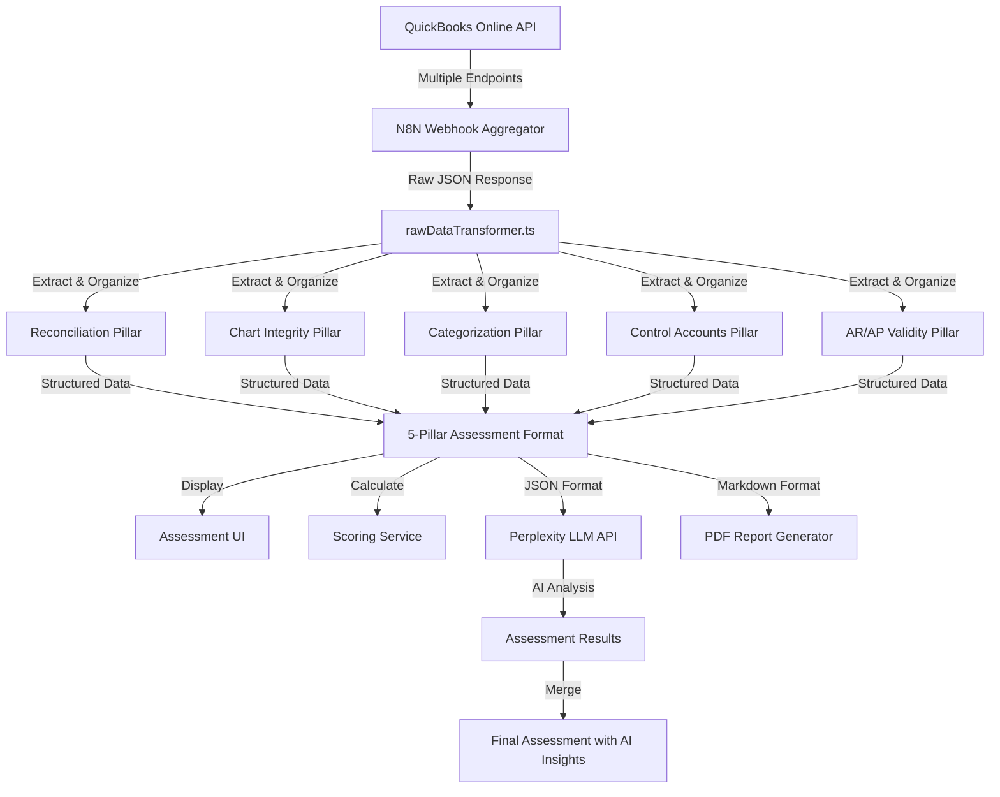

# QuickBooks Online Data Mapping to 5-Pillar Assessment Format
## Technical Specification Document

---

## Executive Summary

This document describes how raw QuickBooks Online (QBO) data is organized into a 5-pillar assessment structure for financial books hygiene evaluation. **Important: NO mathematical transformations are performed on the raw data** - values remain exactly as received from QBO (e.g., AP balances remain negative). The system only performs structural organization of the data into logical assessment pillars.

---

## 1. Data Flow Overview

```
┌─────────────────────┐
│   QuickBooks API    │
└──────────┬──────────┘
           │
           ▼
┌─────────────────────┐
│  N8N Webhook Proxy  │  (Fetches multiple QBO reports)
└──────────┬──────────┘
           │
           ▼
┌─────────────────────┐
│   Raw QBO Data      │  (Multiple report structures)
│  - Chart of Accounts│
│  - Transaction List │
│  - AR Aging Report  │
│  - AP Aging Report  │
│  - Trial Balance    │
│  - Journal Entries  │
└──────────┬──────────┘
           │
           ▼
┌─────────────────────┐
│ rawDataTransformer  │  (Structural organization only)
└──────────┬──────────┘
           │
           ▼
┌─────────────────────┐
│  5-Pillar Format    │  (Organized for assessment)
│  1. Reconciliation  │
│  2. Chart Integrity │
│  3. Categorization  │
│  4. Control Accounts│
│  5. AR/AP Validity  │
└─────────────────────┘
```

---

## 2. Incoming Raw Data Structure from QBO

The N8N webhook aggregates multiple QBO API endpoints into a single response:

### 2.1 Raw Data Components

```typescript
interface RawQBOData {
  // Chart of Accounts Query
  chartOfAccounts?: {
    Account: Array<{
      Name: string;                // Account name
      SubAccount: boolean;          // Is this a sub-account?
      ParentRef?: { value: string }; // Parent account reference
      Active: boolean;              // Is account active?
      Classification: string;       // Asset, Liability, Equity, Revenue, Expense
      AccountType: string;          // Bank, Credit Card, AR, AP, etc.
      AccountSubType: string;       // Detailed account type
      CurrentBalance: number;       // Current balance (raw from QBO)
      Id: string;                   // QBO account ID
    }>;
  };

  // Transaction List Report
  txnList?: {
    headers: any;                   // Report metadata
    columns: any;                   // Column definitions
    rows: {
      Row: Array<{
        ColData: Array<{
          value: string;            // Transaction data values
          id?: string;              // Optional ID reference
        }>;
        type: string;               // Row type
      }>;
    };
  };

  // Accounts Receivable Aging Report
  ar?: {
    headers: any;
    columns: any;
    rows: {
      Row: Array<any>;              // Aging buckets by customer
    };
  };

  // Accounts Payable Aging Report
  ap?: {
    headers: any;
    columns: any;
    rows: {
      Row: Array<any>;              // Aging buckets by vendor
    };
  };

  // Trial Balance Report
  trialBal?: {
    headers: any;
    columns: any;
    rows: {
      Row: Array<any>;              // Account balances
    };
  };

  // Journal Entries
  journalEntries?: {
    entries: Array<any>;            // Manual journal entries
    startPos: number;
    maxResults: number;
    totalCount: number;
  };
}
```

---

## 3. Data Mapping Logic - Structural Organization into 5 Pillars

### 3.1 Pillar 1: Reconciliation

**Purpose**: Assess bank and credit card reconciliation status

**Source Data**: 
- Chart of Accounts (Bank & Credit Card accounts)
- Transaction List (transaction details)

**Mapping Logic**:
```typescript
reconciliation: {
  // Transaction processing metadata
  clearedColumnFound: boolean,        // Whether cleared status is available
  totalRowsFound: number,              // Total transactions in report
  totalTransactionsProcessed: number,  // Transactions successfully processed
  totalAccountsFound: number,          // Number of bank/CC accounts
  hasTransactionData: boolean,         // Whether transaction data exists

  // Variance analysis per account
  variance: Array<{
    account: string,                  // Account name
    bookEndingBalance: number,        // Raw from CurrentBalance
    clearedAmount: number,            // Calculated from cleared transactions
    unclearedAmount: number,          // Calculated from uncleared transactions
    varianceBookVsCleared: number,    // Book balance vs cleared
    lastReconciliationDate: null,    // Not available in current data
    outstandingItems30Days: number,  // Count of old uncleared items
    outstandingItems60Days: number,
    outstandingItems90Days: number
  }>,

  // Account-level transaction summary
  byAccount: Array<{
    account: string,                  // Account name
    outstanding_30d_count: number,   // Old transaction counts
    outstanding_30d_amount: number,   // Old transaction amounts
    cleared_amount: number,           // Total cleared
    uncleared_amount: number,         // Total uncleared
    txns: number                      // Total transaction count
  }>
}
```

**Why This Structure**: Enables assessment of reconciliation completeness and aging of unreconciled items.

### 3.2 Pillar 2: Chart Integrity

**Purpose**: Evaluate chart of accounts structure and quality

**Source Data**: Chart of Accounts

**Mapping Logic**:
```typescript
chartIntegrity: {
  // Account totals
  totals: {
    accounts: number,                 // Total account count
    active: number,                   // Active accounts
    inactive: number,                 // Inactive accounts
    withSubAccounts: number           // Accounts with sub-accounts
  },

  // Data quality issues
  duplicates: {
    name: string[],                   // Duplicate account names
    acctNum: string[]                 // Duplicate account numbers
  },

  // Accounts missing required fields
  missingDetail: Array<{
    id: string,
    name: string
  }>,

  // Inactive accounts with balances (cleanup candidates)
  inactiveWithBalance: Array<{
    name: string,
    balance: number                   // Raw balance from QBO
  }>,

  // Sub-accounts without parent references
  subAccountsMissingParent: string[]
}
```

**Why This Structure**: Identifies structural issues in the chart of accounts that need cleanup.

### 3.3 Pillar 3: Categorization

**Purpose**: Identify uncategorized transactions requiring classification

**Source Data**: Chart of Accounts (specific uncategorized accounts)

**Mapping Logic**:
```typescript
categorization: {
  uncategorized: {
    'Uncategorized Expense': {
      count: number,                  // Transaction count (if available)
      amount: number                  // Raw balance from CurrentBalance
    },
    'Uncategorized Income': {
      count: number,
      amount: number                  // Raw balance from CurrentBalance
    },
    'Uncategorized Asset': {
      count: number,
      amount: number                  // Raw balance from CurrentBalance
    },
    'Ask My Accountant': {
      count: number,
      amount: number                  // Raw balance from CurrentBalance
    }
  },
  totalUncategorized: number,         // Sum of all uncategorized amounts
  hasUncategorizedTransactions: boolean
}
```

**Why This Structure**: Quantifies the cleanup work needed for proper transaction categorization.

### 3.4 Pillar 4: Control Accounts

**Purpose**: Monitor critical control account balances

**Source Data**: 
- Chart of Accounts (control account balances)
- Journal Entries (manual adjustments to AR/AP)

**Mapping Logic**:
```typescript
controlAccounts: {
  // Opening Balance Equity (should be zero after setup)
  openingBalanceEquity: {
    balance: number,                  // Raw from CurrentBalance
    accountId: string | null
  },

  // Undeposited Funds (should be minimal)
  undepositedFunds: {
    balance: number,                  // Raw from CurrentBalance
    accountId: string | null
  },

  // Accounts Receivable
  ar: {
    balance: number,                  // Raw from CurrentBalance (positive)
    accountId: string | null
  },

  // Accounts Payable
  ap: {
    balance: number,                  // Raw from CurrentBalance (negative as per QBO)
    accountId: string | null
  },

  // Manual journal entries to AR/AP (potential issues)
  journalEntriesToARorAP: number      // Count of manual JEs
}
```

**Important Note**: AP balance remains negative as received from QBO - NO sign reversal is performed.

### 3.5 Pillar 5: AR/AP Validity

**Purpose**: Analyze aging of receivables and payables

**Source Data**: 
- AR Aging Report
- AP Aging Report

**Mapping Logic**:
```typescript
arApValidity: {
  // AR Aging buckets
  arAging: {
    current: number,                  // 0-30 days (raw from report)
    d1_30: number,                    // 1-30 days past due
    d31_60: number,                   // 31-60 days past due
    d61_90: number,                   // 61-90 days past due
    d90_plus: number                  // >90 days past due
  },

  // AP Aging buckets (negative values as per QBO)
  apAging: {
    current: number,                  // 0-30 days (raw from report)
    d1_30: number,                    // 1-30 days past due
    d31_60: number,                   // 31-60 days past due
    d61_90: number,                   // 61-90 days past due
    d90_plus: number                  // >90 days past due
  },

  arTotal: number,                    // Sum of all AR aging buckets
  apTotal: number                     // Sum of all AP aging buckets (negative)
}
```

**Important Note**: AP aging values remain as received from QBO (typically negative) - NO transformation applied.

---

## 4. Why This Mapping is Necessary

### 4.1 Assessment Requirements
The 5-pillar structure aligns with the Financial Books Hygiene Assessment Methodology (requirement.md), which requires evaluation of:

1. **Data Accuracy & Reliability** - Assessed through reconciliation status
2. **Completeness** - Evaluated via chart integrity and categorization
3. **Consistency** - Checked through control account balances
4. **Compliance** - Verified through AR/AP aging patterns
5. **Integrity** - Monitored through duplicate detection and structural issues

### 4.2 Benefits of Structural Organization

1. **Focused Analysis**: Each pillar targets specific hygiene aspects
2. **Actionable Insights**: Organized data enables clear remediation priorities
3. **Progress Tracking**: Structured format allows monitoring improvements over time
4. **Scalability**: Consistent structure works across different business sizes
5. **No Data Manipulation**: Raw values preserved for audit trail

---

## 5. Key Implementation Details

### 5.1 Data Extraction Points

The system extracts specific fields from raw QBO data:

- **Account Filtering**: Uses `AccountType` to identify Bank, Credit Card, AR, AP accounts
- **Transaction Matching**: Links transactions to accounts via account names
- **Aging Calculation**: Parses aging report summary rows for totals
- **Duplicate Detection**: Creates name maps to find duplicate account names
- **Balance Preservation**: All balances remain exactly as provided by QBO

### 5.2 Fields Appearing in Output

Common fields across pillars and their sources:

| Field | Source | Purpose |
|-------|--------|---------|
| `variance` | Calculated from bank account balances vs cleared | Reconciliation gaps |
| `byAccount` | Transaction list grouped by account | Per-account transaction summary |
| `totals` | Count aggregations from chart of accounts | Account statistics |
| `duplicates` | Name frequency analysis | Data quality issues |
| `uncategorized` | Specific account name lookups | Classification gaps |
| `balance` | Direct from CurrentBalance field | Raw account balances |
| `aging buckets` | Parsed from aging report columns | Payment timeline analysis |

---

## 6. Console Output Interpretation

When the system logs "RAW QBO DATA IN 5 PILLARS", it shows:

```javascript
{
  dataFlow: {
    step1: 'Raw QBO data received from webhook',
    step2: 'Organized into 5 pillars (NO transformation)',
    step3: 'Data displayed as received from QuickBooks'
  },
  // Pillar summaries with counts and raw values...
}
```

This confirms:
1. Data is received in raw format from QBO
2. Structural organization is applied (not mathematical transformation)
3. Values remain exactly as QuickBooks provides them

---

## 7. Critical Notes

1. **No Sign Reversal**: AP balances remain negative as per QBO convention
2. **No Mathematical Transformation**: All amounts are raw QBO values
3. **Structural Organization Only**: The system reorganizes data for assessment purposes
4. **Preservation of Data Integrity**: Original values maintained for audit compliance
5. **Report-Based Extraction**: Data comes from QBO reports, not direct database access

---

## 8. Data Sent to LLM API for AI Analysis

### 8.1 LLM Input Data Structure

When the system sends data to the Perplexity AI LLM for hygiene assessment analysis, it uses a **structured JSON format**, not the human-readable markdown format. The data flow is:

```
5-Pillar Format → formatWebhookAssessmentDataForAnalysis() → Perplexity API
```

### 8.2 Actual Data Format Sent to LLM

The system sends the following structured data to the LLM API:

```javascript
{
  // Header Information
  "assessmentHeader": {
    "title": "QUICKBOOKS ONLINE FINANCIAL DATA ANALYSIS",
    "assessmentDate": "2024-12-31",
    "dataPeriod": "2024-10-01 to 2024-12-31",
    "companyRealmId": "1234567890"
  },

  // Key Financial Metrics Summary
  "financialMetrics": {
    "bankAccounts": 3,           // Count of bank/credit card accounts
    "totalAccounts": 125,         // Total chart of accounts
    "dataCompletenessScore": 85, // Percentage of data available
    "arTotal": 45678.90,         // Total accounts receivable
    "apTotal": -23456.78         // Total accounts payable (negative)
  },

  // Complete 5-Pillar Raw Data (JSON format)
  "detailedPillarData": {
    // PILLAR 1: Bank & Credit Card Reconciliation
    "reconciliation": {
      "clearedColumnFound": false,
      "totalRowsFound": 1250,
      "totalTransactionsProcessed": 1250,
      "totalAccountsFound": 3,
      "hasTransactionData": true,
      "variance": [
        {
          "account": "Business Checking",
          "bookEndingBalance": 12345.67,
          "clearedAmount": 11234.56,
          "unclearedAmount": 1111.11,
          "varianceBookVsCleared": 1111.11
        }
      ],
      "byAccount": [/* Account-level transaction details */]
    },

    // PILLAR 2: Chart of Accounts Integrity
    "chartIntegrity": {
      "totals": {
        "accounts": 125,
        "active": 110,
        "inactive": 15,
        "withSubAccounts": 30
      },
      "duplicates": {
        "name": ["Office Supplies", "Travel Expense"],
        "acctNum": []
      },
      "missingDetail": [/* Accounts missing required fields */],
      "inactiveWithBalance": [/* Inactive accounts with balances */],
      "subAccountsMissingParent": []
    },

    // PILLAR 3: Transaction Categorization
    "categorization": {
      "uncategorized": {
        "Uncategorized Expense": {
          "count": 15,
          "amount": 2345.67
        },
        "Uncategorized Income": {
          "count": 3,
          "amount": 456.78
        },
        "Uncategorized Asset": {
          "count": 0,
          "amount": 0.00
        },
        "Ask My Accountant": {
          "count": 8,
          "amount": 1234.56
        }
      },
      "totalUncategorized": 4037.01,
      "hasUncategorizedTransactions": true
    },

    // PILLAR 4: Control Account Accuracy
    "controlAccounts": {
      "openingBalanceEquity": {
        "balance": 5000.00,  // Should be zero after setup
        "accountId": "123"
      },
      "undepositedFunds": {
        "balance": 1500.00,  // Should be minimal
        "accountId": "124"
      },
      "ar": {
        "balance": 45678.90, // Raw positive value
        "accountId": "125"
      },
      "ap": {
        "balance": -23456.78, // Raw negative value from QBO
        "accountId": "126"
      },
      "journalEntriesToARorAP": 12
    },

    // PILLAR 5: A/R & A/P Validity
    "arApValidity": {
      "arAging": {
        "current": 30000.00,
        "d1_30": 10000.00,
        "d31_60": 3000.00,
        "d61_90": 1500.00,
        "d90_plus": 1178.90
      },
      "apAging": {
        "current": -15000.00,  // Negative values as per QBO
        "d1_30": -5000.00,
        "d31_60": -2000.00,
        "d61_90": -1000.00,
        "d90_plus": -456.78
      },
      "arTotal": 45678.90,
      "apTotal": -23456.78
    }
  }
}
```

### 8.3 Key Points About LLM Input Data

1. **Format**: The LLM receives **structured JSON data**, not markdown text
2. **Raw Values**: All financial values are sent exactly as received from QBO (e.g., AP remains negative)
3. **Complete Context**: The LLM gets the full 5-pillar organized data for comprehensive analysis
4. **No Pre-calculated Scores**: The LLM receives raw data and calculates its own assessment scores
5. **Metadata Included**: Assessment date, data period, and company information provide context

### 8.4 LLM Analysis Process

The Perplexity AI LLM uses this structured data to:

1. **Calculate Scores**: Generate scores for each pillar based on the Day-30 Readiness Framework
2. **Identify Issues**: Detect critical problems in each pillar
3. **Generate Recommendations**: Create actionable remediation steps
4. **Produce Reports**: Generate both business owner summaries and technical bookkeeper reports

### 8.5 LLM Response Structure

The LLM returns a structured JSON response containing:

```javascript
{
  "overallScore": 72,
  "pillarScores": {
    "reconciliation": 65,
    "coaIntegrity": 80,
    "categorization": 70,
    "controlAccounts": 75,
    "arApValidity": 70
  },
  "readinessStatus": "MINOR_FIXES_NEEDED",
  
  "section1_executiveSummary": {
    // Business-friendly summary
  },
  
  "section2_detailedResults": {
    // Pillar-by-pillar breakdown
  },
  
  "section3_technicalRemediation": {
    // Specific fix instructions for bookkeepers
  },
  
  "section4_scoringTransparency": {
    // Scoring methodology and limitations
  }
}
```

### 8.6 Important Notes on LLM Integration

1. **Two Different Formats**:
   - **For LLM API**: Structured JSON data (shown above)
   - **For Human Viewing**: Markdown format (via `LLMInputFormatter.formatForLLM()`)

2. **Data Preservation**: The LLM receives raw QBO values without transformation
3. **Context-Aware Analysis**: The LLM understands QBO conventions (e.g., negative AP balances)
4. **Scoring Independence**: The LLM calculates its own scores based on the raw data

---

## Appendix: Complete Data Flow Diagram



This specification demonstrates that:
1. The system performs structural organization of raw QBO data into logical assessment categories
2. No mathematical transformation of values occurs
3. The LLM receives structured JSON data for analysis
4. Human-readable formats (markdown/PDF) are generated separately for viewing