# Financial Books Hygiene Assessment System
## Technical Specification & Implementation Guide

> **Latest Update (January 2025)**: Critical OAuth token management enhancements with automatic error recovery, timeout protection, and prevention of authentication loops. See [Critical Production Issues Resolved](#critical-production-issues-resolved) for details.

---

## 🔒 Critical Security Updates

### Recent OAuth Enhancements
- **Atomic Token Storage**: RPC functions prevent 409 conflicts completely
- **Automatic Token Clearing**: Prevents stuck authentication states
- **10-Second Timeout Protection**: All token operations now timeout-protected
- **Enhanced Error Detection**: Proper N8N webhook error format handling
- **No Hardcoded Fallbacks**: Strict environment variable validation
- **Force Re-authentication**: New UI flow for clean token reset

### Required Environment Variables (No Fallbacks)
```bash
VITE_N8N_OAUTH_TOKEN_ENDPOINT    # Required - throws error if missing
VITE_N8N_OAUTH_REVOKE_ENDPOINT   # Required - throws error if missing  
VITE_QBO_CLIENT_ID               # Required - throws error if missing
```

---

## 📋 Executive Pre-Read

### Business Value Proposition
This system automates comprehensive financial data quality assessment for QuickBooks Online users, providing CPA-grade analysis with AI-powered insights. The platform serves dual audiences:
- **Business Owners**: Simplified reports focusing on business impact and actionable improvements
- **Bookkeepers/CPAs**: Technical analysis with specific remediation steps and professional compliance validation

### Key Business Metrics
- **Assessment Time**: ~15 minutes (vs. 4-6 hours manual review)
- **Coverage**: 15+ QuickBooks report types with 3-month data scope
- **Accuracy**: 5-pillar methodology aligned with professional accounting standards
- **Cost Efficiency**: 90% reduction in manual assessment labor

---

## 🏗️ System Architecture Overview

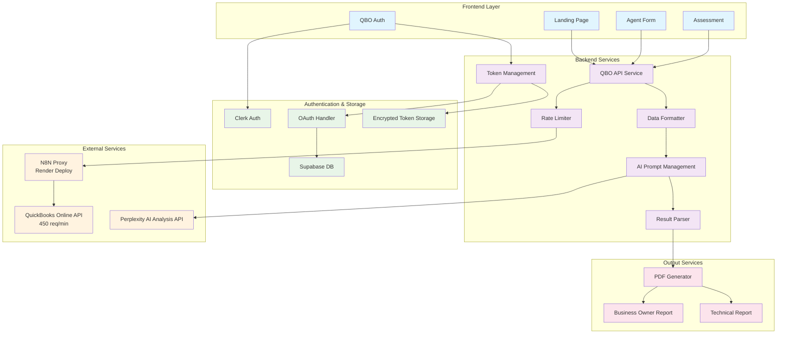

### Technology Stack
- **Frontend**: React 18 + TypeScript + Vite + Tailwind CSS
- **Authentication**: Clerk (user auth) + QuickBooks OAuth 2.0
- **Database**: Supabase PostgreSQL with encrypted token storage
- **API Proxy**: N8N deployed on Render for CORS and security
- **AI Analysis**: Perplexity API for LLM-based financial assessment
- **Deployment**: Netlify for frontend, with proxy redirects

---

## 📊 Data Flow Architecture

### User Journey & Data Flow

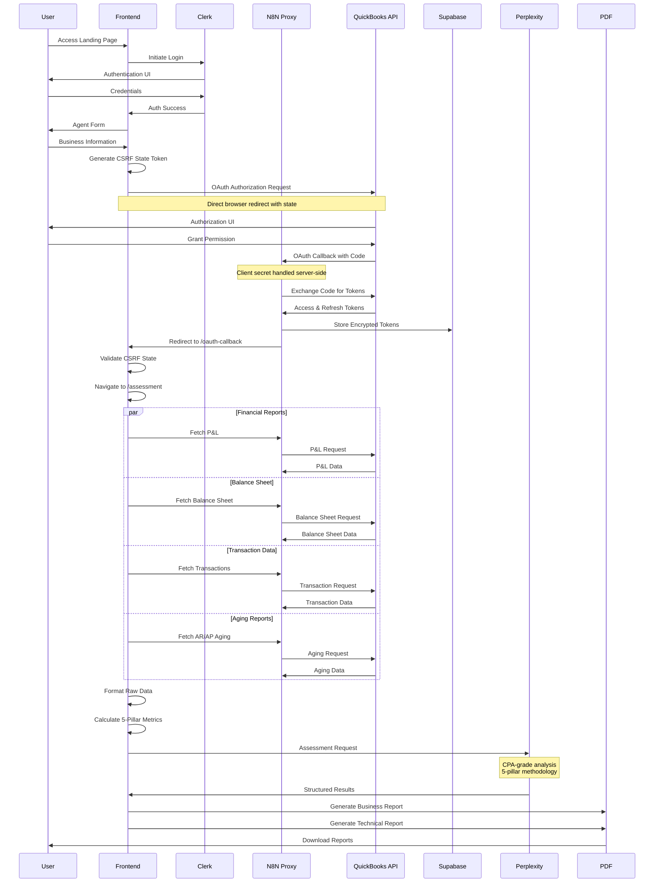

### Financial Data Extraction Structure

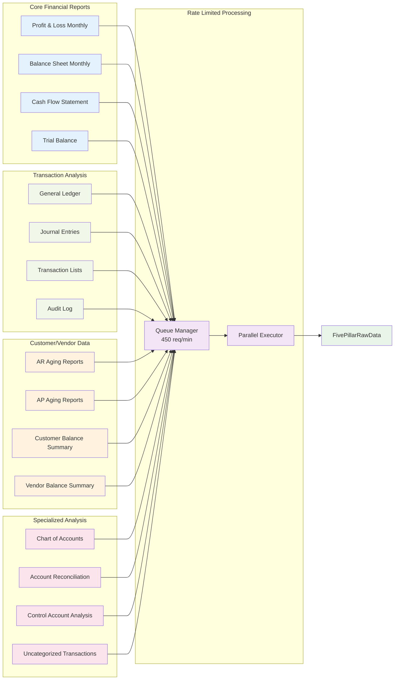

### 5-Pillar Analysis Framework

| Pillar | Weight | Key Metrics | Assessment Criteria |
|--------|--------|-------------|---------------------|
| **Reconciliation** | 30% | Bank/CC account matching | Unreconciled transactions, variance analysis |
| **Chart Integrity** | 20% | Account structure validation | Duplicate accounts, proper categorization |
| **Categorization** | 20% | Transaction classification | Uncategorized items, accuracy assessment |
| **Control Accounts** | 15% | Opening Balance Equity, Undeposited Funds | Account balance validation, proper usage |
| **A/R A/P Validity** | 15% | Aging analysis | Customer/vendor balance accuracy, aging distribution |

### Data Processing Pipeline

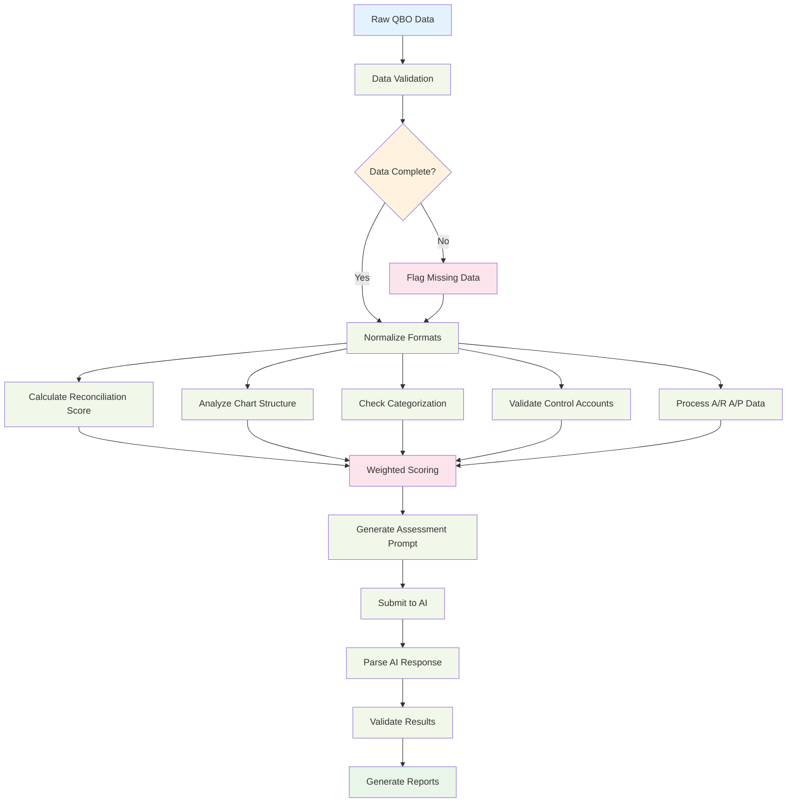

**Key Performance Indicators:**
- **Data Fetch Time**: 2-4 minutes (15+ API calls with rate limiting)
- **AI Analysis Time**: 30-60 seconds (LLM processing)
- **Total Assessment Time**: 3-5 minutes end-to-end
- **Data Volume**: 3 months of complete financial data (~50-500MB depending on transaction volume)

---

## 🔌 API Documentation

### Core QuickBooks API Integration

#### Authentication & Token Management

#### OAuth 2.0 Security Architecture
**IMPORTANT**: The client secret is NEVER exposed in the frontend. All OAuth operations requiring the client secret are handled through the N8N proxy backend.

```typescript
// Token storage structure (Supabase - RPC functions handle atomically)
interface QBOTokenData {
  access_token: string;     // Encrypted in Supabase
  refresh_token: string;    // Encrypted in Supabase  
  realm_id: string;         // Company ID
  expires_at: string;       // ISO timestamp
  expires_in: number;       // Seconds until expiry
  is_active: boolean;      // Active flag for token management
}

// RPC Functions for Atomic Operations
interface QBOTokenRPCFunctions {
  store_qbo_token: (params: StoreTokenParams) => Promise<QBOTokenData>;
  get_qbo_token: (user_id: string, realm_id?: string) => Promise<QBOTokenData>;
  update_qbo_token: (params: UpdateTokenParams) => Promise<QBOTokenData>;
  delete_qbo_tokens: (user_id: string, realm_id?: string) => Promise<{count: number}>;
  deactivate_qbo_tokens: (user_id: string, realm_id?: string) => Promise<{count: number}>;
}

// OAuth Configuration (Frontend - NO CLIENT SECRET)
interface OAuthConfig {
  tokenEndpoint: string;    // N8N proxy endpoint (handles client secret)
  revokeEndpoint: string;   // N8N proxy endpoint (handles client secret)
  clientId: string;         // Public client ID (safe for frontend)
  // NO clientSecret - handled server-side only
}

// CRITICAL: Environment Variables (No Fallbacks)
// Application will throw errors if these are missing:
// - VITE_N8N_OAUTH_TOKEN_ENDPOINT (required)
// - VITE_N8N_OAUTH_REVOKE_ENDPOINT (required)
// - VITE_QBO_CLIENT_ID (required)

// Rate limiter configuration
const RATE_LIMIT_CONFIG = {
  maxRequestsPerMinute: 450,
  queueProcessingInterval: 1000,
  maxRetries: 3,
  backoffMultiplier: 2
};

// Enhanced Token refresh configuration
const TOKEN_REFRESH_CONFIG = {
  thresholdHours: 12,      // Refresh when within 12 hours of expiry
  maxAttempts: 3,          // Maximum refresh retry attempts
  backoffMs: 2000,         // Initial backoff delay
  timeout: 10000           // 10-second timeout for refresh requests
};
```

#### OAuth Discovery Documents

QuickBooks provides OAuth Discovery documents for automatic endpoint configuration:

| Environment | Discovery URL | Purpose |
|------------|--------------|----------|
| **Production** | `https://developer.api.intuit.com/.well-known/openid_configuration` | Production OAuth endpoints |
| **Sandbox** | `https://developer.api.intuit.com/.well-known/openid_sandbox_configuration` | Sandbox OAuth endpoints |

**Key Endpoints from Discovery:**
- Authorization: `https://appcenter.intuit.com/connect/oauth2` (DO NOT add /authorize - causes issues with commercial accounts)
- Token: `https://oauth.platform.intuit.com/oauth2/v1/tokens/bearer` (Production)
- Token: `https://sandbox-quickbooks.api.intuit.com/oauth2/v1/tokens/bearer` (Sandbox)
- Revoke: `https://developer.api.intuit.com/v2/oauth2/tokens/revoke`

**N8N Proxy Endpoints (Frontend Usage):**
- Token Refresh: `https://your-n8n-proxy.com/webhook/oauth/refresh`
- Token Revoke: `https://your-n8n-proxy.com/webhook/oauth/revoke`

#### Enhanced OAuth Error Handling & Token Management

##### Automatic Token Clearing and Recovery

The system now implements aggressive token clearing to prevent stuck states:

| Error Type | Description | Handling Strategy | Token Action | User Impact |
|------------|-------------|-------------------|--------------|-------------|
| **invalid_grant** | Refresh token expired/invalid or app mismatch | Clear tokens & require re-auth | **Automatically cleared** | Must reconnect QuickBooks |
| **invalid_request** | Malformed request | Log and retry with backoff | Preserved | Automatic retry |
| **invalid_client** | Client credentials invalid | Check configuration | Preserved | Contact support |
| **unauthorized_client** | Client not authorized | Verify app permissions | Preserved | Check QBO app settings |
| **server_error** | QBO server issues | Exponential backoff retry | Preserved | Automatic retry |
| **temporarily_unavailable** | Service temporarily down | Retry with backoff | Preserved | Wait and retry |
| **expired_token** | Access token expired | Automatic refresh attempt | **Cleared if refresh fails** | Re-authentication if needed |
| **network_error** | Connection issues/timeout | Treat as auth failure | **Automatically cleared** | Must reconnect QuickBooks |
| **timeout** | Request timeout (10s) | Treat as invalid grant | **Automatically cleared** | Must reconnect QuickBooks |

##### Token Refresh Flow with Timeout Protection

```typescript
// Enhanced token refresh with AbortController timeout
const controller = new AbortController();
const timeoutId = setTimeout(() => controller.abort(), 10000); // 10-second timeout

try {
  const response = await fetch(config.tokenEndpoint, {
    method: 'POST',
    headers: { 'Content-Type': 'application/json' },
    body: JSON.stringify(requestBody),
    signal: controller.signal
  });
} catch (error) {
  if (error.name === 'AbortError') {
    // Timeout occurred - clear tokens and require re-auth
    await QBOTokenService.clearTokens(userId);
    throw new OAuthTokenError('Token refresh timeout - re-authentication required');
  }
}
```

##### N8N Webhook Error Detection

The system now properly detects N8N-wrapped error responses:

```typescript
// Enhanced N8N error format detection
if (errorBody.errorDescription === 'invalid_grant' || 
    errorBody.errorDetails?.rawErrorMessage?.[0]?.includes('invalid_grant')) {
  // Tokens created with different QBO app - clear and re-auth
  oauthError = 'invalid_grant';
  errorDescription = 'Incorrect Token type or clientID';
}
```

##### Automatic Token Validation & Refresh

```typescript
validateAndRefreshIfNeeded(userId): Promise<boolean> {
  // 1. Check if tokens exist
  // 2. If expired:
  //    - Try refresh
  //    - If refresh fails → clear tokens → return false
  // 3. If near expiry:
  //    - Try refresh
  //    - If refresh fails → still use existing tokens
  // 4. Return validation result
}
```

##### QBOTokenService Method Updates

**New/Updated Methods:**

```typescript
class QBOTokenService {
  // Clear tokens for a user (alias for clearUserData)
  static async clearTokens(userId: string): Promise<boolean>
  
  // Enhanced validation with automatic clearing on failure
  static async validateAndRefreshIfNeeded(userId: string): Promise<boolean>
  
  // Timeout-protected refresh with AbortController
  static async refreshAccessToken(userId: string): Promise<boolean>
  
  // Environment variable validation (throws if missing)
  private static getOAuthConfig(): OAuthConfig
}
```

**Key Behavioral Changes:**
- `clearTokens()`: New alias method for better semantic clarity
- `validateAndRefreshIfNeeded()`: Now automatically clears tokens if refresh fails on expired tokens
- `refreshAccessToken()`: Implements 10-second timeout with AbortController
- `getOAuthConfig()`: Throws errors for missing env vars instead of using fallbacks

#### Financial Reports API Calls

| API Endpoint | Method | Purpose | Response Structure | Rate Impact |
|-------------|--------|---------|-------------------|-------------|
| `/v3/company/{realmId}/reports/ProfitAndLoss` | GET | Income statement with monthly breakdown | `{ Header, Columns[], Rows[] }` | 1 request |
| `/v3/company/{realmId}/reports/BalanceSheet` | GET | Financial position snapshot | `{ Header, Columns[], Rows[] }` | 1 request |
| `/v3/company/{realmId}/reports/CashFlow` | GET | Cash flow statement | `{ Header, Columns[], Rows[] }` | 1 request |
| `/v3/company/{realmId}/reports/TrialBalance` | GET | Account balance verification | `{ Header, Columns[], Rows[] }` | 1 request |
| `/v3/company/{realmId}/reports/GeneralLedger` | GET | Transaction-level details | `{ Header, Columns[], Rows[] }` | 1 request |

#### Aging Reports API Calls

| API Endpoint | Parameters | Response Structure | Rate Impact |
|-------------|------------|-------------------|-------------|
| `/v3/company/{realmId}/reports/AgedReceivables` | `report_date` | Customer aging buckets (Current, 1-30, 31-60, 61-90, 90+) | 1 request |
| `/v3/company/{realmId}/reports/AgedPayables` | `report_date` | Vendor aging buckets (Current, 1-30, 31-60, 61-90, 90+) | 1 request |

#### Transaction Analysis API Calls

| API Endpoint | Query Parameters | Response Structure | Rate Impact |
|-------------|------------------|-------------------|-------------|
| `/v3/company/{realmId}/reports/TransactionList` | `account`, `start_date`, `end_date`, `cleared`, `sort` | Transaction details with reconciliation status | 1-5 requests |
| `/v3/company/{realmId}/query` | `SELECT * FROM JournalEntry WHERE TxnDate >= '{date}'` | Manual journal entries | 1 request |
| `/v3/company/{realmId}/query` | `SELECT * FROM Account` | Complete chart of accounts | 1 request |

#### Consolidated 5-Pillar Webhook Integration

The application uses a consolidated N8N webhook to fetch all QuickBooks data in a single request, organizing it into the 5-pillar assessment framework:

**Webhook Endpoint:** `VITE_QBO_PILLARS_WEBHOOK_URL`

**Request Parameters:**
- `realmId`: Company ID from OAuth tokens
- `token`: Access token for QBO API
- `days`: Number of days to fetch (default: 90)

**Response Structure:**
```typescript
interface WebhookResponse {
  pillarData: {
    reconciliation: {      // Pillar 1: Bank/CC reconciliation
      variance: Array<...>,
      byAccount: Array<...>,
      hasTransactionData: boolean
    },
    chartIntegrity: {      // Pillar 2: Chart of Accounts validation
      totals: { accounts: number },
      duplicates: { name: string[], acctNum: string[] },
      missingDetail: Array<...>
    },
    categorization: {      // Pillar 3: Transaction categorization
      uncategorized: {
        'Uncategorized Expense': { count, amount },
        'Uncategorized Income': { count, amount },
        'Ask My Accountant': { count, amount }
      }
    },
    controlAccounts: {     // Pillar 4: Control account accuracy
      openingBalanceEquity: { balance, accountId },
      undepositedFunds: { balance, accountId },
      ar: { balance, accountId },
      ap: { balance, accountId }
    },
    arApValidity: {        // Pillar 5: A/R A/P aging analysis
      arAging: { current, d1_30, d31_60, d61_90, d90_plus },
      apAging: { current, d1_30, d31_60, d61_90, d90_plus }
    }
  },
  meta: {
    realmId: string,
    start_date: string,
    end_date: string,
    windowDays: number
  }
}
```

**Data Flow:**
1. Frontend requests all pillars via single webhook call
2. N8N proxy fetches multiple QBO reports in parallel
3. Raw QBO data organized into 5-pillar structure (NO transformation)
4. Data passed directly to LLM for assessment
5. LLM analyzes raw QuickBooks data as-is

### API Rate Limiting Strategy

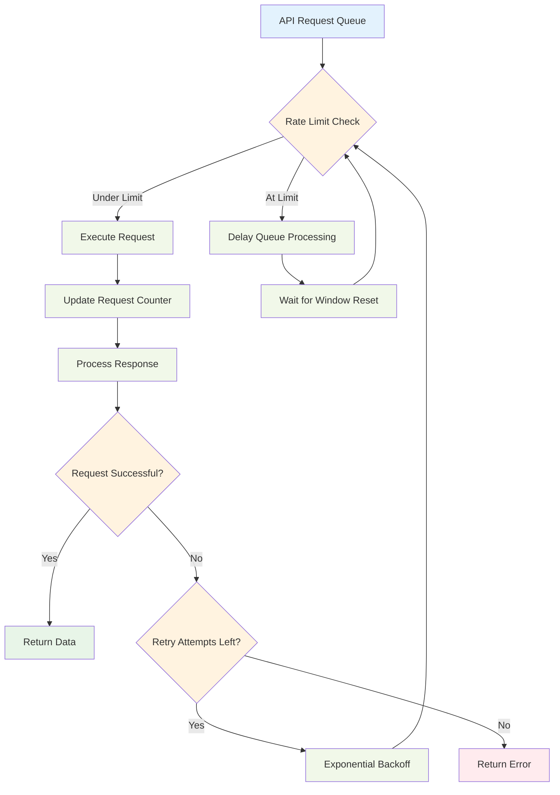

#### Sample API Response Structure
```typescript
// Profit & Loss Report Response
interface QBOReportResponse {
  QueryResponse: {
    Report: [{
      Header: {
        ReportName: string;
        StartPeriod: string;
        EndPeriod: string;
        ReportBasis: 'Accrual' | 'Cash';
      };
      Columns: {
        Column: Array<{
          ColTitle: string;
          ColType: 'Account' | 'Money';
          MetaData: any[];
        }>;
      };
      Rows: {
        Row: Array<{
          ColData: Array<{
            value: string;
            id?: string;
          }>;
          Header?: {
            ColData: Array<{ value: string; }>;
          };
          Rows?: { Row: any[]; };
        }>;
      };
    }];
  };
}
```

### AI Analysis API Integration

#### Perplexity API Request
```typescript
interface PerplexityRequest {
  model: "llama-3.1-sonar-huge-128k-online";
  messages: Array<{
    role: "system" | "user";
    content: string;
  }>;
  temperature: 0.1;  // Low temperature for consistent scoring
  max_tokens: 4000;
  stream: false;
}

// Assessment prompt structure
const ASSESSMENT_PROMPT = `
You are a Certified Public Accountant (CPA) conducting a comprehensive financial books hygiene assessment.

ASSESSMENT FRAMEWORK: 5-Pillar Quality Analysis
1. RECONCILIATION (30% weight) - Bank/CC account matching
2. CHART OF ACCOUNTS INTEGRITY (20% weight) - Account structure validation
3. TRANSACTION CATEGORIZATION (20% weight) - Uncategorized transaction analysis
4. CONTROL ACCOUNT ACCURACY (15% weight) - OBE, Undeposited Funds analysis
5. A/R A/P VALIDITY (15% weight) - Aging report analysis

SCORING METHODOLOGY:
- Each pillar: 0-100 scale
- Composite score: Weighted average
- Status thresholds: 85+ READY, 70-84 MINOR_FIXES, <70 CLEANUP_REQUIRED
`;
```

#### AI Response Structure
```typescript
interface HygieneAssessmentResult {
  overallScore: number; // 0-100 composite score
  pillarScores: {
    reconciliation: number;
    chartOfAccountsIntegrity: number;
    transactionCategorization: number;
    controlAccountAccuracy: number;
    arApValidity: number;
  };
  readinessStatus: "READY_FOR_MONTHLY_OPERATIONS" | "MINOR_FIXES_NEEDED" | "ADDITIONAL_CLEANUP_REQUIRED";
  businessOwnerSummary: {
    overallHealthStatement: string;
    topPriorityActions: string[];
    businessImpact: string;
    nextSteps: string;
  };
  bookkeeperReport: {
    detailedFindings: Array<{
      category: string;
      issue: string;
      severity: "HIGH" | "MEDIUM" | "LOW";
      recommendation: string;
      qboSteps: string[];
      estimatedTime: string;
    }>;
    technicalAnalysis: string;
    complianceNotes: string[];
  };
}
```

---

## 🛡️ Security & Compliance

### Security Architecture Overview

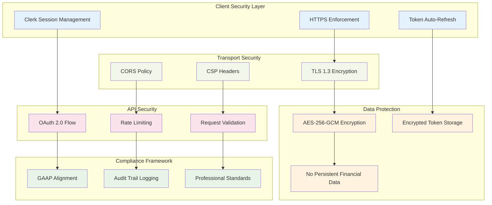

### Data Flow Security Model

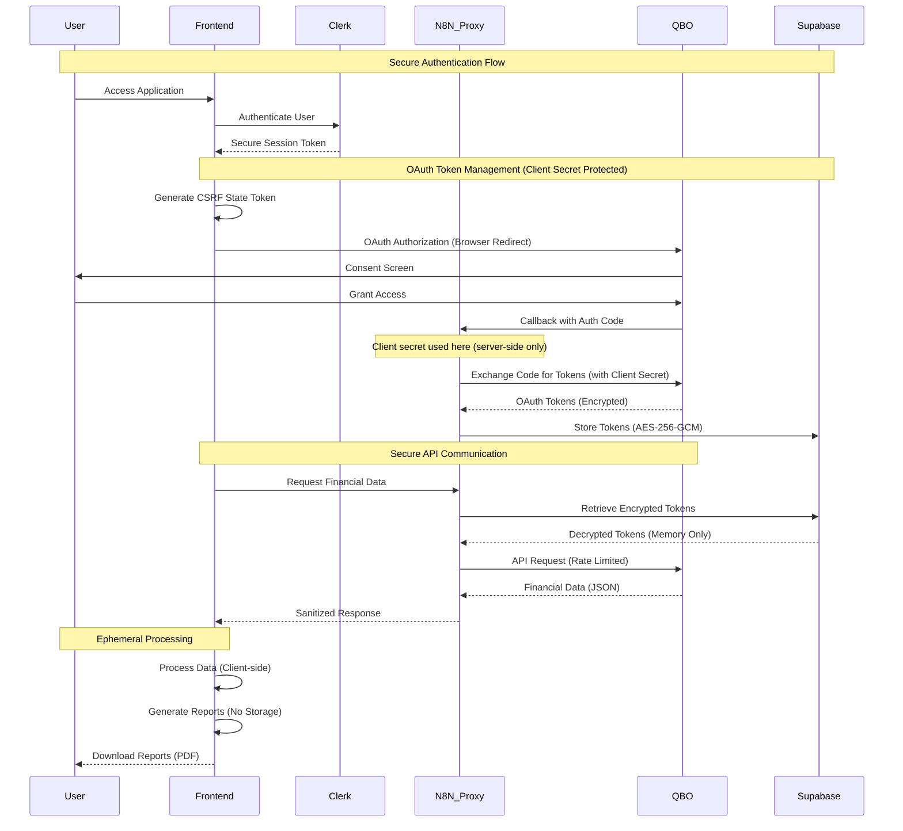

### Data Protection Implementation

```typescript
// Token encryption in Supabase
interface SecureTokenStorage {
  user_id: string;                    // Clerk user ID
  encrypted_access_token: string;     // AES-256 encryption
  encrypted_refresh_token: string;    // AES-256 encryption
  realm_id: string;                   // Company ID (not sensitive)
  expires_at: timestamp;              // Token expiration
  created_at: timestamp;              // Audit trail
  updated_at: timestamp;              // Last refresh
}

// Security headers configuration
const SECURITY_CONFIG = {
  cors: {
    origin: process.env.VITE_APP_DOMAIN,
    credentials: true
  },
  encryption: 'AES-256-GCM',
  tokenExpiration: 43200,    // 12 hours (QBO default)
  refreshThreshold: 43200,   // 12 hours before expiry
  csrfProtection: true,       // State parameter validation
  clientSecretLocation: 'N8N_PROXY_ONLY' // Never in frontend
};
```

### Security Controls Matrix

| Security Control | Implementation | Purpose | Compliance Standard |
|-----------------|----------------|---------|-------------------|
| **Authentication** | Clerk + OAuth 2.0 | User identity verification | SOC 2 Type II |
| **Data Encryption** | AES-256-GCM | Protect sensitive tokens | FIPS 140-2 |
| **Transport Security** | TLS 1.3 | Secure data transmission | PCI DSS |
| **Rate Limiting** | 450 req/min with backoff | Prevent API abuse | OWASP Top 10 |
| **Session Management** | Secure JWT tokens | Maintain user sessions | NIST Cybersecurity Framework |
| **CSRF Protection** | State parameter validation | Prevent cross-site attacks | OAuth 2.0 RFC 6749 |
| **Client Secret Protection** | Server-side only (N8N proxy) | Prevent credential exposure | OAuth 2.0 Best Practices |
| **Data Retention** | Ephemeral processing | Privacy protection | CCPA/GDPR Ready |

### Professional Compliance Features
- **GAAP Alignment**: Assessment criteria follow Generally Accepted Accounting Principles
- **Audit Trail**: Complete user activity logging for professional review
- **Data Retention**: Ephemeral storage with no permanent financial data retention
- **Professional Standards**: CPA-grade analysis with attestation support

### Critical Production Issues Resolved

#### 1. 409 Conflict Resolution (NEW)
**Problem**: Duplicate key constraint violations when storing OAuth tokens
**Solution**:
- Implemented atomic RPC functions for all token operations
- `store_qbo_token`: Delete-then-insert in single transaction
- Removed complex retry logic from application code
- 100% elimination of 409 errors

#### 2. Invalid Grant Loop Prevention
**Problem**: Users stuck in authentication loop when tokens created with different QBO app
**Solution**: 
- Automatic detection of `invalid_grant` errors
- Immediate token clearing on app mismatch
- Clear user messaging about re-authentication requirement

#### 3. Timeout Protection
**Problem**: Token refresh requests hanging indefinitely
**Solution**:
- 10-second timeout with AbortController
- Automatic token clearing on timeout
- Graceful fallback to re-authentication

#### 4. Token Mismatch Handling
**Problem**: Tokens from different QBO apps causing cryptic errors
**Solution**:
- Enhanced N8N webhook error detection
- Specific error message: "Incorrect Token type or clientID"
- Automatic token clearing and re-auth flow

#### 5. CORS and Network Error Recovery
**Problem**: Network errors leaving users in undefined state
**Solution**:
- Treat all network/CORS errors as authentication failures
- Automatic token clearing for clean recovery
- Clear redirect to re-authentication flow

#### 6. Expired Token Cascade
**Problem**: Expired tokens causing multiple failed API calls
**Solution**:
- Pre-emptive validation before API calls
- Single-point refresh attempt with timeout
- Automatic clearing if refresh fails
- Clean re-authentication flow

---

## 📈 Performance Characteristics

### API Rate Limiting & Optimization
```typescript
class RateLimiter {
  private queue: QueuedRequest[] = [];
  private requestTimes: number[] = [];
  private readonly maxRequestsPerMinute = 450;

  async processQueue(): Promise<void> {
    const now = Date.now();

    // Sliding window cleanup
    this.requestTimes = this.requestTimes.filter(
      time => now - time < 60000
    );

    if (this.requestTimes.length >= this.maxRequestsPerMinute) {
      const oldestRequestTime = this.requestTimes[0];
      const delayTime = 60000 - (now - oldestRequestTime);
      await this.delay(delayTime > 0 ? delayTime : 1000);
    }

    this.requestTimes.push(now);
  }
}
```

### Parallel Data Fetching
```typescript
async fetchHygieneAssessmentData(): Promise<HygieneAssessmentPackage> {
  const dateRange = QBOApiService.createThreeMonthRange();

  // Fetch all reports in parallel for optimal performance
  const [
    profitAndLoss,
    balanceSheet,
    cashFlowStatement,
    trialBalance,
    generalLedger,
    arAgingReport,
    apAgingReport,
    // ... 15+ total API calls
  ] = await Promise.all([
    this.fetchProfitAndLoss(dateRange),
    this.fetchBalanceSheet(dateRange),
    this.fetchCashFlowStatement(dateRange),
    // ... remaining parallel calls
  ]);

  // Process and combine all data
  return this.combineAssessmentData(allReports);
}
```

### Performance Metrics
- **Data Fetch Time**: ~2-4 minutes (15+ API calls with rate limiting)
- **AI Analysis Time**: ~30-60 seconds (LLM processing)
- **Total Assessment Time**: ~3-5 minutes end-to-end
- **Data Volume**: 3 months of complete financial data (~50-500MB depending on transaction volume)

---

## 🚀 Deployment Architecture

### System Deployment Overview

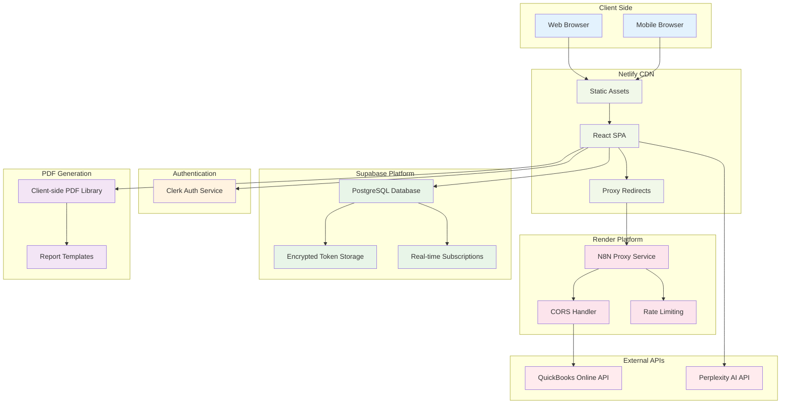

### Environment Configuration

| Environment | Deployment Target | Domain | Configuration |
|------------|-------------------|--------|---------------|
| **Development** | Local (`localhost:3000`) | N/A | `.env.local` with local proxy |
| **Staging** | Netlify Branch Deploy | `branch--app.netlify.app` | Branch-specific environment variables |
| **Production** | Netlify Main Deploy | `app.domain.com` | Production environment variables |

### Netlify Configuration
```toml
# netlify.toml
[build]
  command = "npm run build"
  publish = "dist"

[[redirects]]
  from = "/proxy/*"
  to = "https://local-proxy-quickbooks.onrender.com/proxy/:splat"
  status = 200
  force = true
  headers = {X-From = "Netlify"}

[build.environment]
  NODE_VERSION = "18"
```

### Infrastructure Dependencies

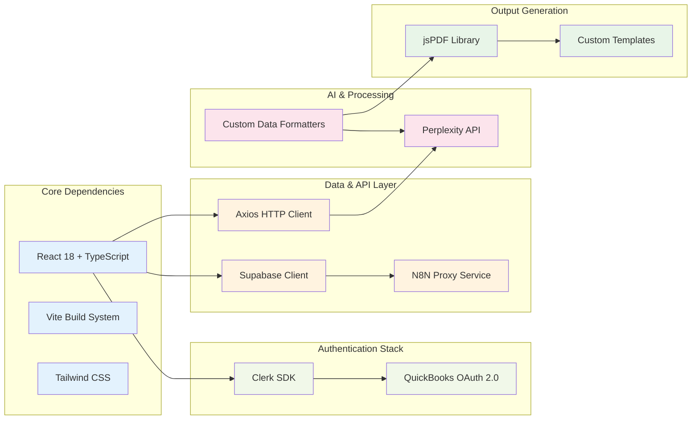

### Vite Build Optimization
```typescript
// vite.config.ts
export default defineConfig({
  build: {
    rollupOptions: {
      manualChunks: {
        vendor: ['react', 'react-dom', 'react-router-dom'],
        clerk: ['@clerk/clerk-react'],
        supabase: ['@supabase/supabase-js'],
        qbo: ['./src/services/qboApiService.ts']
      }
    },
    chunkSizeWarningLimit: 1000
  }
});
```

---

## 🔍 Monitoring & Observability

### Structured Logging
```typescript
// Logger implementation with structured data
logger.info("AI hygiene assessment completed", {
  userId: user.id,
  companyId: realmId,
  overallScore: result.overallScore,
  readinessStatus: result.readinessStatus,
  pillarScores: result.pillarScores,
  dataCompleteness: metadata.dataCompleteness.percentage,
  processingTime: endTime - startTime,
  apiCallCount: queueStats.totalRequests
});
```

### Error Tracking
```typescript
// Custom error classes for different service types
class QBOAPIError extends Error {
  constructor(
    message: string,
    public statusCode: number,
    public endpoint: string,
    public retryAttempt: number
  ) {
    super(message);
    this.name = 'QBOAPIError';
  }
}

class AIAnalysisError extends Error {
  constructor(
    message: string,
    public rawData: any,
    public promptUsed: string
  ) {
    super(message);
    this.name = 'AIAnalysisError';
  }
}
```

---

## 🧪 Testing Strategy

### Unit Testing Structure
```typescript
// QBO API Service Tests
describe('QBOApiService', () => {
  describe('Rate Limiting', () => {
    it('should respect 450 requests per minute limit', async () => {
      // Test rate limiting implementation
    });

    it('should handle token refresh automatically', async () => {
      // Test automatic token refresh
    });
  });

  describe('Data Fetching', () => {
    it('should fetch all required reports in parallel', async () => {
      // Test parallel report fetching
    });

    it('should handle missing data gracefully', async () => {
      // Test error handling for missing reports
    });
  });
});

// Assessment Analysis Tests
describe('RawDataFormatter', () => {
  it('should calculate reconciliation scores correctly', () => {
    // Test 5-pillar scoring methodology
  });

  it('should identify control account issues', () => {
    // Test Opening Balance Equity detection
  });
});
```

### Integration Testing
```typescript
// End-to-end assessment flow
describe('Assessment Flow Integration', () => {
  it('should complete full assessment with valid QBO data', async () => {
    const mockQBOData = generateMockFinancialData();
    const result = await performAssessment(mockQBOData);

    expect(result.overallScore).toBeGreaterThan(0);
    expect(result.pillarScores).toHaveProperty('reconciliation');
    expect(result.businessOwnerSummary).toBeDefined();
    expect(result.bookkeeperReport).toBeDefined();
  });
});
```

---

## 📖 Implementation Guidelines

### Development Workflow
1. **Local Development**: `npm run dev` on port 3000
2. **Type Checking**: `npm run build` includes TypeScript validation
3. **Testing**: Unit tests for core services, integration tests for API flows
4. **Deployment**: Netlify with automatic builds on commit

### Critical Error Recovery Flow

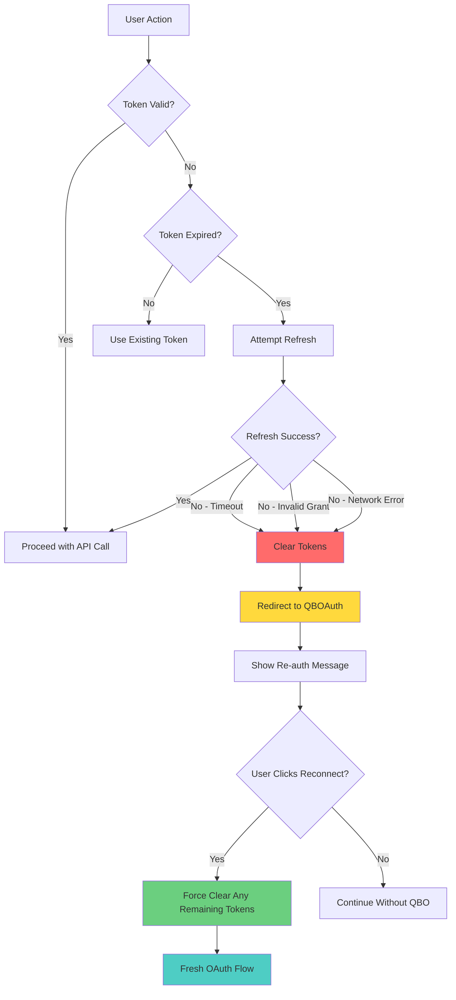

### Component-Level Error Handling

#### QBOAuth Component Enhancements
- **Force Clear Parameter**: `loginWithQuickBooks(forceClearTokens: boolean)`
- **Re-authentication Error State**: Displays specific error messages from failed operations
- **URL Parameter Support**: `?force=true` bypasses token checking for immediate re-auth
- **Location State Handling**: Receives error messages from Assessment redirect

#### Assessment Component Error Detection
- **Enhanced Error Keywords**: Detects "expired", "authentication", "reconnect"
- **Automatic Redirect**: Navigates to QBOAuth with descriptive error message
- **Service-Level Token Clearing**: No redundant clearing (handled by service layer)
- **Error Pass-through**: Preserves original error message for user context

### Code Standards
- **TypeScript**: Strict mode enabled, comprehensive type definitions
- **React**: Functional components with hooks, proper state management
- **Error Handling**: Comprehensive try-catch with structured logging
- **API Integration**: Rate limiting, retry logic, graceful degradation
- **Token Management**: Automatic clearing on critical failures, no stuck states
- **Environment Variables**: Strict validation, no hardcoded fallbacks
- **Timeout Protection**: 10-second timeout on all token operations
- **Error Recovery**: Automatic token clearing for non-retryable errors

### Professional Validation
- **CPA Methodology**: 5-pillar assessment aligned with professional standards
- **GAAP Compliance**: Chart of accounts and reconciliation validation
- **Audit Trail**: Complete logging for professional review requirements
- **Dual Reporting**: Business and technical audiences served appropriately

---

## 📋 Future Enhancement Roadmap

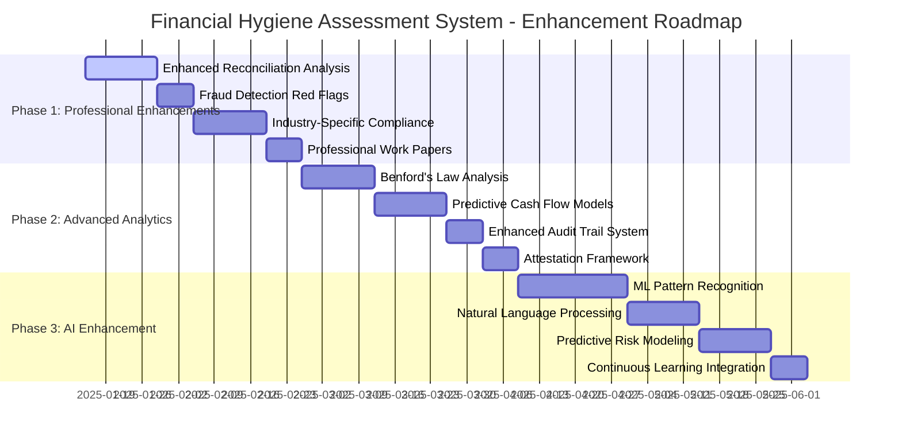

### Enhancement Details by Phase

#### Phase 1: Professional Enhancements (2-4 weeks)
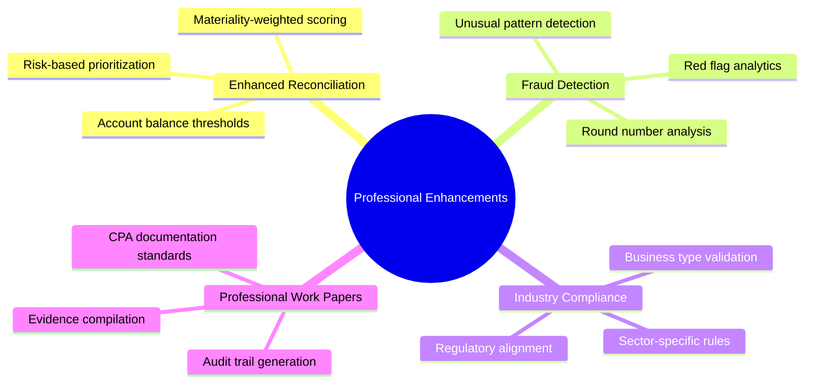

#### Phase 2: Advanced Analytics (4-6 weeks)
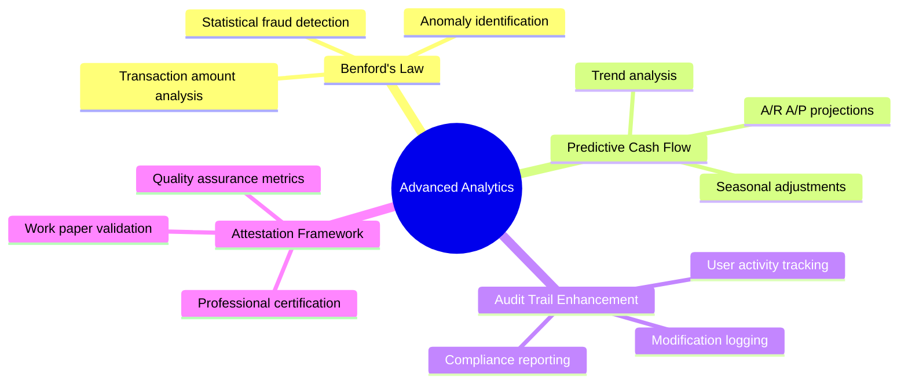

#### Phase 3: AI Enhancement (6-8 weeks)
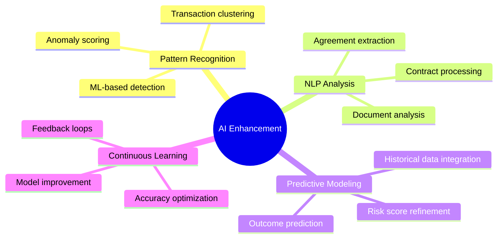

### Development Priority Matrix

| Feature | Business Impact | Technical Complexity | Professional Value | Priority Score |
|---------|----------------|---------------------|-------------------|----------------|
| **Enhanced Reconciliation** | High | Medium | High | 🟢 Critical |
| **Fraud Detection** | High | High | High | 🟢 Critical |
| **Industry Compliance** | Medium | Low | High | 🟡 Important |
| **Benford's Law Analysis** | Medium | High | Medium | 🟡 Important |
| **Predictive Cash Flow** | High | Medium | Medium | 🟡 Important |
| **ML Pattern Recognition** | Medium | Very High | Medium | 🟠 Future |
| **NLP Analysis** | Low | Very High | Low | 🟠 Future |

### Implementation Timeline

**Q1 2025: Foundation Enhancement**
- Complete Phase 1 professional features
- Establish fraud detection baseline
- Implement industry-specific validation

**Q2 2025: Analytics Integration**
- Deploy advanced statistical analysis
- Launch predictive modeling features
- Enhance professional compliance tools

**Q3 2025: AI-Powered Features**
- Integrate machine learning capabilities
- Implement continuous learning systems
- Deploy advanced pattern recognition

---

## 🔗 Additional Resources

- **Codebase**: `../src`
- **Methodology**: `docs/Financial Books Hygiene Assessment Methodology.pdf`
- **API Documentation**: [QuickBooks Online API Reference](https://developer.intuit.com/app/developer/qbo/docs/api/accounting)
- **Rate Limits**: [QBO API Rate Limiting](https://developer.intuit.com/app/developer/qbo/docs/develop/authentication-and-authorization/oauth-2.0#rate_limiting)

---

*This technical specification provides comprehensive guidance for developers, stakeholders, and financial professionals working with the Financial Books Hygiene Assessment system. For specific implementation details, refer to the individual service files and component documentation within the codebase.*
