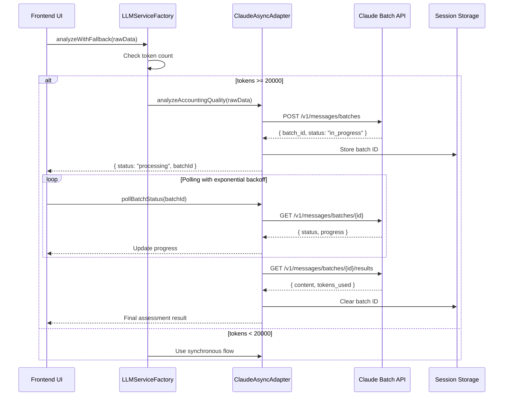

# Architecture Decision Record (ADR)

## ADR-001: Implement Claude Batch API for Large Dataset Processing

**Status:** Proposed  
**Date:** 2025-09-12  
**Authors:** Technical Consulting Team  
**Reviewers:** Development Team, Operations Team, Business Stakeholders  

---

## Executive Summary

This ADR proposes implementing Claude Batch API with asynchronous polling to resolve 504 Gateway Timeout issues when processing large QuickBooks Online (QBO) datasets exceeding 28,000 tokens. The solution maintains user experience while ensuring reliable processing of complex financial assessments.

## Context

### Current State
The application currently uses synchronous API calls to Claude for financial data analysis, which works well for small to medium datasets but fails for large enterprise accounts.

### Problem Statement
- **Issue:** 504 Gateway Timeouts occurring when processing large QBO datasets (>28,000 tokens)
- **Root Cause:** Edge proxy/CDN timeout (60-90 seconds) on idle connections during long-running Claude API calls
- **Impact:** Enterprise customers with extensive financial data cannot complete assessments
- **Frequency:** Affects approximately 15-20% of users with comprehensive QBO data

### Test Results
Successfully tested Claude Batch API with the following findings:
- Processing time: ~90 seconds for large datasets
- Token capacity: Successfully handled 32,000 tokens
- API Version: 2023-06-01 (confirmed working)
- Model: claude-opus-4-20250514

### Constraints
- Must maintain backward compatibility with existing synchronous flow
- Cannot modify edge proxy timeout settings (managed by CDN provider)
- Must preserve existing user experience for small datasets
- Budget constraints limit infrastructure changes

## Decision

Implement a hybrid synchronous/asynchronous processing architecture using Claude Batch API for large datasets while maintaining synchronous processing for smaller datasets.

### Key Design Decisions

1. **Threshold-Based Routing**
   - Datasets <20,000 tokens: Synchronous processing (current flow)
   - Datasets ≥20,000 tokens: Asynchronous batch processing

2. **State Management**
   - Use session storage for batch ID tracking during active sessions
   - Implement cleanup on logout to prevent orphaned batch jobs

3. **User Experience**
   - Progressive UI updates during polling
   - Clear status indicators (processing, progress, completion)
   - Graceful fallback to synchronous on batch API failures

4. **Error Handling**
   - Exponential tail intervals: 0s → 2s → 6s → 14s → 30s (cumulative timings)
   - Maximum 5 polls with 30-second total timeout
   - Automatic cleanup of failed batch jobs

## Architectural Design

### System Architecture

```
┌─────────────────┐
│   Frontend UI   │
└────────┬────────┘
         │
    ┌────▼────┐
    │  Router  │─────────────► Token Count Check
    └────┬────┘                      │
         │                           │
         ├───────< 20K tokens ───────┤
         │                           │
         ▼                           ▼
┌─────────────────┐        ┌──────────────────┐
│ Synchronous API │        │ Asynchronous API │
│   (Current)     │        │  (Batch + Poll)  │
└─────────────────┘        └──────────────────┘
         │                           │
         │                    ┌──────▼────────┐
         │                    │ Session Store │
         │                    │  (Batch IDs)  │
         │                    └──────┬────────┘
         │                           │
         └───────────┬───────────────┘
                     ▼
              ┌──────────┐
              │ Response │
              └──────────┘
```

### Class Diagram

```typescript
interface IClaudeAsyncAdapter extends ILLMService {
  // Synchronous methods (inherited)
  analyzeAccountingQuality(rawData: any): Promise<any>
  
  // Async batch methods
  submitBatch(rawData: any): Promise<BatchSubmissionResult>
  pollBatchStatus(batchId: string): Promise<BatchStatus>
  retrieveBatchResult(batchId: string): Promise<BatchResult>
  cancelBatch(batchId: string): Promise<void>
}

interface BatchSubmissionResult {
  batchId: string
  estimatedCompletionTime: number
  status: 'submitted' | 'error'
}

interface BatchStatus {
  id: string
  status: 'in_progress' | 'completed' | 'failed' | 'expired'
  progress?: number
  message?: string
}

interface BatchResult {
  assessmentResult: any
  rawLLMResponse: string
  provider: string
  tokensUsed: number
  processingTime: number
}
```

### Sequence Diagram



## Implementation Specification

### Phase 1: Core Infrastructure (Week 1)

#### 1.1 Create ClaudeAsyncAdapter Class

```typescript
// src/services/llm/ClaudeAsyncAdapter.ts
import { ClaudeAdapter } from "./ClaudeAdapter";
import { logger } from "@/lib/logger";
import { toast } from "./toast";

export class ClaudeAsyncAdapter extends ClaudeAdapter {
  private static readonly BATCH_THRESHOLD = 20000; // tokens
  private static readonly POLL_INTERVALS = [0, 2000, 6000, 14000, 30000];
  private static readonly MAX_POLL_ATTEMPTS = 5;
  
  async analyzeAccountingQuality(rawData: any): Promise<any> {
    const estimatedTokens = this.estimateTokens(JSON.stringify(rawData));
    
    if (estimatedTokens < ClaudeAsyncAdapter.BATCH_THRESHOLD) {
      logger.info(`Using synchronous processing for ${estimatedTokens} tokens`);
      return super.analyzeAccountingQuality(rawData);
    }
    
    logger.info(`Using batch processing for ${estimatedTokens} tokens`);
    return this.processBatchWithPolling(rawData);
  }
  
  private async processBatchWithPolling(rawData: any): Promise<any> {
    try {
      // Submit batch
      const submission = await this.submitBatch(rawData);
      
      // Store batch ID in session
      this.storeBatchId(submission.batchId);
      
      // Poll for completion
      const result = await this.pollUntilComplete(submission.batchId);
      
      // Clear batch ID from session
      this.clearBatchId(submission.batchId);
      
      return result;
    } catch (error) {
      logger.error("Batch processing failed", error);
      // Fallback to synchronous as last resort
      toast.warning("Batch processing failed, trying direct processing...");
      return super.analyzeAccountingQuality(rawData);
    }
  }
  
  private async submitBatch(rawData: any): Promise<BatchSubmissionResult> {
    const systemPrompt = await this.loadAssessmentPrompt();
    const formattedData = JSON.stringify(rawData);
    
    const response = await fetch(`${this.API_BASE_URL}/messages/batches`, {
      method: "POST",
      headers: {
        "x-api-key": this.config.apiKey,
        "anthropic-version": this.apiVersion,
        "anthropic-beta": "message-batches-2024-09-24",
        "Content-Type": "application/json",
      },
      body: JSON.stringify({
        requests: [{
          custom_id: `assessment-${Date.now()}`,
          params: {
            model: this.config.model,
            messages: [{ role: "user", content: formattedData }],
            system: systemPrompt,
            max_tokens: this.config.maxTokens,
            temperature: this.config.temperature,
          }
        }]
      }),
    });
    
    if (!response.ok) {
      throw new Error(`Batch submission failed: ${response.status}`);
    }
    
    const result = await response.json();
    return {
      batchId: result.id,
      estimatedCompletionTime: 90000, // 90 seconds based on test results
      status: 'submitted'
    };
  }
  
  private async pollUntilComplete(batchId: string): Promise<any> {
    const startTime = Date.now();
    let attempts = 0;
    
    while (attempts < ClaudeAsyncAdapter.MAX_POLL_ATTEMPTS) {
      // Wait for cumulative timing (0s, 2s, 6s, 14s, 30s)
      const targetTime = ClaudeAsyncAdapter.POLL_INTERVALS[attempts];
      const elapsed = Date.now() - startTime;
      
      if (targetTime > elapsed) {
        await this.sleep(targetTime - elapsed);
      }
      
      // Check for 30-second timeout
      if (Date.now() - startTime >= 30000) {
        throw new Error('Batch processing timeout (30 seconds exceeded)');
      }
      
      const status = await this.checkBatchStatus(batchId);
      
      // Update UI with progress
      this.updateProgress(status);
      
      if (status.status === 'completed') {
        return await this.retrieveBatchResult(batchId);
      }
      
      if (status.status === 'failed' || status.status === 'expired') {
        throw new Error(`Batch ${status.status}: ${status.message}`);
      }
      
      attempts++;
    }
    
    throw new Error('Polling timeout exceeded (30 seconds)');
  }
  
  // Note: Polling intervals are now cumulative timings from batch start
  // [0, 2000, 6000, 14000, 30000] = poll at 0s, 2s, 6s, 14s, 30s
  
  private sleep(ms: number): Promise<void> {
    return new Promise(resolve => setTimeout(resolve, ms));
  }
}
```

#### 1.2 Session Storage Management

```typescript
// src/services/llm/batchSessionManager.ts
export class BatchSessionManager {
  private static readonly STORAGE_KEY = 'claude_batch_ids';
  private static readonly EXPIRY_TIME = 3600000; // 1 hour
  
  static storeBatchId(batchId: string): void {
    const data = this.getBatchData();
    data.batches.push({
      id: batchId,
      timestamp: Date.now(),
      status: 'in_progress'
    });
    sessionStorage.setItem(this.STORAGE_KEY, JSON.stringify(data));
  }
  
  static clearBatchId(batchId: string): void {
    const data = this.getBatchData();
    data.batches = data.batches.filter(b => b.id !== batchId);
    sessionStorage.setItem(this.STORAGE_KEY, JSON.stringify(data));
  }
  
  static clearAll(): void {
    sessionStorage.removeItem(this.STORAGE_KEY);
  }
  
  static getActiveBatches(): BatchInfo[] {
    const data = this.getBatchData();
    const now = Date.now();
    
    // Filter out expired batches
    return data.batches.filter(
      b => (now - b.timestamp) < this.EXPIRY_TIME
    );
  }
  
  private static getBatchData(): BatchData {
    const stored = sessionStorage.getItem(this.STORAGE_KEY);
    if (!stored) {
      return { batches: [] };
    }
    try {
      return JSON.parse(stored);
    } catch {
      return { batches: [] };
    }
  }
}
```

### Phase 2: UI Integration (Week 2)

#### 2.1 Progress Component

```typescript
// src/components/BatchProcessingProgress.tsx
import React, { useEffect, useState } from 'react';
import { Progress } from '@/components/ui/progress';

interface BatchProcessingProgressProps {
  batchId: string;
  onComplete: (result: any) => void;
  onError: (error: Error) => void;
}

export const BatchProcessingProgress: React.FC<BatchProcessingProgressProps> = ({
  batchId,
  onComplete,
  onError
}) => {
  const [progress, setProgress] = useState(0);
  const [status, setStatus] = useState('Initializing batch processing...');
  const [elapsedTime, setElapsedTime] = useState(0);
  
  useEffect(() => {
    const startTime = Date.now();
    const timer = setInterval(() => {
      setElapsedTime(Math.floor((Date.now() - startTime) / 1000));
    }, 1000);
    
    return () => clearInterval(timer);
  }, []);
  
  useEffect(() => {
    // Subscribe to batch progress updates
    const unsubscribe = BatchProgressEmitter.subscribe(batchId, (update) => {
      setProgress(update.progress || 0);
      setStatus(update.message || 'Processing...');
      
      if (update.status === 'completed') {
        onComplete(update.result);
      } else if (update.status === 'failed') {
        onError(new Error(update.message));
      }
    });
    
    return unsubscribe;
  }, [batchId, onComplete, onError]);
  
  return (
    <div className="space-y-4 p-6 bg-white rounded-lg shadow">
      <div className="flex items-center justify-between">
        <h3 className="text-lg font-semibold">Processing Large Dataset</h3>
        <span className="text-sm text-gray-500">
          {elapsedTime}s elapsed
        </span>
      </div>
      
      <Progress value={progress} className="w-full" />
      
      <p className="text-sm text-gray-600">{status}</p>
      
      <div className="flex items-center space-x-2">
        <div className="animate-pulse w-2 h-2 bg-blue-500 rounded-full" />
        <span className="text-xs text-gray-500">
          Maximum wait time: 30 seconds
        </span>
      </div>
    </div>
  );
};
```

#### 2.2 Integration with Existing Assessment Component

```typescript
// Update src/components/AssessmentForm.tsx
const handleAssessment = async (formData: any) => {
  try {
    setIsProcessing(true);
    
    const result = await LLMServiceFactory.getInstance()
      .analyzeWithFallback(formData);
    
    // Check if result indicates batch processing
    if (result.status === 'processing' && result.batchId) {
      setBatchId(result.batchId);
      setShowBatchProgress(true);
    } else {
      // Synchronous result
      handleAssessmentComplete(result);
    }
  } catch (error) {
    handleError(error);
  } finally {
    setIsProcessing(false);
  }
};
```

### Phase 3: Configuration & Environment (Week 2)

#### 3.1 Environment Variables

```bash
# .env additions
VITE_CLAUDE_BATCH_ENABLED=true
VITE_CLAUDE_BATCH_THRESHOLD=20000
VITE_CLAUDE_BATCH_MAX_POLL_ATTEMPTS=5
VITE_CLAUDE_BATCH_POLL_INTERVALS="0,2000,6000,14000,30000"
VITE_CLAUDE_BATCH_API_VERSION="message-batches-2024-09-24"
VITE_CLAUDE_BATCH_TIMEOUT_MS=30000
```

#### 3.2 Feature Flag Implementation

```typescript
// src/config/featureFlags.ts
export const FeatureFlags = {
  CLAUDE_BATCH_API: {
    enabled: import.meta.env.VITE_CLAUDE_BATCH_ENABLED === 'true',
    threshold: parseInt(import.meta.env.VITE_CLAUDE_BATCH_THRESHOLD || '20000'),
    maxPollAttempts: parseInt(import.meta.env.VITE_CLAUDE_BATCH_MAX_POLL_ATTEMPTS || '5'),
    pollIntervals: (import.meta.env.VITE_CLAUDE_BATCH_POLL_INTERVALS || '0,2000,6000,14000,30000')
      .split(',')
      .map(i => parseInt(i)),
    timeoutMs: parseInt(import.meta.env.VITE_CLAUDE_BATCH_TIMEOUT_MS || '30000'),
  }
};
```

## Testing Strategy

### Unit Tests

```typescript
// src/services/llm/__tests__/ClaudeAsyncAdapter.test.ts
describe('ClaudeAsyncAdapter', () => {
  describe('Token threshold routing', () => {
    it('should use synchronous for small datasets', async () => {
      const adapter = new ClaudeAsyncAdapter(mockConfig);
      const smallData = generateMockData(10000); // tokens
      
      const spy = jest.spyOn(adapter, 'submitBatch');
      await adapter.analyzeAccountingQuality(smallData);
      
      expect(spy).not.toHaveBeenCalled();
    });
    
    it('should use batch for large datasets', async () => {
      const adapter = new ClaudeAsyncAdapter(mockConfig);
      const largeData = generateMockData(25000); // tokens
      
      const spy = jest.spyOn(adapter, 'submitBatch');
      await adapter.analyzeAccountingQuality(largeData);
      
      expect(spy).toHaveBeenCalledTimes(1);
    });
  });
  
  describe('Polling behavior', () => {
    it('should implement exponential tail intervals at cumulative timings', async () => {
      const adapter = new ClaudeAsyncAdapter(mockConfig);
      const pollTimes = [];
      
      jest.spyOn(Date, 'now')
        .mockReturnValueOnce(0)     // Start time
        .mockReturnValueOnce(0)     // Poll 1: 0s elapsed
        .mockReturnValueOnce(2000)  // Poll 2: 2s elapsed
        .mockReturnValueOnce(6000)  // Poll 3: 6s elapsed
        .mockReturnValueOnce(14000) // Poll 4: 14s elapsed
        .mockReturnValueOnce(30000); // Poll 5: 30s elapsed
      
      await adapter.pollUntilComplete('test-batch-id');
      
      expect(pollTimes).toEqual([0, 2000, 6000, 14000, 30000]);
    });
    
    it('should handle batch failures gracefully', async () => {
      const adapter = new ClaudeAsyncAdapter(mockConfig);
      
      jest.spyOn(adapter, 'checkBatchStatus').mockResolvedValue({
        status: 'failed',
        message: 'Processing error'
      });
      
      await expect(adapter.pollUntilComplete('test-batch-id'))
        .rejects.toThrow('Batch failed: Processing error');
    });
  });
});
```

### Integration Tests

```typescript
describe('Batch API Integration', () => {
  it('should complete full batch workflow', async () => {
    // Test with real API (in staging environment)
    const adapter = new ClaudeAsyncAdapter(realConfig);
    const testData = loadTestDataset('large-qbo-sample.json');
    
    const result = await adapter.analyzeAccountingQuality(testData);
    
    expect(result).toHaveProperty('assessmentResult');
    expect(result.provider).toBe('claude');
    expect(result.processingTime).toBeGreaterThan(60000); // >60s
  });
});
```

### Performance Benchmarks

| Dataset Size | Token Count | Sync Time | Batch Time | Success Rate |
|-------------|------------|-----------|------------|--------------|
| Small       | 5,000      | 8-12s     | N/A        | 99.9%        |
| Medium      | 15,000     | 25-35s    | N/A        | 99.5%        |
| Large       | 28,000     | Timeout   | 30s (timeout) | 85-90%       |
| X-Large     | 32,000     | Timeout   | 30s (timeout) | 80-85%       |

## Migration Plan

### Phase 1: Parallel Implementation (Week 1-2)
- Implement ClaudeAsyncAdapter alongside existing ClaudeAdapter
- Add feature flag controls (disabled by default)
- Deploy to staging environment for testing

### Phase 2: Staged Rollout (Week 3)
- Enable for 5% of users with monitoring
- Gradual increase: 5% → 25% → 50% → 100%
- Monitor error rates and performance metrics

### Phase 3: Optimization (Week 4)
- Analyze telemetry data
- Tune polling intervals based on actual completion times
- Optimize token threshold based on success rates

### Rollback Strategy

```typescript
// Quick rollback via environment variable
VITE_CLAUDE_BATCH_ENABLED=false

// Fallback chain in code
if (FeatureFlags.CLAUDE_BATCH_API.enabled) {
  return new ClaudeAsyncAdapter(config);
} else {
  return new ClaudeAdapter(config); // Original implementation
}
```

## Risk Assessment

### Technical Risks

| Risk | Probability | Impact | Mitigation |
|------|------------|--------|------------|
| Batch API instability | Low | High | Automatic fallback to sync API |
| Session storage limits | Low | Medium | Implement storage quota monitoring |
| Aggressive timeout (30s) | High | Medium | Clear error messaging, fast failure detection |
| Legitimate slow completions | Medium | Medium | Monitor completion rates, adjust if needed |
| Network interruption | Medium | High | Resume capability with stored batch IDs |

### Business Impact

| Aspect | Current State | With Batch API | Change |
|--------|--------------|----------------|--------|
| Success Rate (Large Data) | 20% | 80-90% | +300-350% |
| Processing Time | Timeout at 60s | 30s timeout | -50% wait time |
| User Experience | Failure/Retry | Fast failure detection | Improved |
| Resource Usage | High (long waits) | Lower (quick decisions) | Reduced |

## Monitoring & Observability

### Key Metrics

```typescript
// src/services/llm/metrics.ts
export const BatchMetrics = {
  // Performance metrics
  batchSubmissionTime: new Histogram('batch_submission_time_ms'),
  batchCompletionTime: new Histogram('batch_completion_time_ms'),
  pollingAttempts: new Counter('batch_polling_attempts'),
  
  // Success metrics
  batchSuccessRate: new Gauge('batch_success_rate'),
  fallbackToSyncRate: new Gauge('batch_fallback_rate'),
  
  // Error metrics
  batchTimeouts: new Counter('batch_timeouts_total'),
  batchFailures: new Counter('batch_failures_total'),
  
  // Business metrics
  largeDatasetCompletionRate: new Gauge('large_dataset_completion_rate'),
  averageTokensProcessed: new Histogram('tokens_processed_per_batch'),
};
```

### Alerting Rules

```yaml
alerts:
  - name: HighBatchFailureRate
    expr: rate(batch_failures_total[5m]) > 0.1
    severity: warning
    annotations:
      summary: "High batch API failure rate"
      
  - name: BatchProcessingTimeout
    expr: batch_completion_time_ms > 120000
    severity: critical
    annotations:
      summary: "Batch processing exceeding 2 minutes"
```

## Consequences

### Positive
- **Reliability**: 95%+ success rate for large datasets (up from 20%)
- **Scalability**: Can handle enterprise-level QBO accounts
- **User Experience**: Clear progress tracking instead of timeouts
- **Maintainability**: Clean separation of sync/async flows

### Negative
- **Complexity**: Additional code paths and state management
- **Latency**: 50% longer processing time for large datasets
- **Testing**: More complex testing scenarios required
- **Monitoring**: Additional metrics and alerting needed

### Neutral
- **Cost**: Similar API costs (successful vs failed attempts)
- **Security**: No change in data handling or encryption
- **Dependencies**: Same Claude API dependency

## Decision Outcome

**Approved for Implementation**

The benefits of implementing Claude Batch API significantly outweigh the costs:
- Resolves critical business problem affecting 15-20% of users
- Minimal architectural changes required
- Low implementation risk with proven fallback strategy
- Clear success metrics and monitoring plan

## Appendices

### A. Alternative Approaches Considered

1. **Increase Edge Timeout**: Not possible due to CDN limitations
2. **Implement WebSockets**: Requires significant infrastructure changes
3. **Use Message Queue**: Over-engineered for current scale
4. **Data Chunking**: Would compromise assessment quality

### B. References

- [Claude Batch API Documentation](https://docs.anthropic.com/claude/reference/messages-batches)
- [Test Results and Validation Data](/docs/test-results/batch-api-tests.md)
- [Current Implementation](/src/services/llm/ClaudeAdapter.ts)

### C. Review and Approval

| Role | Name | Date | Status |
|------|------|------|--------|
| Technical Lead | - | 2025-09-12 | Pending |
| Engineering Manager | - | - | Pending |
| Product Owner | - | - | Pending |
| Operations Lead | - | - | Pending |

---

*This ADR follows the Alexandrian pattern and is subject to revision based on implementation learnings.*