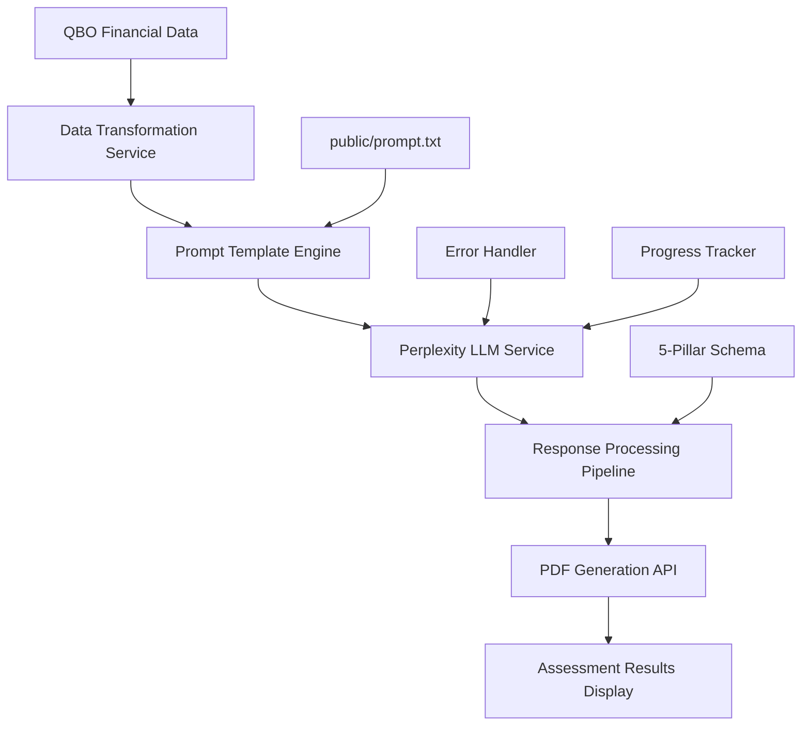

# Perplexity LLM Integration Architecture for Financial Books Hygiene Assessment

## Executive Summary

This document outlines the comprehensive architecture for integrating Perplexity LLM into the financial books hygiene assessment system. The integration follows the data flow: **QBO Data → Perplexity LLM → PDF Generation → Results Display**, using a custom system prompt and structured JSON responses.

## 1. LLM Integration Data Flow Architecture



## 2. LLM Service Layer Architecture

### Core LLM Service Interface

```typescript
// src/services/llmService.ts
export interface LLMAssessmentRequest {
  systemPrompt: string;
  userMessage: string;
  customerId?: string;
  dateRange: DateRange;
  metadata: {
    companyName: string;
    assessmentType: 'business' | 'bookkeeper';
    timestamp: string;
  };
}

export interface LLMAssessmentResponse {
  overallScore: number;
  category: 'EXCELLENT' | 'GOOD' | 'FAIR' | 'POOR' | 'CRITICAL';
  pillars: {
    accuracyReliability: PillarAssessment;
    completeness: PillarAssessment;
    compliance: PillarAssessment;
    consistency: PillarAssessment;
    timeliness: PillarAssessment;
    integrity: PillarAssessment;
  };
  criticalIssues: CriticalIssue[];
  recommendations: Recommendation[];
  confidence: number;
  analysisMetadata: {
    tokensUsed: number;
    processingTime: number;
    llmModel: string;
    assessmentDate: string;
  };
}

export interface PillarAssessment {
  score: number; // 0-100
  weight: number; // From requirements.md
  status: 'good' | 'warning' | 'critical';
  findings: string[];
  specificIssues: SpecificIssue[];
  recommendations: string[];
}

export interface CriticalIssue {
  id: string;
  pillar: string;
  severity: 'high' | 'medium' | 'low';
  problem: string;
  location: string;
  fix: string;
  estimatedTime: string;
  priority: number;
}

export interface SpecificIssue {
  type: string;
  description: string;
  affectedAccounts: string[];
  impact: 'financial' | 'compliance' | 'operational';
  urgency: 'immediate' | 'within_week' | 'within_month';
}

export interface Recommendation {
  category: string;
  action: string;
  priority: 'high' | 'medium' | 'low';
  timeFrame: string;
  expectedImpact: string;
  steps: string[];
}
```

### Perplexity API Client

```typescript
// src/services/perplexityClient.ts
export class PerplexityLLMClient {
  private readonly API_BASE_URL = 'https://api.perplexity.ai';
  private readonly API_KEY: string;
  private readonly REQUEST_TIMEOUT = 180000; // 3 minutes
  private readonly MAX_RETRIES = 3;
  
  constructor() {
    this.API_KEY = import.meta.env.VITE_PERPLEXITY_API_KEY;
    if (!this.API_KEY) {
      throw new Error('VITE_PERPLEXITY_API_KEY environment variable is required');
    }
  }

  async generateAssessment(request: LLMAssessmentRequest): Promise<LLMAssessmentResponse> {
    const payload = {
      model: 'llama-3.1-sonar-large-128k-online', // or 'llama-3.1-sonar-huge-128k-online'
      messages: [
        {
          role: 'system',
          content: request.systemPrompt
        },
        {
          role: 'user',
          content: request.userMessage
        }
      ],
      max_tokens: 4000,
      temperature: 0.2, // Low temperature for consistent financial analysis
      top_p: 0.9,
      return_citations: false,
      search_domain_filter: ["perplexity.ai"], // Optional: limit search scope
      return_images: false,
      return_related_questions: false,
      search_recency_filter: "month", // Recent financial data practices
      top_k: 0,
      stream: false,
      presence_penalty: 0,
      frequency_penalty: 1
    };

    return this.executeRequest(payload, request.metadata);
  }

  private async executeRequest(
    payload: any, 
    metadata: LLMAssessmentRequest['metadata']
  ): Promise<LLMAssessmentResponse> {
    const startTime = Date.now();
    
    for (let attempt = 1; attempt <= this.MAX_RETRIES; attempt++) {
      try {
        const response = await fetch(`${this.API_BASE_URL}/chat/completions`, {
          method: 'POST',
          headers: {
            'Authorization': `Bearer ${this.API_KEY}`,
            'Content-Type': 'application/json',
          },
          body: JSON.stringify(payload),
          signal: AbortSignal.timeout(this.REQUEST_TIMEOUT)
        });

        if (!response.ok) {
          throw new LLMError(
            response.status === 429 ? LLMErrorType.RATE_LIMIT : LLMErrorType.API_ERROR,
            `API request failed: ${response.status} ${response.statusText}`,
            { response: await response.text() },
            response.status === 429 || response.status >= 500
          );
        }

        const data = await response.json();
        const processingTime = Date.now() - startTime;

        return this.parseAssessmentResponse(data, {
          processingTime,
          tokensUsed: data.usage?.total_tokens || 0,
          llmModel: payload.model,
          assessmentDate: new Date().toISOString(),
          ...metadata
        });

      } catch (error) {
        if (attempt === this.MAX_RETRIES) {
          throw this.handleLLMError(error);
        }
        
        // Exponential backoff for retries
        await new Promise(resolve => setTimeout(resolve, Math.pow(2, attempt) * 1000));
      }
    }
  }

  private parseAssessmentResponse(
    data: any, 
    metadata: any
  ): LLMAssessmentResponse {
    try {
      const content = data.choices[0]?.message?.content;
      if (!content) {
        throw new Error('No content in LLM response');
      }

      // Parse JSON from LLM response
      const jsonMatch = content.match(/\{[\s\S]*\}/);
      if (!jsonMatch) {
        throw new Error('No JSON found in LLM response');
      }

      const assessmentData = JSON.parse(jsonMatch[0]);
      
      // Validate and structure the response
      return {
        ...assessmentData,
        analysisMetadata: metadata
      };

    } catch (error) {
      throw new LLMError(
        LLMErrorType.PARSING_ERROR,
        'Failed to parse LLM assessment response',
        { originalResponse: data, error: error.message }
      );
    }
  }

  private handleLLMError(error: any): LLMError {
    if (error instanceof LLMError) {
      return error;
    }

    if (error.name === 'AbortError') {
      return new LLMError(
        LLMErrorType.TIMEOUT_ERROR,
        'LLM request timed out',
        { timeout: this.REQUEST_TIMEOUT }
      );
    }

    return new LLMError(
      LLMErrorType.UNKNOWN_ERROR,
      `Unexpected LLM error: ${error.message}`,
      { originalError: error }
    );
  }
}

// Error handling
export enum LLMErrorType {
  API_ERROR = 'API_ERROR',
  RATE_LIMIT = 'RATE_LIMIT',
  TIMEOUT_ERROR = 'TIMEOUT_ERROR',
  PARSING_ERROR = 'PARSING_ERROR',
  VALIDATION_ERROR = 'VALIDATION_ERROR',
  UNKNOWN_ERROR = 'UNKNOWN_ERROR'
}

export class LLMError extends Error {
  constructor(
    public type: LLMErrorType,
    message: string,
    public metadata?: any,
    public retryable: boolean = false
  ) {
    super(message);
    this.name = 'LLMError';
  }
}
```

## 3. Data Transformation Pipeline

### QBO Data to LLM User Message Transformer

```typescript
// src/services/dataTransformationService.ts
export class QBODataTransformationService {
  
  async transformFinancialDataToLLMInput(
    financialData: QBOFinancialReports,
    selectedCustomer?: QBOCustomer,
    dateRange?: DateRange
  ): Promise<string> {
    
    const transformedData = {
      companyInfo: this.transformCompanyInfo(financialData.companyInfo),
      financialSummary: this.transformFinancialSummary(financialData),
      chartOfAccounts: this.transformChartOfAccounts(financialData.chartOfAccounts),
      transactionAnalysis: this.transformTransactionData(financialData.generalLedger),
      reconciliationStatus: this.transformReconciliationData(financialData.bankReconciliation),
      agingReports: this.transformAgingReports(financialData),
      complianceData: this.transformComplianceData(financialData),
      customerScope: selectedCustomer ? this.transformCustomerInfo(selectedCustomer) : null,
      assessmentPeriod: dateRange || this.getDefaultDateRange()
    };

    return this.generateStructuredUserMessage(transformedData);
  }

  private transformCompanyInfo(companyInfo: QBOCompanyInfo): any {
    return {
      name: companyInfo.CompanyName,
      legalName: companyInfo.LegalName,
      fiscalYearStart: companyInfo.FiscalYearStartMonth,
      country: companyInfo.Country,
      businessType: 'General Business', // Could be enhanced with QBO industry data
      setupDate: companyInfo.MetaData.CreateTime
    };
  }

  private transformFinancialSummary(data: QBOFinancialReports): any {
    return {
      profitAndLoss: this.extractPLSummary(data.profitAndLoss),
      balanceSheet: this.extractBSSummary(data.balanceSheet),
      trialBalance: this.extractTBSummary(data.trialBalance),
      keyMetrics: this.calculateKeyMetrics(data)
    };
  }

  private transformChartOfAccounts(accounts: QBOAccount[]): any {
    const accountsByType = accounts.reduce((acc, account) => {
      if (!acc[account.AccountType]) {
        acc[account.AccountType] = [];
      }
      acc[account.AccountType].push({
        id: account.Id,
        name: account.Name,
        balance: account.CurrentBalance,
        active: account.Active,
        hasSubAccounts: account.SubAccount,
        classification: account.Classification
      });
      return acc;
    }, {} as Record<string, any[]>);

    return {
      totalAccounts: accounts.length,
      activeAccounts: accounts.filter(a => a.Active).length,
      inactiveAccounts: accounts.filter(a => !a.Active).length,
      accountsByType,
      structureAnalysis: this.analyzeAccountStructure(accounts)
    };
  }

  private transformTransactionData(journalEntries: QBOJournalEntry[]): any {
    return {
      totalTransactions: journalEntries.length,
      dateRange: this.getTransactionDateRange(journalEntries),
      adjustmentEntries: journalEntries.filter(je => je.Adjustment).length,
      averageTransactionSize: this.calculateAverageTransactionSize(journalEntries),
      transactionPatterns: this.analyzeTransactionPatterns(journalEntries),
      suspiciousEntries: this.identifySuspiciousEntries(journalEntries)
    };
  }

  private transformReconciliationData(reconciliationReport: QBOReport): any {
    // Extract reconciliation status from cash flow report
    return {
      lastReconciliationDate: this.extractLastReconciliationDate(reconciliationReport),
      unreconciledItems: this.extractUnreconciledItems(reconciliationReport),
      reconciliationFrequency: this.assessReconciliationFrequency(reconciliationReport),
      cashFlowAccuracy: this.assessCashFlowAccuracy(reconciliationReport)
    };
  }

  private transformAgingReports(data: QBOFinancialReports): any {
    return {
      accountsReceivable: {
        totalOutstanding: this.extractARTotal(data.arAgingSummary),
        agingBuckets: this.extractARAgingBuckets(data.arAgingSummary),
        overduePercentage: this.calculateOverduePercentage(data.arAgingSummary),
        customerIssues: this.identifyCustomerIssues(data.arAgingDetail)
      },
      accountsPayable: {
        totalOutstanding: this.extractAPTotal(data.apAgingSummary),
        agingBuckets: this.extractAPAgingBuckets(data.apAgingSummary),
        overduePercentage: this.calculateAPOverduePercentage(data.apAgingSummary),
        vendorIssues: this.identifyVendorIssues(data.apAgingDetail)
      }
    };
  }

  private generateStructuredUserMessage(transformedData: any): string {
    return `
# Financial Books Hygiene Assessment Request

## Company Overview
**Company:** ${transformedData.companyInfo.name}
**Assessment Period:** ${transformedData.assessmentPeriod.start_date} to ${transformedData.assessmentPeriod.end_date}
**Fiscal Year Start:** ${transformedData.companyInfo.fiscalYearStart || 'January'}
${transformedData.customerScope ? `**Customer Scope:** ${transformedData.customerScope.name}` : '**Scope:** All Customers'}

## Financial Data Summary

### Profit & Loss Analysis
${JSON.stringify(transformedData.financialSummary.profitAndLoss, null, 2)}

### Balance Sheet Analysis  
${JSON.stringify(transformedData.financialSummary.balanceSheet, null, 2)}

### Chart of Accounts Structure
${JSON.stringify(transformedData.chartOfAccounts, null, 2)}

### Transaction Analysis
${JSON.stringify(transformedData.transactionAnalysis, null, 2)}

### Bank Reconciliation Status
${JSON.stringify(transformedData.reconciliationStatus, null, 2)}

### Aging Reports Analysis
${JSON.stringify(transformedData.agingReports, null, 2)}

## Assessment Requirements

Please analyze this financial data according to the 5-pillar methodology and provide a comprehensive assessment with:

1. **Overall Hygiene Score (0-100)** with category classification
2. **Individual Pillar Scores** for each of the 6 dimensions:
   - Accuracy & Reliability (25% weight)
   - Completeness (20% weight) 
   - Compliance (20% weight)
   - Consistency (15% weight)
   - Timeliness (10% weight)
   - Integrity (10% weight)

3. **Critical Issues** with specific locations and fix instructions
4. **Actionable Recommendations** prioritized by impact and urgency
5. **Confidence Level** in the assessment based on data completeness

Return the analysis as structured JSON matching the expected response schema.
`;
  }

  // Helper methods for data extraction and analysis
  private extractPLSummary(plReport: QBOReport): any {
    // Implementation to extract key P&L metrics
    return {};
  }

  private calculateKeyMetrics(data: QBOFinancialReports): any {
    // Implementation to calculate financial ratios and KPIs
    return {};
  }

  // Additional helper methods...
}
```

## 4. Prompt Template System

### Prompt Template Engine

```typescript
// src/services/promptTemplateService.ts
export class PromptTemplateService {
  private systemPrompt: string | null = null;

  async loadSystemPrompt(): Promise<string> {
    if (this.systemPrompt) {
      return this.systemPrompt;
    }

    try {
      const response = await fetch('/prompt.txt');
      if (!response.ok) {
        throw new Error(`Failed to load prompt: ${response.statusText}`);
      }
      
      this.systemPrompt = await response.text();
      return this.systemPrompt;
      
    } catch (error) {
      throw new Error(`Failed to load system prompt from /prompt.txt: ${error.message}`);
    }
  }

  // Validate that prompt contains required placeholders/sections
  validatePrompt(prompt: string): boolean {
    const requiredSections = [
      'accuracy',
      'completeness', 
      'compliance',
      'consistency',
      'timeliness',
      'integrity'
    ];

    return requiredSections.every(section => 
      prompt.toLowerCase().includes(section.toLowerCase())
    );
  }

  // Inject dynamic context into prompt if needed
  enrichPrompt(basePrompt: string, context: any): string {
    let enrichedPrompt = basePrompt;
    
    // Add assessment type specific instructions
    if (context.assessmentType === 'business') {
      enrichedPrompt += '\n\nFocus on business-impact language suitable for business owners.';
    } else if (context.assessmentType === 'bookkeeper') {
      enrichedPrompt += '\n\nProvide technical implementation details suitable for bookkeepers.';
    }
    
    // Add company context
    if (context.companyName) {
      enrichedPrompt = enrichedPrompt.replace(
        /\[COMPANY_NAME\]/g, 
        context.companyName
      );
    }

    return enrichedPrompt;
  }
}
```

## 5. Main LLM Assessment Service

### Core Assessment Service

```typescript
// src/services/llmAssessmentService.ts
export class LLMAssessmentService {
  private perplexityClient: PerplexityLLMClient;
  private dataTransformer: QBODataTransformationService;
  private promptService: PromptTemplateService;

  constructor() {
    this.perplexityClient = new PerplexityLLMClient();
    this.dataTransformer = new QBODataTransformationService();
    this.promptService = new PromptTemplateService();
  }

  async assessFinancialData(
    financialData: QBOFinancialReports,
    options: {
      selectedCustomer?: QBOCustomer;
      dateRange?: DateRange;
      assessmentType: 'business' | 'bookkeeper';
      progressCallback?: (progress: AssessmentProgress) => void;
    }
  ): Promise<LLMAssessmentResponse> {
    
    const { selectedCustomer, dateRange, assessmentType, progressCallback } = options;

    // Progress tracking
    const updateProgress = (step: string, percentage: number, details?: string) => {
      if (progressCallback) {
        progressCallback({
          currentStep: step,
          percentage,
          details,
          timestamp: new Date().toISOString()
        });
      }
    };

    try {
      // Step 1: Load system prompt
      updateProgress('Loading assessment prompt template...', 10);
      const systemPrompt = await this.promptService.loadSystemPrompt();
      
      if (!this.promptService.validatePrompt(systemPrompt)) {
        throw new LLMError(
          LLMErrorType.VALIDATION_ERROR,
          'System prompt validation failed - missing required assessment pillars'
        );
      }

      // Step 2: Transform financial data
      updateProgress('Transforming financial data for analysis...', 25);
      const userMessage = await this.dataTransformer.transformFinancialDataToLLMInput(
        financialData,
        selectedCustomer,
        dateRange
      );

      // Step 3: Enrich prompt with context
      updateProgress('Preparing assessment context...', 35);
      const enrichedPrompt = this.promptService.enrichPrompt(systemPrompt, {
        assessmentType,
        companyName: financialData.companyInfo.CompanyName,
        customerScope: selectedCustomer?.DisplayName || 'All Customers'
      });

      // Step 4: Call Perplexity LLM
      updateProgress('Analyzing financial data with AI...', 45);
      const assessmentRequest: LLMAssessmentRequest = {
        systemPrompt: enrichedPrompt,
        userMessage,
        customerId: selectedCustomer?.Id,
        dateRange: dateRange || this.getDefaultDateRange(),
        metadata: {
          companyName: financialData.companyInfo.CompanyName,
          assessmentType,
          timestamp: new Date().toISOString()
        }
      };

      updateProgress('Waiting for AI assessment results...', 70);
      const llmResponse = await this.perplexityClient.generateAssessment(assessmentRequest);

      // Step 5: Validate and process response
      updateProgress('Processing assessment results...', 85);
      const validatedResponse = this.validateAssessmentResponse(llmResponse);
      
      // Step 6: Enrich with additional analysis
      updateProgress('Finalizing assessment report...', 95);
      const enrichedResponse = await this.enrichAssessmentResponse(
        validatedResponse,
        financialData,
        assessmentType
      );

      updateProgress('Assessment complete!', 100);
      return enrichedResponse;

    } catch (error) {
      updateProgress('Assessment failed', 0, error.message);
      throw error;
    }
  }

  private validateAssessmentResponse(response: LLMAssessmentResponse): LLMAssessmentResponse {
    // Validate overall score is between 0-100
    if (response.overallScore < 0 || response.overallScore > 100) {
      throw new LLMError(
        LLMErrorType.VALIDATION_ERROR,
        `Invalid overall score: ${response.overallScore}. Must be between 0-100.`
      );
    }

    // Validate all required pillars are present
    const requiredPillars = ['accuracyReliability', 'completeness', 'compliance', 'consistency', 'timeliness', 'integrity'];
    for (const pillar of requiredPillars) {
      if (!response.pillars[pillar]) {
        throw new LLMError(
          LLMErrorType.VALIDATION_ERROR,
          `Missing required pillar assessment: ${pillar}`
        );
      }
    }

    // Validate pillar scores and weights
    for (const [pillarName, pillarData] of Object.entries(response.pillars)) {
      if (pillarData.score < 0 || pillarData.score > 100) {
        throw new LLMError(
          LLMErrorType.VALIDATION_ERROR,
          `Invalid pillar score for ${pillarName}: ${pillarData.score}`
        );
      }
    }

    return response;
  }

  private async enrichAssessmentResponse(
    response: LLMAssessmentResponse,
    financialData: QBOFinancialReports,
    assessmentType: 'business' | 'bookkeeper'
  ): Promise<LLMAssessmentResponse> {
    
    // Add calculated weighted score verification
    const calculatedScore = this.calculateWeightedScore(response.pillars);
    const scoreDifference = Math.abs(calculatedScore - response.overallScore);
    
    if (scoreDifference > 5) {
      console.warn(`Score calculation mismatch: LLM=${response.overallScore}, Calculated=${calculatedScore}`);
    }

    // Add data completeness metrics
    const dataCompletenessMetrics = this.calculateDataCompleteness(financialData);
    
    // Enhance critical issues with QBO navigation paths
    const enhancedIssues = response.criticalIssues.map(issue => ({
      ...issue,
      qboPath: this.generateQBONavigationPath(issue.location),
      estimatedBusinessImpact: this.estimateBusinessImpact(issue, financialData)
    }));

    return {
      ...response,
      criticalIssues: enhancedIssues,
      analysisMetadata: {
        ...response.analysisMetadata,
        dataCompleteness: dataCompletenessMetrics,
        scoreVerification: {
          llmScore: response.overallScore,
          calculatedScore,
          variance: scoreDifference
        }
      }
    };
  }

  private calculateWeightedScore(pillars: any): number {
    const weights = {
      accuracyReliability: 0.25,
      completeness: 0.20,
      compliance: 0.20,
      consistency: 0.15,
      timeliness: 0.10,
      integrity: 0.10
    };

    let weightedSum = 0;
    for (const [pillarName, weight] of Object.entries(weights)) {
      if (pillars[pillarName]) {
        weightedSum += pillars[pillarName].score * weight;
      }
    }

    return Math.round(weightedSum);
  }

  private calculateDataCompleteness(financialData: QBOFinancialReports): any {
    return {
      accountsCount: financialData.chartOfAccounts.length,
      transactionsCount: financialData.generalLedger.length,
      customersCount: financialData.customers.length,
      hasBalanceSheet: !!financialData.balanceSheet,
      hasProfitLoss: !!financialData.profitAndLoss,
      hasTrialBalance: !!financialData.trialBalance,
      completenessScore: this.calculateCompletenessScore(financialData)
    };
  }

  private getDefaultDateRange(): DateRange {
    const now = new Date();
    const currentYear = now.getFullYear();
    return {
      start_date: `${currentYear}-01-01`,
      end_date: `${currentYear}-12-31`
    };
  }
}

export interface AssessmentProgress {
  currentStep: string;
  percentage: number;
  details?: string;
  timestamp: string;
}
```

## 6. Assessment Component Integration

### Updated Assessment Component Flow

```typescript
// Updated Assessment.tsx integration points
const Assessment = ({ /* props */ }: AssessmentProps) => {
  const [llmAssessmentService] = useState(() => new LLMAssessmentService());
  const [assessmentProgress, setAssessmentProgress] = useState<AssessmentProgress | null>(null);
  const [llmAssessmentResults, setLLMAssessmentResults] = useState<LLMAssessmentResponse | null>(null);

  const handleAnalysisWithLLM = async () => {
    if (!selectedCustomer) return;
    
    setIsAnalyzing(true);
    setAssessmentProgress(null);

    try {
      // Fetch QBO data first
      const financialData = await qboService.fetchAllFinancialData(
        selectedCustomer.Id,
        dateRange,
        (progress) => {
          console.log(`QBO Progress: ${progress.percentage.toFixed(1)}% - ${progress.currentStep}`);
        }
      );

      // Run LLM assessment
      const assessmentResults = await llmAssessmentService.assessFinancialData(
        financialData,
        {
          selectedCustomer,
          dateRange,
          assessmentType: viewMode,
          progressCallback: (progress) => {
            setAssessmentProgress(progress);
          }
        }
      );

      setLLMAssessmentResults(assessmentResults);
      
      // Generate PDF report
      await generatePDFReport(assessmentResults);
      
      setCurrentStep('results');

    } catch (error) {
      console.error('LLM Assessment failed:', error);
      // Handle different error types appropriately
      if (error instanceof LLMError) {
        setErrorMessage(`Assessment failed: ${error.message}`);
      } else {
        setErrorMessage('An unexpected error occurred during assessment');
      }
    } finally {
      setIsAnalyzing(false);
      setAssessmentProgress(null);
    }
  };

  const generatePDFReport = async (assessmentResults: LLMAssessmentResponse) => {
    try {
      const pdfResponse = await fetch('/api/generate-pdf', {
        method: 'POST',
        headers: {
          'Content-Type': 'application/json',
        },
        body: JSON.stringify({
          assessmentResults,
          companyInfo: financialData.companyInfo,
          reportType: viewMode
        })
      });

      if (!pdfResponse.ok) {
        throw new Error('PDF generation failed');
      }

      const pdfBlob = await pdfResponse.blob();
      const pdfUrl = URL.createObjectURL(pdfBlob);
      
      // Handle PDF download or display
      setGeneratedPDFUrl(pdfUrl);
      
    } catch (error) {
      console.error('PDF generation failed:', error);
      // Non-blocking error - assessment results still available
    }
  };

  // Rest of component...
};
```

## 7. Error Handling and Fallback Strategies

### Comprehensive Error Handling

```typescript
// src/services/errorHandlingService.ts
export class LLMErrorHandlingService {
  
  async handleLLMFailure(
    error: LLMError,
    financialData: QBOFinancialReports,
    fallbackOptions: {
      useRuleBasedFallback: boolean;
      useCachedResponse: boolean;
      allowPartialAssessment: boolean;
    }
  ): Promise<LLMAssessmentResponse> {
    
    switch (error.type) {
      case LLMErrorType.RATE_LIMIT:
        return this.handleRateLimitError(error, financialData, fallbackOptions);
        
      case LLMErrorType.TIMEOUT_ERROR:
        return this.handleTimeoutError(error, financialData, fallbackOptions);
        
      case LLMErrorType.API_ERROR:
        return this.handleAPIError(error, financialData, fallbackOptions);
        
      case LLMErrorType.PARSING_ERROR:
        return this.handleParsingError(error, financialData, fallbackOptions);
        
      default:
        return this.generateFallbackAssessment(financialData);
    }
  }

  private async handleRateLimitError(
    error: LLMError,
    financialData: QBOFinancialReports,
    options: any
  ): Promise<LLMAssessmentResponse> {
    
    // Implement exponential backoff retry
    const retryDelays = [5000, 15000, 45000]; // 5s, 15s, 45s
    
    for (const delay of retryDelays) {
      await new Promise(resolve => setTimeout(resolve, delay));
      
      try {
        // Retry with reduced token usage
        return await this.retryWithReducedTokens(financialData);
      } catch (retryError) {
        if (!(retryError instanceof LLMError) || retryError.type !== LLMErrorType.RATE_LIMIT) {
          throw retryError;
        }
      }
    }
    
    // Final fallback
    return this.generateFallbackAssessment(financialData);
  }

  private generateFallbackAssessment(
    financialData: QBOFinancialReports
  ): LLMAssessmentResponse {
    
    // Rule-based assessment as fallback
    const ruleBasedScores = this.calculateRuleBasedScores(financialData);
    
    return {
      overallScore: ruleBasedScores.overall,
      category: this.categorizeScore(ruleBasedScores.overall),
      pillars: ruleBasedScores.pillars,
      criticalIssues: this.identifyRuleBasedIssues(financialData),
      recommendations: this.generateBasicRecommendations(ruleBasedScores),
      confidence: 0.6, // Lower confidence for rule-based fallback
      analysisMetadata: {
        tokensUsed: 0,
        processingTime: 0,
        llmModel: 'rule-based-fallback',
        assessmentDate: new Date().toISOString(),
        fallbackReason: 'LLM service unavailable'
      }
    };
  }
}
```

## 8. Token Optimization and Cost Management

### Token Usage Optimization

```typescript
// src/services/tokenOptimizationService.ts
export class TokenOptimizationService {
  private readonly MAX_TOKENS_PER_REQUEST = 120000; // Conservative limit
  private readonly TARGET_RESPONSE_TOKENS = 4000;
  
  optimizeUserMessage(originalMessage: string): string {
    const tokenEstimate = this.estimateTokenCount(originalMessage);
    
    if (tokenEstimate <= this.MAX_TOKENS_PER_REQUEST - this.TARGET_RESPONSE_TOKENS) {
      return originalMessage;
    }
    
    // Apply optimization strategies
    return this.applyCompressionStrategies(originalMessage);
  }

  private applyCompressionStrategies(message: string): string {
    let optimizedMessage = message;
    
    // 1. Summarize large JSON objects
    optimizedMessage = this.summarizeJSONObjects(optimizedMessage);
    
    // 2. Remove redundant whitespace
    optimizedMessage = this.compressWhitespace(optimizedMessage);
    
    // 3. Prioritize critical data points
    optimizedMessage = this.prioritizeImportantData(optimizedMessage);
    
    // 4. Use abbreviated account names where possible
    optimizedMessage = this.abbreviateAccountNames(optimizedMessage);
    
    return optimizedMessage;
  }

  estimateTokenCount(text: string): number {
    // Rough estimation: 4 characters per token
    return Math.ceil(text.length / 4);
  }

  calculateCostEstimate(inputTokens: number, outputTokens: number): number {
    // Perplexity pricing (as of 2024)
    const INPUT_COST_PER_1K_TOKENS = 0.002; // $0.002 per 1K tokens
    const OUTPUT_COST_PER_1K_TOKENS = 0.006; // $0.006 per 1K tokens
    
    const inputCost = (inputTokens / 1000) * INPUT_COST_PER_1K_TOKENS;
    const outputCost = (outputTokens / 1000) * OUTPUT_COST_PER_1K_TOKENS;
    
    return inputCost + outputCost;
  }
}
```

## 9. Progress Tracking and User Experience

### Real-time Progress Implementation

```typescript
// Enhanced progress tracking in Assessment component
const ProgressTracker: React.FC<{ progress: AssessmentProgress | null }> = ({ progress }) => {
  if (!progress) return null;

  return (
    <div className="bg-blue-50 border border-blue-200 rounded-lg p-6">
      <div className="flex items-center mb-4">
        <ReloadIcon className="w-6 h-6 text-blue-600 animate-spin mr-3" />
        <div className="flex-1">
          <h3 className="text-lg font-semibold text-blue-900">AI Assessment in Progress</h3>
          <p className="text-blue-700">{progress.currentStep}</p>
          {progress.details && (
            <p className="text-sm text-blue-600 mt-1">{progress.details}</p>
          )}
        </div>
      </div>
      
      <div className="w-full bg-blue-200 rounded-full h-3 mb-2">
        <div 
          className="bg-blue-600 h-3 rounded-full transition-all duration-300 ease-out"
          style={{ width: `${progress.percentage}%` }}
        />
      </div>
      
      <div className="flex justify-between text-sm text-blue-600">
        <span>{progress.percentage.toFixed(1)}% Complete</span>
        <span>{new Date(progress.timestamp).toLocaleTimeString()}</span>
      </div>
    </div>
  );
};
```

## 10. PDF Generation Integration

### PDF Service Interface

```typescript
// src/services/pdfGenerationService.ts
export interface PDFGenerationRequest {
  assessmentResults: LLMAssessmentResponse;
  companyInfo: QBOCompanyInfo;
  reportType: 'business' | 'bookkeeper';
  customizations?: {
    logo?: string;
    branding?: {
      primaryColor: string;
      secondaryColor: string;
    };
    additionalSections?: string[];
  };
}

export class PDFGenerationService {
  private readonly PDF_API_ENDPOINT: string;
  
  constructor() {
    this.PDF_API_ENDPOINT = import.meta.env.VITE_PDF_GENERATION_API_URL;
  }

  async generateAssessmentReport(request: PDFGenerationRequest): Promise<Blob> {
    const response = await fetch(this.PDF_API_ENDPOINT, {
      method: 'POST',
      headers: {
        'Content-Type': 'application/json',
      },
      body: JSON.stringify(request)
    });

    if (!response.ok) {
      throw new Error(`PDF generation failed: ${response.status} ${response.statusText}`);
    }

    const contentType = response.headers.get('content-type');
    if (!contentType || !contentType.includes('application/pdf')) {
      throw new Error('Invalid response type - expected PDF');
    }

    return await response.blob();
  }
}
```

This comprehensive architecture provides a robust, scalable foundation for integrating Perplexity LLM into your financial assessment system with proper error handling, cost optimization, and user experience considerations.