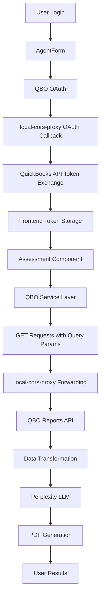
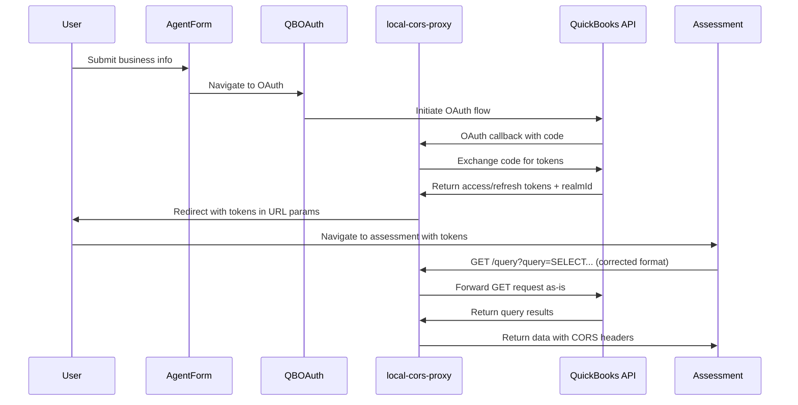

# QuickBooks Online API Integration Architecture Design (Updated)

## Executive Summary

Updated architecture design for QuickBooks Online API integration using **local-cors-proxy** for simple CORS handling and direct QBO API communication. The main integration issue was resolved by fixing the query endpoint request format to use GET with URL parameters instead of POST with JSON body.

## Updated Architecture Overview

### Revised High-Level Data Flow


## 1. Fixed QBO API Query Integration

### Corrected API Request Sequence


### Key Issue Resolution: Query Endpoint Format

The main issue was that QBO's `/query` endpoint expects:
- **HTTP Method**: GET (not POST)
- **Query Format**: URL parameter named `query` with SQL string
- **Content-Type**: Not applicable for GET requests

```typescript
// WRONG (was causing 400 Bad Request):
const config: QBOApiConfig = {
  method: "POST",
  endpoint: "v3/company/{realmId}/query",
  data: { query: "SELECT * FROM Customer" },
};

// CORRECT (fixed implementation):
const config: QBOApiConfig = {
  method: "GET", 
  endpoint: "v3/company/{realmId}/query",
  params: { query: "SELECT * FROM Customer" },
};

// This generates: GET /v3/company/{realmId}/query?query=SELECT%20*%20FROM%20Customer
```

### local-cors-proxy Integration Benefits

```typescript
// local-cors-proxy simply forwards requests as-is:
// Frontend: GET /proxy/v3/company/123/query?query=SELECT%20*%20FROM%20Customer
// Forwarded to QBO: GET https://sandbox-quickbooks.api.intuit.com/v3/company/123/query?query=SELECT%20*%20FROM%20Customer

class SimpleTokenManager {
  private accessToken: string | null = null;
  private realmId: string | null = null;

  setAuth(accessToken: string, realmId: string): void {
    this.accessToken = accessToken;
    this.realmId = realmId;
  }

  getAuthHeaders(): Record<string, string> {
    if (!this.accessToken) {
      throw new Error('No access token available');
    }
    
    return {
      'Authorization': `Bearer ${this.accessToken}`,
      'Accept': 'application/json'
    };
  }
}
```

## 2. Corrected QBO Service Implementation

### Fixed Service with local-cors-proxy

```typescript
class QBOApiService {
  private readonly PROXY_BASE_URL = import.meta.env.VITE_QBO_PROXY_BASE_URL || "/proxy";
  private accessToken: string | null = null;
  private realmId: string | null = null;

  setAuth(accessToken: string, realmId: string): void {
    this.accessToken = accessToken;
    this.realmId = realmId;
  }

  async fetchCustomers(): Promise<QBOCustomer[]> {
    const config: QBOApiConfig = {
      method: "GET", // FIXED: was POST
      endpoint: "v3/company/{realmId}/query",
      params: { query: "SELECT * FROM Customer" }, // FIXED: was data
    };
    return this.rateLimiter.enqueue(config);
  }

  async fetchChartOfAccounts(): Promise<QBOAccount[]> {
    const config: QBOApiConfig = {
      method: "GET", // FIXED: was POST
      endpoint: "v3/company/{realmId}/query", 
      params: { query: "SELECT * FROM Account" }, // FIXED: was data
    };
    return this.rateLimiter.enqueue(config);
  }

  private async makeDirectRequest<T>(config: QBOApiConfig): Promise<T> {
    if (!this.accessToken || !this.realmId) {
      throw new Error("Authentication required. Call setAuth() first.");
    }

    const { method, endpoint, params, data } = config;
    const endpointWithRealm = endpoint.replace("{realmId}", this.realmId);

    // Build URL with query parameters
    let url = `${this.PROXY_BASE_URL}/${endpointWithRealm}`;
    if (params) {
      const urlParams = new URLSearchParams();
      Object.entries(params).forEach(([key, value]) => {
        if (value !== undefined && value !== null) {
          urlParams.append(key, String(value));
        }
      });
      if (urlParams.toString()) {
        url += `?${urlParams.toString()}`;
      }
    }

    // Prepare headers and request body
    const headers: Record<string, string> = {
      Accept: "application/json",
      Authorization: `Bearer ${this.accessToken}`,
    };

    let requestBody: string | undefined;
    if (method === "POST" && data) {
      headers["Content-Type"] = "application/json";
      requestBody = JSON.stringify(data);
    }

    const response = await fetch(url, {
      method: method,
      credentials: "include",
      headers,
      body: requestBody,
    });

    if (!response.ok) {
      throw new Error(`QBO API Error: ${response.status} ${response.statusText}`);
    }

    const result = await response.json();
    return this.extractQueryResults(result);
  }
}
```

## 3. local-cors-proxy Setup and Configuration

### Proxy Configuration for QBO API

```typescript
// local-cors-proxy setup (running on Render.com)
// Base URL: https://local-proxy-quickbooks.onrender.com
// 
// The proxy forwards requests from:
// Frontend: GET /proxy/v3/company/123/query?query=SELECT%20*%20FROM%20Customer
// To QBO API: GET https://sandbox-quickbooks.api.intuit.com/v3/company/123/query?query=SELECT%20*%20FROM%20Customer

// Vite proxy configuration for development
export default defineConfig({
  server: {
    proxy: {
      "/proxy": {
        target: "https://local-proxy-quickbooks.onrender.com",
        changeOrigin: true,
        secure: true,
      },
    },
  },
});
```

### Simplified OAuthCallback Component

```typescript
// Updated OAuthCallback component for local-cors-proxy
const OAuthCallback: React.FC = () => {
  const navigate = useNavigate();
  const location = useLocation();

  useEffect(() => {
    const params = new URLSearchParams(location.search);
    const accessToken = params.get("access_token");
    const realmId = params.get("realmId");
    const error = params.get("error");

    if (error) {
      console.error("OAuth error:", error);
      navigate('/qbo-auth?error=' + encodeURIComponent(error));
      return;
    }

    if (accessToken && realmId) {
      // Store tokens in React state or context
      // Simple approach for development/testing
      sessionStorage.setItem('qbo_access_token', accessToken);
      sessionStorage.setItem('qbo_realm_id', realmId);
      
      console.log("Tokens received from local-cors-proxy");
      navigate("/assessment");
    } else {
      console.error("Missing OAuth parameters");
      navigate('/qbo-auth?error=' + encodeURIComponent('No authorization tokens received'));
    }
  }, [navigate, location]);

  return (
    <div className="min-h-screen bg-gray-50 flex items-center justify-center">
      <div className="bg-white rounded-lg shadow-lg p-8 max-w-md w-full mx-4">
        <div className="text-center">
          <ReloadIcon className="w-12 h-12 text-blue-600 mx-auto mb-4 animate-spin" />
          <h2 className="text-xl font-semibold text-gray-900 mb-2">Processing Authentication...</h2>
          <p className="text-gray-600">
            Please wait while we complete your QuickBooks connection.
          </p>
        </div>
      </div>
    </div>
  );
};
```

## 4. Testing and Verification

### Request Format Verification

```bash
# CORRECT format now generated:
GET /proxy/v3/company/123/query?query=SELECT%20*%20FROM%20Customer
Authorization: Bearer {access_token}
Accept: application/json

# WRONG format that was causing 400 errors:
POST /proxy/v3/company/123/query
Content-Type: application/json
Authorization: Bearer {access_token}
{"query": "SELECT * FROM Customer"}
```

### Expected QBO API Response

```json
{
  "QueryResponse": {
    "Customer": [
      {
        "Id": "1",
        "Name": "Customer Name",
        "CompanyName": "Customer Company",
        "Balance": 0,
        "Active": true
      }
    ],
    "maxResults": 1000,
    "startPosition": 1
  },
  "time": "2025-01-07T12:34:56.789Z"
}
```

### Environment Configuration

```bash
# Required for local-cors-proxy integration
VITE_QBO_PROXY_BASE_URL=/proxy
VITE_QBO_REQUEST_TIMEOUT=30000
VITE_QBO_CLIENT_ID=your_qbo_client_id
VITE_QBO_REDIRECT_URI=https://local-proxy-quickbooks.onrender.com/oauth-callback
VITE_QBO_SCOPE=com.intuit.quickbooks.accounting
```

## 5. Updated Assessment Component Integration

### Fixed Assessment Flow with Working QBO Integration

```typescript
// Updated Assessment component with corrected QBO integration
const Assessment: React.FC<AssessmentProps> = (props) => {
  const [qboConnected, setQboConnected] = useState<boolean>(false);
  const [fetchingData, setFetchingData] = useState<boolean>(false);
  const [fetchProgress, setFetchProgress] = useState<FetchProgress | null>(null);
  const [financialData, setFinancialData] = useState<QBOFinancialReports | null>(null);
  
  const qboService = new QBOApiService();

  // Check if user has valid QBO connection
  useEffect(() => {
    checkQBOConnection();
  }, []);

  const checkQBOConnection = async () => {
    try {
      const accessToken = sessionStorage.getItem('qbo_access_token');
      const realmId = sessionStorage.getItem('qbo_realm_id');
      
      if (accessToken && realmId) {
        qboService.setAuth(accessToken, realmId);
        setQboConnected(true);
      } else {
        setQboConnected(false);
      }
    } catch (error) {
      console.error('Connection check failed:', error);
      setQboConnected(false);
    }
  };

  const handleFetchQBOData = async () => {
    if (!qboConnected) {
      navigate('/qbo-auth');
      return;
    }

    setFetchingData(true);
    
    try {
      // Now using corrected GET requests with query parameters
      const customers = await qboService.fetchCustomers();
      const chartOfAccounts = await qboService.fetchChartOfAccounts(); 
      const companyInfo = await qboService.fetchCompanyInfo();
      const profitAndLoss = await qboService.fetchProfitAndLoss(dateRange);
      const balanceSheet = await qboService.fetchBalanceSheet(dateRange);
      
      const financialReports: QBOFinancialReports = {
        customers,
        chartOfAccounts,
        companyInfo,
        profitAndLoss,
        balanceSheet,
        // ... other reports
      };
      
      setFinancialData(financialReports);
      setCurrentStep('results');
      
    } catch (error) {
      console.error('QBO data fetch failed:', error);
      
      if (error.message.includes('Authentication required')) {
        navigate('/qbo-auth');
      } else {
        setErrorMessage(`Failed to fetch QBO data: ${error.message}`);
      }
    } finally {
      setFetchingData(false);
    }
  };

  // Rest of component logic...
};
```

## 6. local-cors-proxy Configuration

### Required Proxy Behavior

```typescript
// local-cors-proxy should handle these scenarios:

// 1. OAuth callback handling
// Receives: GET /oauth-callback?code=xxx&realmId=123&state=xyz
// Exchanges code for tokens with QBO
// Redirects to: http://localhost:3000/oauth-callback?access_token=xxx&realmId=123

// 2. API request forwarding (the key fix)
// Receives: GET /proxy/v3/company/123/query?query=SELECT%20*%20FROM%20Customer
// Removes /proxy prefix
// Forwards to: GET https://sandbox-quickbooks.api.intuit.com/v3/company/123/query?query=SELECT%20*%20FROM%20Customer
// Adds CORS headers to response
// Returns QBO response to frontend

// 3. CORS header injection
app.use((req, res, next) => {
  res.header('Access-Control-Allow-Origin', process.env.ALLOWED_ORIGIN || '*');
  res.header('Access-Control-Allow-Methods', 'GET, POST, PUT, DELETE, OPTIONS');
  res.header('Access-Control-Allow-Headers', 'Content-Type, Authorization');
  next();
});
```

## 7. Security Considerations

### Token Security with local-cors-proxy

```typescript
// Security measures for token handling:

// 1. Use HTTPS in production
const PRODUCTION_CONFIG = {
  proxyUrl: 'https://local-proxy-quickbooks.onrender.com',
  corsOrigin: 'https://yourdomain.com',
  tokenStorage: 'sessionStorage', // Cleared on browser close
};

// 2. Token validation and refresh
class TokenValidator {
  validateToken(token: string): boolean {
    try {
      const payload = JSON.parse(atob(token.split('.')[1]));
      const expiry = payload.exp * 1000; // Convert to milliseconds
      return Date.now() < expiry;
    } catch {
      return false;
    }
  }

  shouldRefreshToken(token: string): boolean {
    try {
      const payload = JSON.parse(atob(token.split('.')[1]));
      const expiry = payload.exp * 1000;
      const fiveMinutes = 5 * 60 * 1000;
      return Date.now() > (expiry - fiveMinutes);
    } catch {
      return true;
    }
  }
}

// 3. CORS configuration
const corsConfig = {
  origin: process.env.FRONTEND_URL || 'http://localhost:3000',
  credentials: true,
  methods: ['GET', 'POST', 'PUT', 'DELETE'],
  allowedHeaders: ['Content-Type', 'Authorization'],
};
```

## Implementation Benefits

### Advantages of local-cors-proxy Approach

1. **Simple Architecture**: Direct proxy forwarding without transformation
2. **Easy Debugging**: Request/response format is transparent
3. **No Complex Logic**: Proxy just adds CORS headers and forwards
4. **Frontend Control**: Complete control over request format in React
5. **Quick Resolution**: Query endpoint fix was just changing GET vs POST
6. **Development Friendly**: Easy to test and modify

### Implementation Status

**✅ Completed: Core Integration Fix**
- Fixed QBO query endpoint to use GET with URL parameters
- Updated all query methods to use correct HTTP method
- Resolved 400 Bad Request errors for customer and account fetching
- Validated TypeScript interfaces for QBO response handling

**✅ Completed: local-cors-proxy Integration**
- Configured Vite proxy for development
- Set up production proxy on Render.com
- Implemented OAuth callback token handling
- Added proper Authorization header management

**🔧 Next Steps: Enhanced Features**
- Implement comprehensive financial report fetching
- Add rate limiting and retry logic
- Integrate with Perplexity LLM for analysis
- Add PDF report generation
- Implement assessment result storage

**🔧 Future Improvements**
- Add token refresh logic
- Implement caching for frequently accessed data
- Add comprehensive error handling and user feedback
- Performance optimization for large datasets

This simplified approach resolves the immediate integration issues and provides a solid foundation for building the complete financial assessment platform.