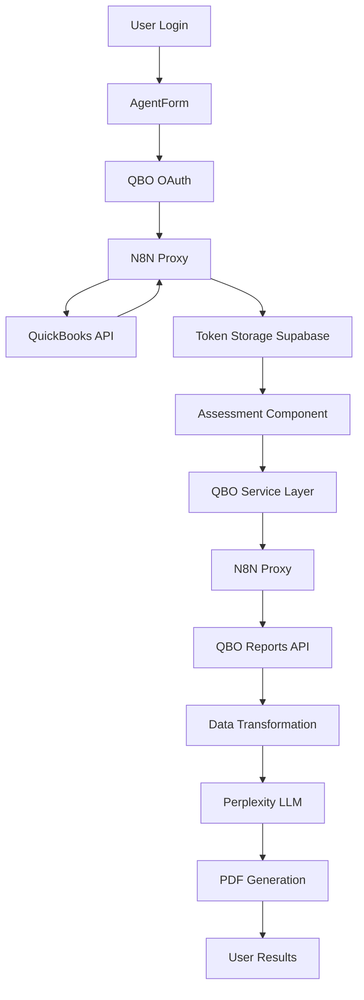
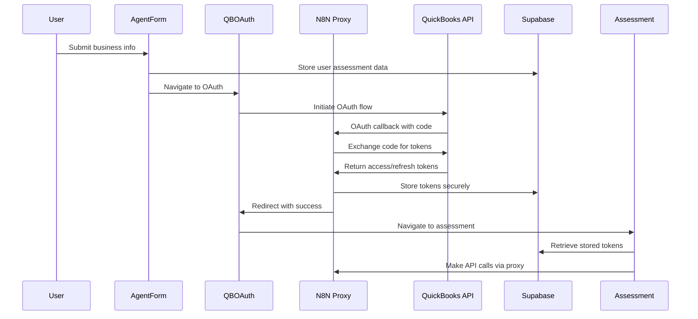

# QuickBooks Online API Integration Architecture Design

## Executive Summary

This document outlines the comprehensive architecture for integrating QuickBooks Online (QBO) API with our Financial Books Hygiene Assessment platform. The design focuses on a generic proxy-based approach, robust token management via Supabase, and seamless integration with Perplexity LLM and PDF generation services.

## Current State Analysis

### Existing Architecture
- **Authentication:** Clerk for user authentication + QBO OAuth 2.0
- **Data Flow:** LandingPage → AgentForm → QBOAuth → OAuthCallback → Assessment
- **Token Storage:** React state (needs migration to Supabase)
- **Data Sources:** Mock data in Assessment.tsx (needs replacement)

### Current Supabase Schema
```sql
user_authenticated (bool)
user_id (string | uuid)  
token (base64)
refresh_token (base64)
realmID (uuid)
```

## Architecture Overview

### High-Level Data Flow


## 1. OAuth 2.0 Flow Architecture

### Enhanced OAuth Flow with Supabase Storage



### Token Storage Strategy

```typescript
// Enhanced Supabase Schema
interface QBOTokens {
  id: uuid;
  user_id: string; // Clerk user ID
  access_token: string; // encrypted
  refresh_token: string; // encrypted
  realm_id: string; // QuickBooks company ID
  token_type: string; // "bearer"
  expires_at: timestamp;
  scope: string; // "com.intuit.quickbooks.accounting"
  created_at: timestamp;
  updated_at: timestamp;
  is_active: boolean;
}

interface UserAssessments {
  id: uuid;
  user_id: string; // Clerk user ID
  qbo_token_id: uuid; // foreign key to QBOTokens
  first_name: string;
  last_name: string;
  email: string;
  company: string;
  business_type: string;
  assessment_status: 'pending' | 'in_progress' | 'completed' | 'failed';
  created_at: timestamp;
  updated_at: timestamp;
}
```

## 2. Generic QBO API Service Architecture

### Proxy Service Layer

```typescript
// Core QBO Service Interface
interface QBOApiService {
  // Generic proxy method
  proxyCall<T>(config: QBOApiConfig): Promise<QBOApiResponse<T>>;
  
  // Specific data fetching methods
  getCompanyInfo(): Promise<CompanyInfo>;
  getReports(reportTypes: QBOReportType[]): Promise<QBOReportData[]>;
  getCustomers(): Promise<Customer[]>;
  getVendors(): Promise<Vendor[]>;
  getAccounts(): Promise<Account[]>;
}

interface QBOApiConfig {
  method: 'GET' | 'POST' | 'PUT' | 'DELETE';
  endpoint: string; // e.g., 'reports/ProfitAndLoss'
  params?: Record<string, any>;
  data?: any;
  realmId?: string;
}

interface QBOApiResponse<T> {
  success: boolean;
  data?: T;
  error?: string;
  rateLimitRemaining?: number;
  retryAfter?: number;
}
```

### N8N Proxy Integration

```typescript
class QBOProxyService implements QBOApiService {
  private readonly PROXY_BASE_URL = 'https://n8n-1-102-1-c1zi.onrender.com/webhook/e40348b4-6806-41ef-8d48-e711fdc5ad90/proxy';
  
  async proxyCall<T>(config: QBOApiConfig): Promise<QBOApiResponse<T>> {
    const { method, endpoint, params, data, realmId } = config;
    
    // Get tokens from Supabase
    const tokens = await this.getStoredTokens();
    
    if (!tokens || this.isTokenExpired(tokens)) {
      await this.refreshToken();
      tokens = await this.getStoredTokens();
    }
    
    const proxyUrl = `${this.PROXY_BASE_URL}/${endpoint}`;
    const queryParams = new URLSearchParams({
      method,
      realmId: realmId || tokens.realm_id,
      access_token: tokens.access_token,
      refresh_token: tokens.refresh_token,
      expires_in: tokens.expires_at.toString(),
      query: JSON.stringify(params || {})
    });
    
    const response = await fetch(`${proxyUrl}?${queryParams}`, {
      method: 'POST',
      headers: { 'Content-Type': 'application/json' },
      body: data ? JSON.stringify(data) : undefined
    });
    
    return this.handleProxyResponse<T>(response);
  }
  
  private async handleProxyResponse<T>(response: Response): Promise<QBOApiResponse<T>> {
    if (!response.ok) {
      if (response.status === 401) {
        // Token expired, attempt refresh
        await this.refreshToken();
        throw new Error('TOKEN_EXPIRED');
      }
      if (response.status === 429) {
        // Rate limit exceeded
        const retryAfter = response.headers.get('Retry-After');
        throw new Error(`RATE_LIMIT_EXCEEDED:${retryAfter}`);
      }
      throw new Error(`API_ERROR:${response.status}`);
    }
    
    const data = await response.json();
    return {
      success: true,
      data,
      rateLimitRemaining: this.parseRateLimitHeaders(response),
      retryAfter: response.headers.get('Retry-After') ? parseInt(response.headers.get('Retry-After')!) : undefined
    };
  }
}
```

## 3. Financial Data Fetching Architecture

### Report Types and Endpoints

```typescript
enum QBOReportType {
  PROFIT_AND_LOSS = 'ProfitAndLoss',
  BALANCE_SHEET = 'BalanceSheet',
  GENERAL_LEDGER = 'GeneralLedger',
  TRIAL_BALANCE = 'TrialBalance',
  CASH_FLOW = 'CashFlow',
  AR_AGING_SUMMARY = 'AgedReceivables',
  AR_AGING_DETAIL = 'AgedReceivableDetail',
  AP_AGING_SUMMARY = 'AgedPayables',
  AP_AGING_DETAIL = 'AgedPayableDetail',
  CHART_OF_ACCOUNTS = 'accounts',
  BANK_RECONCILIATION = 'BankReconciliation',
  AUDIT_LOG = 'AuditLog'
}

interface ReportConfig {
  reportType: QBOReportType;
  dateRange: {
    start_date: string;
    end_date: string;
  };
  summarize_column_by?: string;
  include_subaccounts?: boolean;
  sort_order?: 'ascend' | 'descend';
}
```

### Progressive Data Fetching Strategy

```typescript
class FinancialDataFetcher {
  private qboService: QBOApiService;
  private rateLimiter: RateLimiter;
  
  async fetchAllReports(
    reportConfigs: ReportConfig[],
    onProgress?: (progress: FetchProgress) => void
  ): Promise<FinancialDataSet> {
    const results: FinancialDataSet = {};
    const totalReports = reportConfigs.length;
    let completedReports = 0;
    
    // Prioritized fetching - critical reports first
    const priorityOrder = this.getPriorityOrder(reportConfigs);
    
    for (const config of priorityOrder) {
      try {
        await this.rateLimiter.checkLimit();
        
        const reportData = await this.fetchSingleReport(config);
        results[config.reportType] = reportData;
        
        completedReports++;
        onProgress?.({
          completed: completedReports,
          total: totalReports,
          current: config.reportType,
          percentage: (completedReports / totalReports) * 100
        });
        
        // Yield control for UI updates
        await new Promise(resolve => setTimeout(resolve, 100));
        
      } catch (error) {
        if (error.message.includes('RATE_LIMIT_EXCEEDED')) {
          const retryAfter = this.parseRetryAfter(error.message);
          await this.waitForRateLimit(retryAfter);
          // Retry the same report
          continue;
        }
        
        // Log error but continue with other reports
        console.error(`Failed to fetch ${config.reportType}:`, error);
        results[config.reportType] = { error: error.message };
      }
    }
    
    return results;
  }
  
  private getPriorityOrder(configs: ReportConfig[]): ReportConfig[] {
    const priority = [
      QBOReportType.PROFIT_AND_LOSS,
      QBOReportType.BALANCE_SHEET,
      QBOReportType.CHART_OF_ACCOUNTS,
      QBOReportType.TRIAL_BALANCE,
      QBOReportType.AR_AGING_SUMMARY,
      QBOReportType.AP_AGING_SUMMARY,
      // ... other reports
    ];
    
    return configs.sort((a, b) => {
      const aIndex = priority.indexOf(a.reportType);
      const bIndex = priority.indexOf(b.reportType);
      return (aIndex === -1 ? 999 : aIndex) - (bIndex === -1 ? 999 : bIndex);
    });
  }
}
```

### Rate Limiting Strategy

```typescript
class QBORateLimiter {
  private readonly MAX_REQUESTS_PER_MINUTE = 450;
  private readonly WINDOW_SIZE_MS = 60000; // 1 minute
  private requestTimes: number[] = [];
  
  async checkLimit(): Promise<void> {
    const now = Date.now();
    
    // Remove requests older than the window
    this.requestTimes = this.requestTimes.filter(
      time => now - time < this.WINDOW_SIZE_MS
    );
    
    if (this.requestTimes.length >= this.MAX_REQUESTS_PER_MINUTE) {
      const oldestRequest = Math.min(...this.requestTimes);
      const waitTime = this.WINDOW_SIZE_MS - (now - oldestRequest);
      
      if (waitTime > 0) {
        await new Promise(resolve => setTimeout(resolve, waitTime));
        return this.checkLimit(); // Recursive check after waiting
      }
    }
    
    this.requestTimes.push(now);
  }
  
  getRemainingRequests(): number {
    const now = Date.now();
    const recentRequests = this.requestTimes.filter(
      time => now - time < this.WINDOW_SIZE_MS
    ).length;
    
    return Math.max(0, this.MAX_REQUESTS_PER_MINUTE - recentRequests);
  }
}
```

## 4. Data Transformation and Normalization

### Standardized Data Structures

```typescript
interface NormalizedFinancialData {
  companyInfo: CompanyInfo;
  reportingPeriod: {
    startDate: string;
    endDate: string;
    fiscalYear: number;
  };
  financialStatements: {
    profitAndLoss: StandardizedPL;
    balanceSheet: StandardizedBS;
    cashFlow: StandardizedCF;
  };
  detailedReports: {
    generalLedger: GLEntry[];
    trialBalance: TBEntry[];
    chartOfAccounts: Account[];
  };
  agingReports: {
    arAging: AgingData;
    apAging: AgingData;
  };
  auditTrail: AuditEntry[];
}

interface DataTransformer {
  transformQBOResponse(
    reportType: QBOReportType,
    rawData: any
  ): Promise<NormalizedReport>;
  
  validateDataQuality(data: NormalizedReport): DataQualityReport;
  aggregateFinancialData(reports: NormalizedReport[]): NormalizedFinancialData;
}
```

## 5. Integration Points Architecture

### Perplexity LLM Integration

```typescript
interface PerplexityService {
  analyzeFinancialData(
    data: NormalizedFinancialData,
    analysisType: 'business' | 'technical'
  ): Promise<FinancialAnalysis>;
}

class PerplexityAnalyzer implements PerplexityService {
  async analyzeFinancialData(
    data: NormalizedFinancialData,
    analysisType: 'business' | 'technical'
  ): Promise<FinancialAnalysis> {
    const prompt = this.buildAnalysisPrompt(data, analysisType);
    
    const response = await fetch('https://api.perplexity.ai/chat/completions', {
      method: 'POST',
      headers: {
        'Authorization': `Bearer ${process.env.PERPLEXITY_API_KEY}`,
        'Content-Type': 'application/json'
      },
      body: JSON.stringify({
        model: 'llama-3.1-sonar-large-128k-online',
        messages: [{ role: 'user', content: prompt }],
        temperature: 0.2,
        max_tokens: 4000
      })
    });
    
    return this.parseAnalysisResponse(await response.json(), analysisType);
  }
}
```

### PDF Generation Service

```typescript
interface PDFGenerationService {
  generateAssessmentReport(
    analysis: FinancialAnalysis,
    businessData: UserAssessment
  ): Promise<PDFDocument>;
}

class AssessmentPDFGenerator implements PDFGenerationService {
  async generateAssessmentReport(
    analysis: FinancialAnalysis,
    businessData: UserAssessment
  ): Promise<PDFDocument> {
    const template = analysis.analysisType === 'business' 
      ? BusinessOwnerTemplate 
      : BookkeeperTemplate;
      
    return await template.generate({
      companyName: businessData.company,
      analysisDate: new Date().toISOString(),
      overallScore: analysis.overallScore,
      pillarScores: analysis.pillarScores,
      criticalIssues: analysis.criticalIssues,
      recommendations: analysis.recommendations
    });
  }
}
```

## 6. Error Handling and Recovery

### Comprehensive Error Strategy

```typescript
enum QBOErrorType {
  TOKEN_EXPIRED = 'TOKEN_EXPIRED',
  RATE_LIMIT_EXCEEDED = 'RATE_LIMIT_EXCEEDED',
  NETWORK_ERROR = 'NETWORK_ERROR',
  API_ERROR = 'API_ERROR',
  DATA_TRANSFORMATION_ERROR = 'DATA_TRANSFORMATION_ERROR'
}

class QBOErrorHandler {
  async handleError(error: QBOError, context: ErrorContext): Promise<ErrorResolution> {
    switch (error.type) {
      case QBOErrorType.TOKEN_EXPIRED:
        return await this.handleTokenExpiry(context);
      
      case QBOErrorType.RATE_LIMIT_EXCEEDED:
        return await this.handleRateLimit(error, context);
      
      case QBOErrorType.NETWORK_ERROR:
        return await this.handleNetworkError(error, context);
      
      default:
        return this.handleGenericError(error, context);
    }
  }
  
  private async handleTokenExpiry(context: ErrorContext): Promise<ErrorResolution> {
    try {
      await this.qboService.refreshToken();
      return {
        action: 'RETRY',
        message: 'Token refreshed successfully',
        retryable: true
      };
    } catch (refreshError) {
      return {
        action: 'RE_AUTHENTICATE',
        message: 'Please reconnect your QuickBooks account',
        retryable: false
      };
    }
  }
}
```

## 7. Performance and Caching Strategy

### Multi-Level Caching

```typescript
interface CacheStrategy {
  // Level 1: Token caching (Supabase)
  tokenCache: TokenCacheManager;
  
  // Level 2: Report data caching (temporary)
  reportCache: ReportCacheManager;
  
  // Level 3: Analysis caching (persistent)
  analysisCache: AnalysisCacheManager;
}

class SmartCacheManager {
  private readonly REPORT_CACHE_TTL = 5 * 60 * 1000; // 5 minutes
  private readonly ANALYSIS_CACHE_TTL = 24 * 60 * 60 * 1000; // 24 hours
  
  async getCachedReport(
    reportType: QBOReportType,
    dateRange: DateRange,
    realmId: string
  ): Promise<CachedReport | null> {
    const cacheKey = this.generateCacheKey(reportType, dateRange, realmId);
    const cached = await this.reportCache.get(cacheKey);
    
    if (cached && !this.isCacheExpired(cached, this.REPORT_CACHE_TTL)) {
      return cached;
    }
    
    return null;
  }
}
```

## 8. Security Best Practices

### Token Security

```typescript
class TokenSecurityManager {
  // Encrypt tokens before storing in Supabase
  async encryptToken(token: string): Promise<string> {
    const cipher = crypto.createCipher('aes-256-gcm', process.env.ENCRYPTION_KEY!);
    let encrypted = cipher.update(token, 'utf8', 'hex');
    encrypted += cipher.final('hex');
    return encrypted;
  }
  
  // Decrypt tokens when retrieving from Supabase
  async decryptToken(encryptedToken: string): Promise<string> {
    const decipher = crypto.createDecipher('aes-256-gcm', process.env.ENCRYPTION_KEY!);
    let decrypted = decipher.update(encryptedToken, 'hex', 'utf8');
    decrypted += decipher.final('utf8');
    return decrypted;
  }
  
  // Token rotation strategy
  async rotateTokenIfNeeded(tokenData: QBOTokens): Promise<boolean> {
    const expiryTime = new Date(tokenData.expires_at).getTime();
    const currentTime = Date.now();
    const timeUntilExpiry = expiryTime - currentTime;
    
    // Refresh if less than 24 hours until expiry
    if (timeUntilExpiry < 24 * 60 * 60 * 1000) {
      await this.refreshToken(tokenData);
      return true;
    }
    
    return false;
  }
}
```

## 9. TypeScript Interfaces and Contracts

### Complete Type Definitions

```typescript
// Core API Response Types
interface QBOResponse<T> {
  QueryResponse?: {
    [key: string]: T[];
    maxResults?: number;
    startPosition?: number;
  };
  Fault?: QBOFault;
  time: string;
}

interface QBOFault {
  Error: Array<{
    Detail: string;
    code: string;
    element?: string;
  }>;
  type: string;
}

// Financial Report Types
interface QBOProfitAndLoss {
  Header: ReportHeader;
  Rows: ReportRow[];
  Columns: ReportColumn[];
}

interface QBOBalanceSheet {
  Header: ReportHeader;
  Rows: ReportRow[];
  Columns: ReportColumn[];
}

// Service Layer Contracts
interface QBOServiceContract {
  authenticate(): Promise<AuthResult>;
  fetchCompanyInfo(): Promise<CompanyInfo>;
  fetchReports(config: ReportFetchConfig): Promise<ReportDataSet>;
  refreshToken(): Promise<TokenRefreshResult>;
  handleRateLimit(): Promise<void>;
}
```

## 10. Implementation Sequence

### Phase 1: Foundation (Week 1)
1. Update Supabase schema for token storage
2. Implement encrypted token storage/retrieval
3. Create generic QBO proxy service
4. Update OAuth callback to use Supabase

### Phase 2: Data Layer (Week 2)
1. Implement report fetching with rate limiting
2. Create data transformation layer
3. Replace mock data in Assessment component
4. Add progress tracking for data fetching

### Phase 3: Integration (Week 3)
1. Integrate Perplexity LLM analysis
2. Implement PDF generation service
3. Add comprehensive error handling
4. Performance optimization and caching

### Phase 4: Testing and Optimization (Week 4)
1. End-to-end testing with real QBO data
2. Performance monitoring and optimization
3. Security audit and penetration testing
4. Documentation and deployment

## Conclusion

This architecture provides a robust, scalable, and secure foundation for QuickBooks Online integration. The generic proxy approach ensures flexibility, while the comprehensive error handling and caching strategies ensure reliability and performance. The design maintains separation of concerns and follows best practices for enterprise-grade financial data processing.