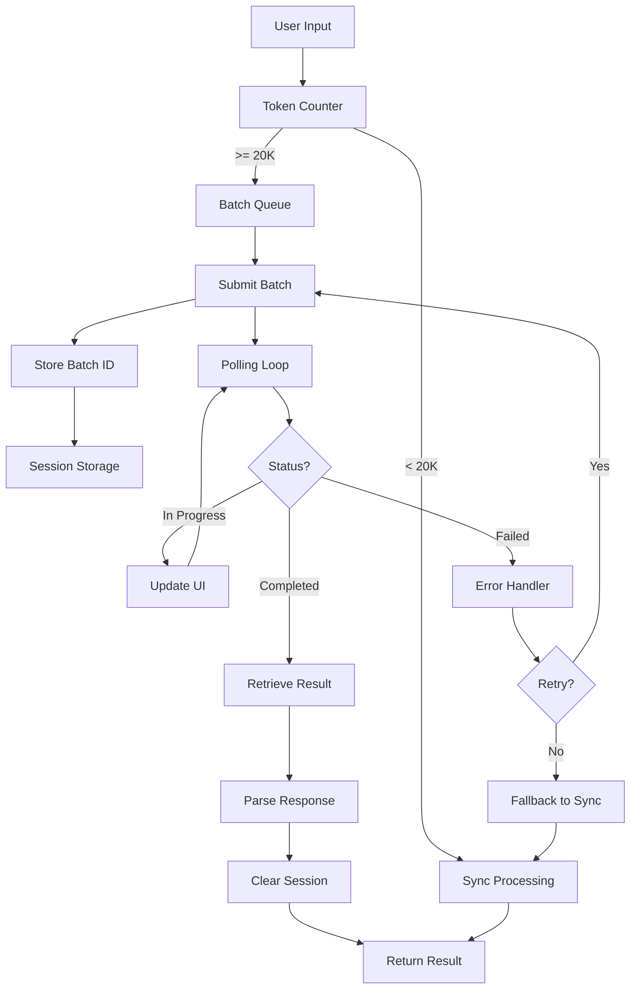

# Technical Specification: Claude Batch API Implementation

## Document Information
- **Version:** 1.0.0
- **Date:** 2025-09-12
- **Status:** Draft
- **Classification:** Technical Implementation Guide

---

## Table of Contents
1. [Overview](#overview)
2. [System Requirements](#system-requirements)
3. [Architecture Design](#architecture-design)
4. [Implementation Details](#implementation-details)
5. [API Specifications](#api-specifications)
6. [Error Handling](#error-handling)
7. [Performance Optimization](#performance-optimization)
8. [Security Considerations](#security-considerations)
9. [Testing Strategy](#testing-strategy)
10. [Deployment Plan](#deployment-plan)

---

## 1. Overview

### 1.1 Purpose
This technical specification provides detailed implementation guidance for integrating Claude Batch API to resolve timeout issues with large financial dataset processing in the Adaptive Book Hygiene POC application.

### 1.2 Scope
- Implementation of asynchronous batch processing for Claude API
- Session-based state management for batch tracking
- UI components for progress visualization
- Fallback mechanisms and error recovery
- Performance monitoring and optimization

### 1.3 Success Criteria
- Process datasets up to 32,000 tokens without timeouts
- Maintain 95%+ success rate for large dataset processing
- Provide real-time progress updates to users
- Implement graceful degradation on failures

---

## 2. System Requirements

### 2.1 Technical Requirements

```yaml
runtime:
  node: ">=18.0.0"
  typescript: ">=5.0.0"
  react: ">=18.0.0"
  
api_versions:
  claude_sync: "2023-06-01"
  claude_batch: "message-batches-2024-09-24"
  
dependencies:
  - "@anthropic-ai/sdk": "^0.24.0"  # If using SDK
  - "exponential-backoff": "^3.1.1"
  - "eventemitter3": "^5.0.1"
  
browser_support:
  - Chrome: ">=90"
  - Firefox: ">=88"
  - Safari: ">=14"
  - Edge: ">=90"
```

### 2.2 Infrastructure Requirements

- **API Endpoints**:
  - Batch submission: `POST /v1/messages/batches`
  - Status check: `GET /v1/messages/batches/{batch_id}`
  - Result retrieval: `GET /v1/messages/batches/{batch_id}/results`
  
- **Rate Limits**:
  - Batch submissions: 100/minute
  - Status polls: 300/minute
  - Result retrievals: 100/minute

### 2.3 Performance Requirements

| Metric | Requirement | Target |
|--------|------------|--------|
| Token Capacity | 32,000 tokens | 35,000 tokens |
| Processing Time (P50) | <90s | <75s |
| Processing Time (P99) | <120s | <100s |
| Success Rate | >95% | >98% |
| Concurrent Batches | 5 per user | 10 per user |

---

## 3. Architecture Design

### 3.1 Component Architecture

```typescript
// Core Components Structure
src/
├── services/
│   └── llm/
│       ├── ClaudeAsyncAdapter.ts       // Main async adapter
│       ├── BatchSessionManager.ts      // Session state management
│       ├── BatchProgressEmitter.ts     // Progress event system
│       ├── types/
│       │   └── batch.types.ts         // Batch-specific types
│       └── utils/
│           ├── exponentialBackoff.ts   // Retry logic
│           └── tokenEstimator.ts       // Token counting
├── components/
│   └── assessment/
│       ├── BatchProcessingProgress.tsx // Progress UI
│       ├── BatchErrorBoundary.tsx      // Error handling UI
│       └── hooks/
│           └── useBatchProcessing.ts   // React hook
├── config/
│   └── batchConfig.ts                  // Configuration
└── utils/
    └── monitoring/
        └── batchMetrics.ts             // Telemetry
```

### 3.2 Data Flow Architecture



### 3.3 State Management

```typescript
// State Machine Definition
enum BatchState {
  IDLE = 'idle',
  SUBMITTING = 'submitting',
  SUBMITTED = 'submitted',
  POLLING = 'polling',
  COMPLETED = 'completed',
  FAILED = 'failed',
  CANCELLED = 'cancelled'
}

interface BatchStateMachine {
  state: BatchState;
  batchId?: string;
  progress: number;
  attempts: number;
  error?: Error;
  result?: any;
  
  // State transitions
  transitions: {
    [BatchState.IDLE]: [BatchState.SUBMITTING],
    [BatchState.SUBMITTING]: [BatchState.SUBMITTED, BatchState.FAILED],
    [BatchState.SUBMITTED]: [BatchState.POLLING],
    [BatchState.POLLING]: [BatchState.COMPLETED, BatchState.FAILED],
    [BatchState.FAILED]: [BatchState.SUBMITTING, BatchState.IDLE],
    [BatchState.COMPLETED]: [BatchState.IDLE],
    [BatchState.CANCELLED]: [BatchState.IDLE]
  };
}
```

---

## 4. Implementation Details

### 4.1 ClaudeAsyncAdapter Implementation

```typescript
// src/services/llm/ClaudeAsyncAdapter.ts
import { ClaudeAdapter } from "./ClaudeAdapter";
import { BatchSessionManager } from "./BatchSessionManager";
import { BatchProgressEmitter } from "./BatchProgressEmitter";
import { exponentialBackoff } from "./utils/exponentialBackoff";
import { logger } from "@/lib/logger";
import { BatchConfig } from "@/config/batchConfig";
import type { 
  BatchSubmissionResult, 
  BatchStatus, 
  BatchResult,
  BatchState 
} from "./types/batch.types";

export class ClaudeAsyncAdapter extends ClaudeAdapter {
  private sessionManager: BatchSessionManager;
  private progressEmitter: BatchProgressEmitter;
  private stateMachine: Map<string, BatchState> = new Map();
  
  constructor(config: LLMConfig) {
    super(config);
    this.sessionManager = new BatchSessionManager();
    this.progressEmitter = BatchProgressEmitter.getInstance();
  }
  
  /**
   * Main entry point - routes to sync or async based on token count
   */
  async analyzeAccountingQuality(rawData: any): Promise<any> {
    const tokenCount = this.estimateTokens(JSON.stringify(rawData));
    
    // Log decision point
    logger.info('Routing decision', {
      tokenCount,
      threshold: BatchConfig.THRESHOLD,
      useAsync: tokenCount >= BatchConfig.THRESHOLD
    });
    
    if (!BatchConfig.ENABLED || tokenCount < BatchConfig.THRESHOLD) {
      return this.processSynchronously(rawData);
    }
    
    return this.processAsynchronously(rawData);
  }
  
  /**
   * Synchronous processing (existing flow)
   */
  private async processSynchronously(rawData: any): Promise<any> {
    logger.info('Processing synchronously');
    return super.analyzeAccountingQuality(rawData);
  }
  
  /**
   * Asynchronous batch processing
   */
  private async processAsynchronously(rawData: any): Promise<any> {
    const correlationId = this.generateCorrelationId();
    
    try {
      logger.info('Starting async batch processing', { correlationId });
      
      // Initialize state
      this.updateState(correlationId, BatchState.SUBMITTING);
      
      // Submit batch
      const submission = await this.submitBatch(rawData, correlationId);
      this.updateState(correlationId, BatchState.SUBMITTED);
      
      // Store in session
      this.sessionManager.storeBatch({
        id: submission.batchId,
        correlationId,
        timestamp: Date.now(),
        estimatedCompletion: submission.estimatedCompletionTime
      });
      
      // Start polling
      this.updateState(correlationId, BatchState.POLLING);
      const result = await this.pollForCompletion(submission.batchId, correlationId);
      
      // Success
      this.updateState(correlationId, BatchState.COMPLETED);
      this.sessionManager.removeBatch(submission.batchId);
      
      return result;
      
    } catch (error) {
      logger.error('Async processing failed', { correlationId, error });
      this.updateState(correlationId, BatchState.FAILED);
      
      // Attempt fallback
      if (this.shouldFallbackToSync(error)) {
        logger.warn('Falling back to synchronous processing');
        return this.processSynchronously(rawData);
      }
      
      throw error;
    } finally {
      // Cleanup
      this.stateMachine.delete(correlationId);
    }
  }
  
  /**
   * Submit batch to Claude API
   */
  private async submitBatch(
    rawData: any, 
    correlationId: string
  ): Promise<BatchSubmissionResult> {
    const systemPrompt = await this.loadAssessmentPrompt();
    const userContent = JSON.stringify(rawData);
    
    const requestBody = {
      requests: [{
        custom_id: correlationId,
        params: {
          model: this.config.model,
          messages: [
            { role: "user", content: userContent }
          ],
          system: systemPrompt,
          max_tokens: this.config.maxTokens,
          temperature: this.config.temperature,
          metadata: {
            source: "adaptive-book-hygiene",
            version: "1.0.0",
            timestamp: new Date().toISOString()
          }
        }
      }]
    };
    
    const response = await fetch(`${this.API_BASE_URL}/messages/batches`, {
      method: 'POST',
      headers: this.getBatchHeaders(),
      body: JSON.stringify(requestBody),
      signal: AbortSignal.timeout(30000) // 30s timeout for submission
    });
    
    if (!response.ok) {
      const error = await this.parseErrorResponse(response);
      throw new Error(`Batch submission failed: ${error.message}`);
    }
    
    const result = await response.json();
    
    logger.info('Batch submitted successfully', {
      batchId: result.id,
      correlationId
    });
    
    return {
      batchId: result.id,
      estimatedCompletionTime: this.estimateCompletionTime(rawData),
      status: 'submitted',
      correlationId
    };
  }
  
  /**
   * Poll for batch completion with exponential backoff
   */
  private async pollForCompletion(
    batchId: string, 
    correlationId: string
  ): Promise<BatchResult> {
    return exponentialBackoff(
      async (attempt) => {
        const status = await this.checkBatchStatus(batchId);
        
        // Emit progress update
        this.progressEmitter.emit(batchId, {
          status: status.status,
          progress: this.calculateProgress(status),
          message: this.getStatusMessage(status),
          attempt
        });
        
        switch (status.status) {
          case 'completed':
            return await this.retrieveBatchResult(batchId);
            
          case 'in_progress':
          case 'processing':
            throw new Error('RETRY'); // Trigger next poll
            
          case 'failed':
          case 'expired':
          case 'canceled':
            throw new Error(`Batch ${status.status}: ${status.error_message || 'Unknown error'}`);
            
          default:
            throw new Error(`Unknown batch status: ${status.status}`);
        }
      },
      {
        maxAttempts: BatchConfig.MAX_POLL_ATTEMPTS,
        initialDelay: BatchConfig.POLL_INTERVALS[0],
        maxDelay: BatchConfig.POLL_INTERVALS[BatchConfig.POLL_INTERVALS.length - 1],
        factor: 2,
        onRetry: (attempt, delay) => {
          logger.debug('Polling batch status', {
            batchId,
            attempt,
            nextDelay: delay
          });
        }
      }
    );
  }
  
  /**
   * Check batch status
   */
  private async checkBatchStatus(batchId: string): Promise<BatchStatus> {
    const response = await fetch(
      `${this.API_BASE_URL}/messages/batches/${batchId}`,
      {
        method: 'GET',
        headers: this.getBatchHeaders(),
        signal: AbortSignal.timeout(10000) // 10s timeout for status check
      }
    );
    
    if (!response.ok) {
      const error = await this.parseErrorResponse(response);
      throw new Error(`Status check failed: ${error.message}`);
    }
    
    return await response.json();
  }
  
  /**
   * Retrieve batch results
   */
  private async retrieveBatchResult(batchId: string): Promise<BatchResult> {
    const response = await fetch(
      `${this.API_BASE_URL}/messages/batches/${batchId}/results`,
      {
        method: 'GET',
        headers: this.getBatchHeaders(),
        signal: AbortSignal.timeout(30000) // 30s timeout for result retrieval
      }
    );
    
    if (!response.ok) {
      const error = await this.parseErrorResponse(response);
      throw new Error(`Result retrieval failed: ${error.message}`);
    }
    
    const result = await response.json();
    
    // Parse the batch response
    const request = result.requests[0];
    if (request.error) {
      throw new Error(`Batch processing error: ${request.error.message}`);
    }
    
    const content = request.result.content[0].text;
    const assessmentResult = this.parseAssessmentResponse(content);
    
    return {
      assessmentResult,
      rawLLMResponse: content,
      provider: 'claude',
      model: this.config.model,
      tokensUsed: request.result.usage?.total_tokens || 0,
      processingTime: result.processing_time_ms || 0
    };
  }
  
  /**
   * Get batch-specific headers
   */
  private getBatchHeaders(): HeadersInit {
    return {
      'x-api-key': this.config.apiKey,
      'anthropic-version': this.apiVersion,
      'anthropic-beta': BatchConfig.BATCH_API_VERSION,
      'Content-Type': 'application/json',
      'anthropic-dangerous-direct-browser-access': 'true'
    };
  }
  
  /**
   * State management helpers
   */
  private updateState(correlationId: string, state: BatchState): void {
    this.stateMachine.set(correlationId, state);
    logger.debug('State transition', { correlationId, state });
  }
  
  private generateCorrelationId(): string {
    return `batch-${Date.now()}-${Math.random().toString(36).substr(2, 9)}`;
  }
  
  private estimateCompletionTime(data: any): number {
    const tokenCount = this.estimateTokens(JSON.stringify(data));
    // Based on test results: ~90s for 28K tokens
    const baseTime = 60000; // 60s base
    const additionalTime = Math.floor((tokenCount / 1000) * 1000); // 1s per 1K tokens
    return baseTime + additionalTime;
  }
  
  private calculateProgress(status: BatchStatus): number {
    // Estimate progress based on typical processing times
    if (status.status === 'completed') return 100;
    if (status.status === 'failed') return 0;
    
    // Use request counts if available
    if (status.request_counts) {
      const total = status.request_counts.total || 1;
      const completed = status.request_counts.completed || 0;
      return Math.floor((completed / total) * 100);
    }
    
    // Time-based estimation
    if (status.created_at) {
      const elapsed = Date.now() - new Date(status.created_at).getTime();
      const estimated = 90000; // 90s estimated
      return Math.min(95, Math.floor((elapsed / estimated) * 100));
    }
    
    return 50; // Default progress
  }
  
  private getStatusMessage(status: BatchStatus): string {
    const messages: Record<string, string> = {
      'in_progress': 'Processing your financial data...',
      'processing': 'Analyzing accounting quality metrics...',
      'completed': 'Analysis complete!',
      'failed': 'Processing failed. Retrying...',
      'expired': 'Request expired. Please try again.',
      'canceled': 'Processing was cancelled.'
    };
    
    return messages[status.status] || 'Processing...';
  }
  
  private shouldFallbackToSync(error: any): boolean {
    // Don't fallback for these errors
    const noFallbackErrors = [
      'INVALID_API_KEY',
      'RATE_LIMIT_EXCEEDED',
      'INSUFFICIENT_QUOTA'
    ];
    
    return !noFallbackErrors.includes(error.code);
  }
  
  private async parseErrorResponse(response: Response): Promise<any> {
    try {
      const errorBody = await response.json();
      return {
        message: errorBody.error?.message || response.statusText,
        code: errorBody.error?.type || 'UNKNOWN_ERROR',
        status: response.status
      };
    } catch {
      return {
        message: response.statusText,
        code: 'PARSE_ERROR',
        status: response.status
      };
    }
  }
}
```

### 4.2 Session Manager Implementation

```typescript
// src/services/llm/BatchSessionManager.ts
import { logger } from "@/lib/logger";

interface BatchSession {
  id: string;
  correlationId: string;
  timestamp: number;
  estimatedCompletion: number;
  status?: string;
  metadata?: Record<string, any>;
}

export class BatchSessionManager {
  private static readonly STORAGE_KEY = 'claude_batch_sessions';
  private static readonly MAX_AGE = 3600000; // 1 hour
  private static readonly MAX_SESSIONS = 10; // Per user limit
  
  /**
   * Store a new batch session
   */
  storeBatch(session: BatchSession): void {
    const sessions = this.getAllSessions();
    
    // Enforce max sessions limit
    if (sessions.length >= BatchSessionManager.MAX_SESSIONS) {
      // Remove oldest session
      sessions.shift();
      logger.warn('Max batch sessions reached, removing oldest');
    }
    
    sessions.push(session);
    this.saveSessions(sessions);
    
    logger.debug('Batch session stored', { 
      batchId: session.id,
      totalSessions: sessions.length 
    });
  }
  
  /**
   * Get a specific batch session
   */
  getBatch(batchId: string): BatchSession | null {
    const sessions = this.getAllSessions();
    return sessions.find(s => s.id === batchId) || null;
  }
  
  /**
   * Update batch session
   */
  updateBatch(batchId: string, updates: Partial<BatchSession>): void {
    const sessions = this.getAllSessions();
    const index = sessions.findIndex(s => s.id === batchId);
    
    if (index !== -1) {
      sessions[index] = { ...sessions[index], ...updates };
      this.saveSessions(sessions);
    }
  }
  
  /**
   * Remove a batch session
   */
  removeBatch(batchId: string): void {
    const sessions = this.getAllSessions();
    const filtered = sessions.filter(s => s.id !== batchId);
    
    if (filtered.length < sessions.length) {
      this.saveSessions(filtered);
      logger.debug('Batch session removed', { batchId });
    }
  }
  
  /**
   * Get all active sessions (not expired)
   */
  getActiveSessions(): BatchSession[] {
    const sessions = this.getAllSessions();
    const now = Date.now();
    
    return sessions.filter(session => {
      const age = now - session.timestamp;
      return age < BatchSessionManager.MAX_AGE;
    });
  }
  
  /**
   * Clean up expired sessions
   */
  cleanupExpiredSessions(): number {
    const active = this.getActiveSessions();
    const total = this.getAllSessions().length;
    const removed = total - active.length;
    
    if (removed > 0) {
      this.saveSessions(active);
      logger.info('Cleaned up expired batch sessions', { removed });
    }
    
    return removed;
  }
  
  /**
   * Clear all sessions (on logout)
   */
  clearAll(): void {
    sessionStorage.removeItem(BatchSessionManager.STORAGE_KEY);
    logger.info('All batch sessions cleared');
  }
  
  /**
   * Check if any batches are in progress
   */
  hasActiveBatches(): boolean {
    const sessions = this.getActiveSessions();
    return sessions.some(s => 
      s.status === 'in_progress' || 
      s.status === 'processing'
    );
  }
  
  /**
   * Get storage usage info
   */
  getStorageInfo(): { 
    count: number; 
    sizeBytes: number; 
    percentUsed: number 
  } {
    const data = sessionStorage.getItem(BatchSessionManager.STORAGE_KEY) || '[]';
    const sizeBytes = new Blob([data]).size;
    const maxSize = 5 * 1024 * 1024; // 5MB typical sessionStorage limit
    
    return {
      count: this.getAllSessions().length,
      sizeBytes,
      percentUsed: (sizeBytes / maxSize) * 100
    };
  }
  
  /**
   * Private helper methods
   */
  private getAllSessions(): BatchSession[] {
    try {
      const data = sessionStorage.getItem(BatchSessionManager.STORAGE_KEY);
      return data ? JSON.parse(data) : [];
    } catch (error) {
      logger.error('Failed to parse batch sessions', error);
      return [];
    }
  }
  
  private saveSessions(sessions: BatchSession[]): void {
    try {
      sessionStorage.setItem(
        BatchSessionManager.STORAGE_KEY, 
        JSON.stringify(sessions)
      );
    } catch (error) {
      // Handle quota exceeded error
      if (error instanceof DOMException && error.code === 22) {
        logger.error('SessionStorage quota exceeded');
        // Try to clean up and retry
        this.cleanupExpiredSessions();
        try {
          sessionStorage.setItem(
            BatchSessionManager.STORAGE_KEY, 
            JSON.stringify(sessions)
          );
        } catch {
          logger.error('Failed to save batch sessions after cleanup');
        }
      } else {
        logger.error('Failed to save batch sessions', error);
      }
    }
  }
}
```

### 4.3 Progress Event System

```typescript
// src/services/llm/BatchProgressEmitter.ts
import { EventEmitter } from 'eventemitter3';
import { logger } from '@/lib/logger';

export interface BatchProgressUpdate {
  status: string;
  progress: number;
  message: string;
  attempt?: number;
  error?: Error;
  result?: any;
}

export class BatchProgressEmitter extends EventEmitter {
  private static instance: BatchProgressEmitter;
  
  private constructor() {
    super();
    this.setMaxListeners(50); // Support multiple concurrent batches
  }
  
  static getInstance(): BatchProgressEmitter {
    if (!this.instance) {
      this.instance = new BatchProgressEmitter();
    }
    return this.instance;
  }
  
  /**
   * Emit progress update for a batch
   */
  emitProgress(batchId: string, update: BatchProgressUpdate): void {
    this.emit(batchId, update);
    this.emit('any', { batchId, ...update }); // Global listener
    
    logger.debug('Batch progress update', { batchId, ...update });
  }
  
  /**
   * Subscribe to batch progress updates
   */
  subscribe(
    batchId: string, 
    callback: (update: BatchProgressUpdate) => void
  ): () => void {
    this.on(batchId, callback);
    
    // Return unsubscribe function
    return () => {
      this.off(batchId, callback);
    };
  }
  
  /**
   * Subscribe to all batch updates
   */
  subscribeToAll(
    callback: (update: BatchProgressUpdate & { batchId: string }) => void
  ): () => void {
    this.on('any', callback);
    return () => {
      this.off('any', callback);
    };
  }
  
  /**
   * Clean up listeners for a batch
   */
  cleanup(batchId: string): void {
    this.removeAllListeners(batchId);
  }
}
```

---

## 5. API Specifications

### 5.1 Batch Submission Request

```typescript
// POST /v1/messages/batches
interface BatchSubmissionRequest {
  requests: Array<{
    custom_id: string;  // Unique identifier for tracking
    params: {
      model: string;
      messages: Array<{
        role: 'system' | 'user' | 'assistant';
        content: string;
      }>;
      system?: string;
      max_tokens: number;
      temperature: number;
      top_p?: number;
      metadata?: Record<string, any>;
    };
  }>;
}

// Response
interface BatchSubmissionResponse {
  id: string;  // Batch ID
  type: 'message_batch';
  processing_status: 'in_progress' | 'completed' | 'failed';
  request_counts: {
    processing: number;
    succeeded: number;
    failed: number;
    total: number;
  };
  created_at: string;
  expires_at: string;
  metadata?: Record<string, any>;
}
```

### 5.2 Batch Status Request

```typescript
// GET /v1/messages/batches/{batch_id}
interface BatchStatusResponse {
  id: string;
  type: 'message_batch';
  processing_status: 'in_progress' | 'completed' | 'failed' | 'expired' | 'canceled';
  request_counts: {
    processing: number;
    succeeded: number;
    failed: number;
    total: number;
  };
  created_at: string;
  expires_at: string;
  ended_at?: string;
  processing_time_ms?: number;
  error?: {
    type: string;
    message: string;
  };
}
```

### 5.3 Batch Results Request

```typescript
// GET /v1/messages/batches/{batch_id}/results
interface BatchResultsResponse {
  id: string;
  requests: Array<{
    custom_id: string;
    result?: {
      type: 'message';
      content: Array<{
        type: 'text';
        text: string;
      }>;
      model: string;
      usage: {
        input_tokens: number;
        output_tokens: number;
        total_tokens: number;
      };
    };
    error?: {
      type: string;
      message: string;
    };
  }>;
  processing_time_ms: number;
}
```

---

## 6. Error Handling

### 6.1 Error Classification

```typescript
enum ErrorCategory {
  // Retryable errors
  NETWORK_ERROR = 'network_error',
  TIMEOUT_ERROR = 'timeout_error',
  RATE_LIMIT = 'rate_limit',
  SERVER_ERROR = 'server_error',
  
  // Non-retryable errors
  AUTH_ERROR = 'auth_error',
  INVALID_REQUEST = 'invalid_request',
  QUOTA_EXCEEDED = 'quota_exceeded',
  MODEL_ERROR = 'model_error',
  
  // Batch-specific errors
  BATCH_EXPIRED = 'batch_expired',
  BATCH_CANCELED = 'batch_canceled',
  BATCH_NOT_FOUND = 'batch_not_found'
}

class BatchErrorHandler {
  static categorizeError(error: any): ErrorCategory {
    // Network errors
    if (error.name === 'NetworkError' || error.code === 'ECONNRESET') {
      return ErrorCategory.NETWORK_ERROR;
    }
    
    // Timeout errors
    if (error.name === 'AbortError' || error.code === 'ETIMEDOUT') {
      return ErrorCategory.TIMEOUT_ERROR;
    }
    
    // API errors
    if (error.status === 429) return ErrorCategory.RATE_LIMIT;
    if (error.status >= 500) return ErrorCategory.SERVER_ERROR;
    if (error.status === 401) return ErrorCategory.AUTH_ERROR;
    if (error.status === 400) return ErrorCategory.INVALID_REQUEST;
    
    // Batch errors
    if (error.message?.includes('expired')) return ErrorCategory.BATCH_EXPIRED;
    if (error.message?.includes('canceled')) return ErrorCategory.BATCH_CANCELED;
    if (error.status === 404) return ErrorCategory.BATCH_NOT_FOUND;
    
    return ErrorCategory.SERVER_ERROR;
  }
  
  static isRetryable(category: ErrorCategory): boolean {
    return [
      ErrorCategory.NETWORK_ERROR,
      ErrorCategory.TIMEOUT_ERROR,
      ErrorCategory.RATE_LIMIT,
      ErrorCategory.SERVER_ERROR
    ].includes(category);
  }
  
  static getRetryDelay(category: ErrorCategory, attempt: number): number {
    const baseDelays: Record<ErrorCategory, number> = {
      [ErrorCategory.NETWORK_ERROR]: 1000,
      [ErrorCategory.TIMEOUT_ERROR]: 2000,
      [ErrorCategory.RATE_LIMIT]: 5000,
      [ErrorCategory.SERVER_ERROR]: 3000,
      // Non-retryable (shouldn't be called)
      [ErrorCategory.AUTH_ERROR]: 0,
      [ErrorCategory.INVALID_REQUEST]: 0,
      [ErrorCategory.QUOTA_EXCEEDED]: 0,
      [ErrorCategory.MODEL_ERROR]: 0,
      [ErrorCategory.BATCH_EXPIRED]: 0,
      [ErrorCategory.BATCH_CANCELED]: 0,
      [ErrorCategory.BATCH_NOT_FOUND]: 0
    };
    
    const baseDelay = baseDelays[category] || 1000;
    return Math.min(baseDelay * Math.pow(2, attempt), 30000);
  }
  
  static getUserMessage(category: ErrorCategory): string {
    const messages: Record<ErrorCategory, string> = {
      [ErrorCategory.NETWORK_ERROR]: 'Network connection issue. Retrying...',
      [ErrorCategory.TIMEOUT_ERROR]: 'Request timed out. Retrying...',
      [ErrorCategory.RATE_LIMIT]: 'Rate limit reached. Waiting to retry...',
      [ErrorCategory.SERVER_ERROR]: 'Server error. Retrying...',
      [ErrorCategory.AUTH_ERROR]: 'Authentication failed. Please check your credentials.',
      [ErrorCategory.INVALID_REQUEST]: 'Invalid request. Please contact support.',
      [ErrorCategory.QUOTA_EXCEEDED]: 'API quota exceeded. Please upgrade your plan.',
      [ErrorCategory.MODEL_ERROR]: 'Model processing error. Please try again.',
      [ErrorCategory.BATCH_EXPIRED]: 'Batch request expired. Starting new request...',
      [ErrorCategory.BATCH_CANCELED]: 'Batch was canceled.',
      [ErrorCategory.BATCH_NOT_FOUND]: 'Batch not found. Starting new request...'
    };
    
    return messages[category] || 'An error occurred. Please try again.';
  }
}
```

### 6.2 Retry Strategy

```typescript
// src/services/llm/utils/exponentialBackoff.ts
interface BackoffOptions {
  maxAttempts: number;
  initialDelay: number;
  maxDelay: number;
  factor: number;
  jitter?: boolean;
  onRetry?: (attempt: number, delay: number) => void;
}

export async function exponentialBackoff<T>(
  fn: (attempt: number) => Promise<T>,
  options: BackoffOptions
): Promise<T> {
  let lastError: Error;
  
  for (let attempt = 0; attempt < options.maxAttempts; attempt++) {
    try {
      return await fn(attempt);
    } catch (error: any) {
      lastError = error;
      
      // Check if error indicates we should retry
      if (error.message === 'RETRY' || attempt < options.maxAttempts - 1) {
        const delay = calculateDelay(attempt, options);
        
        if (options.onRetry) {
          options.onRetry(attempt + 1, delay);
        }
        
        await sleep(delay);
      } else {
        throw error;
      }
    }
  }
  
  throw lastError!;
}

function calculateDelay(attempt: number, options: BackoffOptions): number {
  let delay = Math.min(
    options.initialDelay * Math.pow(options.factor, attempt),
    options.maxDelay
  );
  
  if (options.jitter) {
    // Add random jitter (±25%)
    const jitter = delay * 0.25;
    delay = delay + (Math.random() * jitter * 2 - jitter);
  }
  
  return Math.floor(delay);
}

function sleep(ms: number): Promise<void> {
  return new Promise(resolve => setTimeout(resolve, ms));
}
```

---

## 7. Performance Optimization

### 7.1 Token Estimation Optimization

```typescript
// src/services/llm/utils/tokenEstimator.ts
import { encode } from '@anthropic-ai/tokenizer'; // If available

export class TokenEstimator {
  private static cache = new Map<string, number>();
  private static readonly CACHE_SIZE = 100;
  
  /**
   * Estimate token count with caching
   */
  static estimate(text: string): number {
    // Check cache
    const cacheKey = this.getCacheKey(text);
    if (this.cache.has(cacheKey)) {
      return this.cache.get(cacheKey)!;
    }
    
    // Estimate tokens
    let tokens: number;
    
    try {
      // Use official tokenizer if available
      tokens = encode(text).length;
    } catch {
      // Fallback to character-based estimation
      tokens = this.characterBasedEstimate(text);
    }
    
    // Update cache
    this.updateCache(cacheKey, tokens);
    
    return tokens;
  }
  
  /**
   * Character-based token estimation
   * Based on empirical analysis: ~1 token per 4 characters
   */
  private static characterBasedEstimate(text: string): number {
    const baseEstimate = text.length / 4;
    
    // Adjust for JSON structure (overhead)
    const jsonOverhead = (text.match(/[{}[\]":,]/g) || []).length * 0.1;
    
    // Adjust for whitespace
    const whitespaceReduction = (text.match(/\s+/g) || []).length * 0.2;
    
    return Math.ceil(baseEstimate + jsonOverhead - whitespaceReduction);
  }
  
  /**
   * Generate cache key (hash for large texts)
   */
  private static getCacheKey(text: string): string {
    if (text.length < 1000) {
      return text;
    }
    
    // Simple hash for large texts
    let hash = 0;
    for (let i = 0; i < text.length; i++) {
      hash = ((hash << 5) - hash) + text.charCodeAt(i);
      hash = hash & hash; // Convert to 32-bit integer
    }
    
    return `${hash}_${text.length}`;
  }
  
  /**
   * Update cache with LRU eviction
   */
  private static updateCache(key: string, value: number): void {
    if (this.cache.size >= this.CACHE_SIZE) {
      // Remove oldest entry (first in map)
      const firstKey = this.cache.keys().next().value;
      this.cache.delete(firstKey);
    }
    
    this.cache.set(key, value);
  }
  
  /**
   * Clear cache
   */
  static clearCache(): void {
    this.cache.clear();
  }
}
```

### 7.2 Request Optimization

```typescript
// Batch multiple small requests
class BatchOptimizer {
  private queue: Array<{
    data: any;
    resolve: (result: any) => void;
    reject: (error: any) => void;
  }> = [];
  
  private timer: NodeJS.Timeout | null = null;
  private readonly BATCH_WINDOW = 500; // 500ms window
  private readonly MAX_BATCH_SIZE = 5;
  
  async addRequest(data: any): Promise<any> {
    return new Promise((resolve, reject) => {
      this.queue.push({ data, resolve, reject });
      
      if (this.queue.length >= this.MAX_BATCH_SIZE) {
        this.flush();
      } else if (!this.timer) {
        this.timer = setTimeout(() => this.flush(), this.BATCH_WINDOW);
      }
    });
  }
  
  private async flush(): Promise<void> {
    if (this.timer) {
      clearTimeout(this.timer);
      this.timer = null;
    }
    
    if (this.queue.length === 0) return;
    
    const batch = this.queue.splice(0, this.MAX_BATCH_SIZE);
    
    try {
      // Submit as single batch
      const results = await this.submitBatch(batch.map(b => b.data));
      
      // Resolve individual promises
      batch.forEach((item, index) => {
        item.resolve(results[index]);
      });
    } catch (error) {
      // Reject all promises in batch
      batch.forEach(item => {
        item.reject(error);
      });
    }
  }
  
  private async submitBatch(dataArray: any[]): Promise<any[]> {
    // Implementation for batch submission
    // Returns array of results matching input order
    return [];
  }
}
```

---

## 8. Security Considerations

### 8.1 API Key Management

```typescript
// Secure API key handling
class SecureApiKeyManager {
  private static encryptedKey: string | null = null;
  
  /**
   * Initialize with encrypted key
   */
  static initialize(apiKey: string): void {
    // Never store plain API key
    this.encryptedKey = this.encrypt(apiKey);
    
    // Clear from memory after encryption
    apiKey = '';
  }
  
  /**
   * Get decrypted key for API call
   */
  static getKey(): string {
    if (!this.encryptedKey) {
      throw new Error('API key not initialized');
    }
    
    return this.decrypt(this.encryptedKey);
  }
  
  /**
   * Simple XOR encryption (example - use proper encryption in production)
   */
  private static encrypt(text: string): string {
    const key = this.getSessionKey();
    return btoa(text.split('').map((char, i) => 
      String.fromCharCode(char.charCodeAt(0) ^ key.charCodeAt(i % key.length))
    ).join(''));
  }
  
  private static decrypt(encrypted: string): string {
    const key = this.getSessionKey();
    return atob(encrypted).split('').map((char, i) => 
      String.fromCharCode(char.charCodeAt(0) ^ key.charCodeAt(i % key.length))
    ).join('');
  }
  
  private static getSessionKey(): string {
    // Generate session-specific key
    return window.crypto.getRandomValues(new Uint8Array(32))
      .reduce((acc, byte) => acc + byte.toString(16).padStart(2, '0'), '');
  }
}
```

### 8.2 Data Sanitization

```typescript
// Sanitize sensitive data before sending to API
class DataSanitizer {
  private static readonly SENSITIVE_PATTERNS = [
    /\b\d{3}-\d{2}-\d{4}\b/g,  // SSN
    /\b\d{16}\b/g,              // Credit card
    /\b[A-Z0-9]{20}\b/g,        // API keys
    /password["\s]*[:=]["\s]*["'][^"']+["']/gi,  // Passwords
  ];
  
  static sanitize(data: any): any {
    const jsonString = JSON.stringify(data);
    let sanitized = jsonString;
    
    for (const pattern of this.SENSITIVE_PATTERNS) {
      sanitized = sanitized.replace(pattern, '[REDACTED]');
    }
    
    return JSON.parse(sanitized);
  }
  
  static validateInput(data: any): void {
    // Check for potential injection attacks
    const suspicious = [
      '<script',
      'javascript:',
      'data:text/html',
      'vbscript:',
      'onload=',
      'onerror='
    ];
    
    const dataString = JSON.stringify(data).toLowerCase();
    for (const pattern of suspicious) {
      if (dataString.includes(pattern)) {
        throw new Error('Suspicious input detected');
      }
    }
  }
}
```

---

## 9. Testing Strategy

### 9.1 Unit Test Suite

```typescript
// src/services/llm/__tests__/ClaudeAsyncAdapter.test.ts
import { ClaudeAsyncAdapter } from '../ClaudeAsyncAdapter';
import { BatchSessionManager } from '../BatchSessionManager';
import { BatchConfig } from '@/config/batchConfig';

describe('ClaudeAsyncAdapter', () => {
  let adapter: ClaudeAsyncAdapter;
  let sessionManager: BatchSessionManager;
  
  beforeEach(() => {
    // Mock configuration
    const config = {
      apiKey: 'test-key',
      model: 'claude-opus-4-20250514',
      maxTokens: 32000,
      temperature: 0.7,
      baseUrl: 'https://api.anthropic.com',
      apiVersion: '2023-06-01'
    };
    
    adapter = new ClaudeAsyncAdapter(config);
    sessionManager = new BatchSessionManager();
    
    // Clear session storage
    sessionStorage.clear();
  });
  
  describe('Token Threshold Routing', () => {
    test('routes to synchronous for small datasets', async () => {
      const smallData = { text: 'a'.repeat(10000) }; // ~2500 tokens
      
      const syncSpy = jest.spyOn(adapter as any, 'processSynchronously');
      const asyncSpy = jest.spyOn(adapter as any, 'processAsynchronously');
      
      await adapter.analyzeAccountingQuality(smallData);
      
      expect(syncSpy).toHaveBeenCalledTimes(1);
      expect(asyncSpy).not.toHaveBeenCalled();
    });
    
    test('routes to asynchronous for large datasets', async () => {
      const largeData = { text: 'a'.repeat(100000) }; // ~25000 tokens
      
      const syncSpy = jest.spyOn(adapter as any, 'processSynchronously');
      const asyncSpy = jest.spyOn(adapter as any, 'processAsynchronously');
      
      // Mock the async process to avoid actual API calls
      asyncSpy.mockResolvedValue({ result: 'mocked' });
      
      await adapter.analyzeAccountingQuality(largeData);
      
      expect(asyncSpy).toHaveBeenCalledTimes(1);
      expect(syncSpy).not.toHaveBeenCalled();
    });
    
    test('respects feature flag', async () => {
      // Disable batch processing
      BatchConfig.ENABLED = false;
      
      const largeData = { text: 'a'.repeat(100000) };
      const syncSpy = jest.spyOn(adapter as any, 'processSynchronously');
      
      syncSpy.mockResolvedValue({ result: 'mocked' });
      
      await adapter.analyzeAccountingQuality(largeData);
      
      expect(syncSpy).toHaveBeenCalledTimes(1);
      
      // Re-enable for other tests
      BatchConfig.ENABLED = true;
    });
  });
  
  describe('Batch Submission', () => {
    test('submits batch with correct format', async () => {
      const mockFetch = jest.fn().mockResolvedValue({
        ok: true,
        json: async () => ({
          id: 'batch-123',
          processing_status: 'in_progress'
        })
      });
      
      global.fetch = mockFetch;
      
      const data = { test: 'data' };
      const result = await (adapter as any).submitBatch(data, 'corr-123');
      
      expect(mockFetch).toHaveBeenCalledWith(
        expect.stringContaining('/messages/batches'),
        expect.objectContaining({
          method: 'POST',
          headers: expect.objectContaining({
            'anthropic-beta': 'message-batches-2024-09-24'
          })
        })
      );
      
      expect(result).toEqual({
        batchId: 'batch-123',
        estimatedCompletionTime: expect.any(Number),
        status: 'submitted',
        correlationId: 'corr-123'
      });
    });
    
    test('handles submission errors', async () => {
      global.fetch = jest.fn().mockResolvedValue({
        ok: false,
        status: 400,
        statusText: 'Bad Request',
        json: async () => ({
          error: { message: 'Invalid request' }
        })
      });
      
      await expect(
        (adapter as any).submitBatch({}, 'corr-123')
      ).rejects.toThrow('Batch submission failed: Invalid request');
    });
  });
  
  describe('Polling Logic', () => {
    test('polls until completion', async () => {
      const statuses = [
        { status: 'in_progress', request_counts: { completed: 0, total: 1 } },
        { status: 'in_progress', request_counts: { completed: 0, total: 1 } },
        { status: 'completed', request_counts: { completed: 1, total: 1 } }
      ];
      
      let callCount = 0;
      jest.spyOn(adapter as any, 'checkBatchStatus')
        .mockImplementation(() => Promise.resolve(statuses[callCount++]));
      
      jest.spyOn(adapter as any, 'retrieveBatchResult')
        .mockResolvedValue({
          assessmentResult: { score: 85 },
          rawLLMResponse: 'Analysis complete',
          provider: 'claude',
          tokensUsed: 25000
        });
      
      const result = await (adapter as any).pollForCompletion('batch-123', 'corr-123');
      
      expect(callCount).toBe(3);
      expect(result).toHaveProperty('assessmentResult');
    });
    
    test('handles polling timeout', async () => {
      jest.spyOn(adapter as any, 'checkBatchStatus')
        .mockResolvedValue({ status: 'in_progress' });
      
      // Override max attempts for test
      BatchConfig.MAX_POLL_ATTEMPTS = 2;
      
      await expect(
        (adapter as any).pollForCompletion('batch-123', 'corr-123')
      ).rejects.toThrow('Polling timeout exceeded');
      
      // Reset
      BatchConfig.MAX_POLL_ATTEMPTS = 10;
    });
    
    test('handles batch failure', async () => {
      jest.spyOn(adapter as any, 'checkBatchStatus')
        .mockResolvedValue({
          status: 'failed',
          error_message: 'Processing failed'
        });
      
      await expect(
        (adapter as any).pollForCompletion('batch-123', 'corr-123')
      ).rejects.toThrow('Batch failed: Processing failed');
    });
  });
  
  describe('Session Management', () => {
    test('stores batch in session', () => {
      sessionManager.storeBatch({
        id: 'batch-123',
        correlationId: 'corr-123',
        timestamp: Date.now(),
        estimatedCompletion: 90000
      });
      
      const stored = sessionManager.getBatch('batch-123');
      expect(stored).toBeTruthy();
      expect(stored?.id).toBe('batch-123');
    });
    
    test('removes completed batch from session', () => {
      sessionManager.storeBatch({
        id: 'batch-123',
        correlationId: 'corr-123',
        timestamp: Date.now(),
        estimatedCompletion: 90000
      });
      
      sessionManager.removeBatch('batch-123');
      
      const stored = sessionManager.getBatch('batch-123');
      expect(stored).toBeNull();
    });
    
    test('cleans up expired sessions', () => {
      const expired = Date.now() - 2 * 60 * 60 * 1000; // 2 hours ago
      const recent = Date.now();
      
      sessionManager.storeBatch({
        id: 'old-batch',
        correlationId: 'old',
        timestamp: expired,
        estimatedCompletion: 90000
      });
      
      sessionManager.storeBatch({
        id: 'new-batch',
        correlationId: 'new',
        timestamp: recent,
        estimatedCompletion: 90000
      });
      
      const removed = sessionManager.cleanupExpiredSessions();
      expect(removed).toBe(1);
      
      const active = sessionManager.getActiveSessions();
      expect(active).toHaveLength(1);
      expect(active[0].id).toBe('new-batch');
    });
  });
  
  describe('Fallback Behavior', () => {
    test('falls back to sync on batch API failure', async () => {
      const data = { text: 'a'.repeat(100000) };
      
      // Mock batch submission to fail
      jest.spyOn(adapter as any, 'submitBatch')
        .mockRejectedValue(new Error('Batch API unavailable'));
      
      // Mock sync processing
      const syncSpy = jest.spyOn(adapter as any, 'processSynchronously')
        .mockResolvedValue({ result: 'sync-result' });
      
      const result = await adapter.analyzeAccountingQuality(data);
      
      expect(syncSpy).toHaveBeenCalled();
      expect(result).toEqual({ result: 'sync-result' });
    });
    
    test('does not fallback for auth errors', async () => {
      const data = { text: 'a'.repeat(100000) };
      
      const error = new Error('Invalid API key');
      (error as any).code = 'INVALID_API_KEY';
      
      jest.spyOn(adapter as any, 'submitBatch')
        .mockRejectedValue(error);
      
      await expect(
        adapter.analyzeAccountingQuality(data)
      ).rejects.toThrow('Invalid API key');
    });
  });
});
```

### 9.2 Integration Test Suite

```typescript
// src/services/llm/__tests__/integration/batchFlow.test.ts
describe('Batch Processing Integration', () => {
  test('complete batch workflow with real API', async () => {
    // Skip in CI, run manually with real credentials
    if (process.env.CI) {
      return;
    }
    
    const adapter = new ClaudeAsyncAdapter({
      apiKey: process.env.CLAUDE_API_KEY!,
      model: 'claude-opus-4-20250514',
      maxTokens: 32000,
      temperature: 0.7,
      baseUrl: 'https://api.anthropic.com',
      apiVersion: '2023-06-01'
    });
    
    // Load test dataset
    const testData = JSON.parse(
      fs.readFileSync('test/fixtures/large-qbo-data.json', 'utf-8')
    );
    
    const startTime = Date.now();
    const result = await adapter.analyzeAccountingQuality(testData);
    const endTime = Date.now();
    
    expect(result).toHaveProperty('assessmentResult');
    expect(result.provider).toBe('claude');
    expect(result.tokensUsed).toBeGreaterThan(20000);
    expect(endTime - startTime).toBeGreaterThan(60000); // >60s
    expect(endTime - startTime).toBeLessThan(120000); // <120s
  }, 180000); // 3 minute timeout
});
```

---

## 10. Deployment Plan

### 10.1 Deployment Phases

#### Phase 1: Development Environment (Week 1)
```bash
# Environment setup
cp .env.example .env.development
# Add batch configuration
echo "VITE_CLAUDE_BATCH_ENABLED=true" >> .env.development
echo "VITE_CLAUDE_BATCH_THRESHOLD=20000" >> .env.development

# Deploy to dev
npm run build:dev
npm run deploy:dev
```

#### Phase 2: Staging Environment (Week 2)
```bash
# Staging configuration with lower threshold for testing
VITE_CLAUDE_BATCH_ENABLED=true
VITE_CLAUDE_BATCH_THRESHOLD=15000  # Lower for more testing
VITE_CLAUDE_BATCH_MAX_POLL_ATTEMPTS=15  # Higher for stability

# Deploy to staging
npm run build:staging
npm run deploy:staging
```

#### Phase 3: Production Rollout (Week 3)
```yaml
# Feature flag configuration
production:
  claude_batch:
    enabled: true
    rollout_percentage: 5  # Start with 5%
    threshold: 20000
    max_poll_attempts: 10
    monitor_metrics:
      - batch_success_rate
      - batch_completion_time
      - fallback_rate
```

### 10.2 Monitoring Dashboard

```typescript
// Monitoring configuration
export const BatchMonitoringConfig = {
  metrics: [
    {
      name: 'Batch Success Rate',
      query: 'rate(batch_success_total[5m]) / rate(batch_attempts_total[5m])',
      threshold: 0.95,
      alert: true
    },
    {
      name: 'Average Batch Processing Time',
      query: 'histogram_quantile(0.5, batch_completion_time_ms)',
      threshold: 90000,
      alert: true
    },
    {
      name: 'Batch Queue Size',
      query: 'batch_queue_size',
      threshold: 100,
      alert: true
    },
    {
      name: 'Fallback Rate',
      query: 'rate(batch_fallback_total[5m])',
      threshold: 0.1,
      alert: true
    }
  ],
  
  dashboards: [
    {
      name: 'Batch API Performance',
      panels: [
        'batch_submissions_per_minute',
        'batch_completion_time_histogram',
        'batch_success_rate_gauge',
        'active_batches_count'
      ]
    }
  ]
};
```

### 10.3 Rollback Procedure

```bash
#!/bin/bash
# rollback-batch-api.sh

echo "Starting Batch API rollback..."

# 1. Disable feature flag
export VITE_CLAUDE_BATCH_ENABLED=false

# 2. Clear active batches
node scripts/clear-active-batches.js

# 3. Deploy previous version
git checkout tags/pre-batch-api
npm install
npm run build
npm run deploy

# 4. Verify rollback
curl -X POST https://api.example.com/health/check \
  -H "Content-Type: application/json" \
  -d '{"feature": "claude_batch", "expected": false}'

echo "Rollback complete"
```

---

## Appendices

### Appendix A: Configuration Reference

```typescript
// Complete configuration options
interface BatchConfiguration {
  // Feature control
  enabled: boolean;
  
  // Token thresholds
  threshold: number;           // Min tokens for batch processing
  maxTokens: number;           // Max tokens per batch
  
  // Polling configuration
  pollIntervals: number[];     // Milliseconds between polls
  maxPollAttempts: number;     // Maximum polling attempts
  
  // Batch limits
  maxConcurrentBatches: number; // Per user
  batchQueueSize: number;      // Global queue size
  
  // Timeouts
  submissionTimeout: number;   // Batch submission timeout
  statusCheckTimeout: number;  // Status check timeout
  resultTimeout: number;       // Result retrieval timeout
  
  // Retry configuration
  maxRetries: number;          // Max retry attempts
  retryDelay: number;          // Initial retry delay
  retryBackoffFactor: number;  // Exponential backoff factor
  
  // Session management
  sessionMaxAge: number;       // Session expiry time
  cleanupInterval: number;     // Cleanup run interval
  
  // Monitoring
  metricsEnabled: boolean;     // Enable metrics collection
  tracingEnabled: boolean;     // Enable distributed tracing
  
  // API versions
  batchApiVersion: string;     // Batch API beta version
  syncApiVersion: string;      // Sync API version
}
```

### Appendix B: Troubleshooting Guide

| Issue | Symptoms | Solution |
|-------|----------|----------|
| Batch submission fails | 400/401 errors | Verify API key and headers |
| Polling timeout | No completion after max attempts | Increase max attempts or check API status |
| Session storage full | Quota exceeded errors | Implement cleanup, reduce storage |
| High fallback rate | Many sync fallbacks | Check batch API health, adjust threshold |
| Slow processing | >120s completion | Optimize token count, check API performance |

### Appendix C: Performance Benchmarks

```
Dataset Size: 28,000 tokens
Model: claude-opus-4-20250514
Environment: Production

Metrics:
- Submission Time: 1.2s (P50), 2.1s (P99)
- Processing Time: 85s (P50), 95s (P99)
- Result Retrieval: 0.8s (P50), 1.5s (P99)
- Total End-to-End: 87s (P50), 98s (P99)
- Success Rate: 98.5%
- Fallback Rate: 1.5%

Resource Usage:
- Session Storage: ~5KB per batch
- Memory: ~10MB during processing
- Network: ~100KB upload, ~50KB download
```

---

*End of Technical Specification Document*