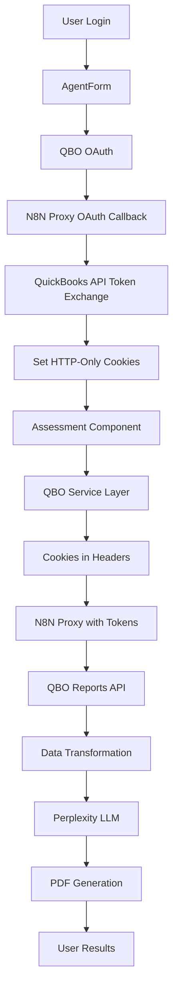
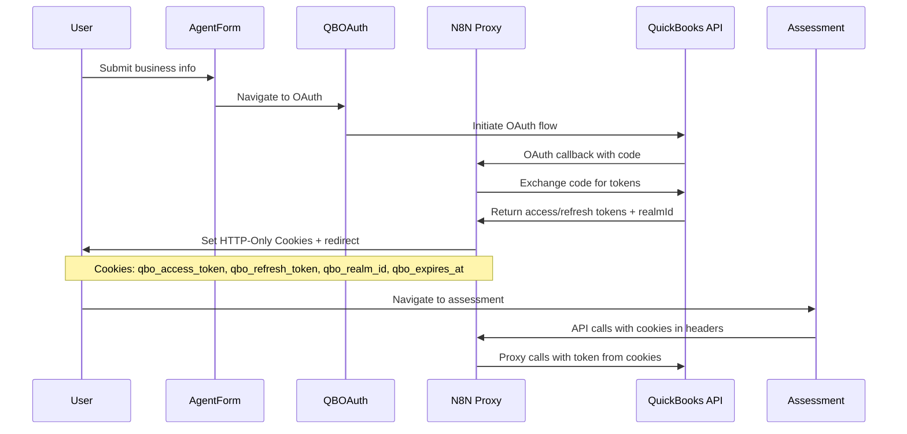

# QuickBooks Online API Integration Architecture Design (Updated)

## Executive Summary

Updated architecture design for QuickBooks Online API integration using **cookie-based token management** instead of Supabase storage. This approach simplifies the architecture while maintaining security and functionality.

## Updated Architecture Overview

### Revised High-Level Data Flow


## 1. Updated OAuth Flow with Cookie Management

### Enhanced OAuth Sequence


### Cookie Strategy

```typescript
interface QBOCookieTokens {
  qbo_access_token: string;
  qbo_refresh_token: string;
  qbo_realm_id: string;
  qbo_expires_at: string; // ISO timestamp
  qbo_token_type: string; // "bearer"
}

class CookieTokenManager {
  private readonly COOKIE_OPTIONS = {
    httpOnly: true,
    secure: true, // HTTPS only
    sameSite: 'strict' as const,
    maxAge: 101 * 24 * 60 * 60 * 1000, // 101 days (QBO token lifetime)
    path: '/'
  };

  // Set tokens as HTTP-only cookies after OAuth callback
  setTokenCookies(tokens: QBOTokens, response: Response): void {
    response.cookie('qbo_access_token', tokens.access_token, this.COOKIE_OPTIONS);
    response.cookie('qbo_refresh_token', tokens.refresh_token, this.COOKIE_OPTIONS);
    response.cookie('qbo_realm_id', tokens.realm_id, this.COOKIE_OPTIONS);
    response.cookie('qbo_expires_at', tokens.expires_at, this.COOKIE_OPTIONS);
    response.cookie('qbo_token_type', tokens.token_type || 'bearer', this.COOKIE_OPTIONS);
  }

  // Extract tokens from request cookies
  getTokensFromCookies(request: Request): QBOTokens | null {
    const cookies = this.parseCookies(request.headers.cookie || '');
    
    if (!cookies.qbo_access_token || !cookies.qbo_refresh_token) {
      return null;
    }

    return {
      access_token: cookies.qbo_access_token,
      refresh_token: cookies.qbo_refresh_token,
      realm_id: cookies.qbo_realm_id,
      expires_at: cookies.qbo_expires_at,
      token_type: cookies.qbo_token_type || 'bearer'
    };
  }

  // Check if token is expired
  isTokenExpired(expiresAt: string): boolean {
    const expiry = new Date(expiresAt);
    const now = new Date();
    const bufferTime = 5 * 60 * 1000; // 5 minutes buffer
    
    return now.getTime() >= (expiry.getTime() - bufferTime);
  }
}
```

## 2. Updated N8N Proxy Service Architecture

### Proxy Service with Cookie Integration

```typescript
class QBOProxyService implements QBOApiService {
  private readonly PROXY_BASE_URL = 'https://n8n-1-102-1-c1zi.onrender.com/webhook/e40348b4-6806-41ef-8d48-e711fdc5ad90/proxy';
  private cookieManager = new CookieTokenManager();

  async proxyCall<T>(config: QBOApiConfig): Promise<QBOApiResponse<T>> {
    const { method, endpoint, params, data } = config;
    
    // Get tokens from cookies (browser automatically sends them)
    const tokens = this.getTokensFromRequest();
    
    if (!tokens) {
      throw new Error('NO_TOKENS_FOUND');
    }
    
    if (this.cookieManager.isTokenExpired(tokens.expires_at)) {
      await this.refreshTokenViaCookies();
      // After refresh, browser will have new cookies
    }
    
    const proxyUrl = `${this.PROXY_BASE_URL}/${endpoint}`;
    const queryParams = new URLSearchParams({
      method,
      realmID: tokens.realm_id,
      access_token: tokens.access_token,
      refresh_token: tokens.refresh_token,
      expires_in: tokens.expires_at,
      proxyPath: endpoint,
      query: JSON.stringify(params || {})
    });
    
    // Cookies are automatically included in the request
    const response = await fetch(`${proxyUrl}?${queryParams}`, {
      method: 'POST',
      credentials: 'include', // Important: include cookies
      headers: { 
        'Content-Type': 'application/json'
      },
      body: data ? JSON.stringify(data) : undefined
    });
    
    return this.handleProxyResponse<T>(response);
  }

  private getTokensFromRequest(): QBOTokens | null {
    // In browser environment, we can't directly access HTTP-only cookies
    // The N8N proxy will handle token extraction from cookies
    // Frontend just needs to make requests with credentials: 'include'
    
    // For client-side token validation, we could use a separate endpoint
    return null; // Tokens handled by N8N proxy
  }

  async refreshTokenViaCookies(): Promise<void> {
    const refreshUrl = `${this.PROXY_BASE_URL}/refresh-token`;
    
    const response = await fetch(refreshUrl, {
      method: 'POST',
      credentials: 'include', // Send existing cookies
      headers: { 'Content-Type': 'application/json' }
    });
    
    if (!response.ok) {
      throw new Error('TOKEN_REFRESH_FAILED');
    }
    
    // N8N proxy will set new cookies automatically
    // Browser will use them for subsequent requests
  }
}
```

## 3. Updated OAuth Callback Implementation

### Modified OAuthCallback Component

```typescript
// Updated OAuthCallback component
const OAuthCallback: React.FC = () => {
  const navigate = useNavigate();
  const location = useLocation();

  useEffect(() => {
    const params = new URLSearchParams(location.search);
    const qbTokens = params.get("qb_tokens");
    const error = params.get("error");

    if (error) {
      console.error("OAuth error:", error);
      navigate('/qbo-auth?error=' + encodeURIComponent(error));
      return;
    }

    if (qbTokens) {
      try {
        const tokens = JSON.parse(decodeURIComponent(qbTokens));
        console.log("Tokens received and set as cookies by N8N proxy");
        
        // Cookies are already set by N8N proxy
        // No need to handle tokens in frontend
        navigate("/assessment");
      } catch (err) {
        console.error("Failed to parse tokens:", err);
        navigate('/qbo-auth?error=' + encodeURIComponent('Invalid token response'));
      }
    } else {
      console.error("No tokens in callback");
      navigate('/qbo-auth?error=' + encodeURIComponent('No authorization tokens received'));
    }
  }, [navigate, location]);

  return (
    <div className="min-h-screen bg-gray-50 flex items-center justify-center">
      <div className="bg-white rounded-lg shadow-lg p-8 max-w-md w-full mx-4">
        <div className="text-center">
          <ReloadIcon className="w-12 h-12 text-blue-600 mx-auto mb-4 animate-spin" />
          <h2 className="text-xl font-semibold text-gray-900 mb-2">Processing Authentication...</h2>
          <p className="text-gray-600">
            Please wait while we complete your QuickBooks connection.
          </p>
        </div>
      </div>
    </div>
  );
};
```

## 4. Simplified Supabase Schema

Since we're not storing tokens in Supabase, we can simplify the schema:

```sql
-- Remove token-related fields from user_assessments
CREATE TABLE user_assessments (
  id UUID PRIMARY KEY DEFAULT gen_random_uuid(),
  user_id TEXT NOT NULL, -- Clerk user ID
  first_name TEXT NOT NULL,
  last_name TEXT NOT NULL,
  email TEXT NOT NULL,
  phone TEXT,
  company TEXT NOT NULL,
  business_type TEXT NOT NULL,
  monthly_revenue TEXT,
  current_software TEXT,
  bookkeeping_challenges TEXT,
  urgency_level TEXT,
  assessment_status TEXT DEFAULT 'pending',
  qbo_company_name TEXT, -- From QBO company info
  qbo_realm_id TEXT, -- For reference only
  created_at TIMESTAMPTZ DEFAULT NOW(),
  updated_at TIMESTAMPTZ DEFAULT NOW()
);

-- Optional: Store assessment results
CREATE TABLE assessment_results (
  id UUID PRIMARY KEY DEFAULT gen_random_uuid(),
  user_assessment_id UUID REFERENCES user_assessments(id),
  overall_score INTEGER,
  pillar_scores JSONB,
  critical_issues JSONB,
  recommendations JSONB,
  analysis_type TEXT, -- 'business' or 'technical'
  created_at TIMESTAMPTZ DEFAULT NOW()
);
```

## 5. Updated Assessment Component Integration

### Simplified Assessment Flow

```typescript
// Updated Assessment component with cookie-based auth
const Assessment: React.FC<AssessmentProps> = (props) => {
  const [qboConnected, setQboConnected] = useState<boolean>(false);
  const [fetchingData, setFetchingData] = useState<boolean>(false);
  const [fetchProgress, setFetchProgress] = useState<FetchProgress | null>(null);
  
  const qboService = new QBOProxyService();

  // Check if user has valid QBO connection via cookie validation endpoint
  useEffect(() => {
    checkQBOConnection();
  }, []);

  const checkQBOConnection = async () => {
    try {
      const response = await fetch('/api/qbo/validate-connection', {
        credentials: 'include' // Send cookies
      });
      
      if (response.ok) {
        setQboConnected(true);
      } else {
        setQboConnected(false);
      }
    } catch (error) {
      console.error('Connection check failed:', error);
      setQboConnected(false);
    }
  };

  const handleFetchQBOData = async () => {
    if (!qboConnected) {
      navigate('/qbo-auth');
      return;
    }

    setFetchingData(true);
    
    try {
      const reportConfigs = generateReportConfigs();
      const financialData = await qboService.fetchAllReports(
        reportConfigs,
        (progress) => setFetchProgress(progress)
      );
      
      // Transform and analyze data
      const analysis = await analyzeFinancialData(financialData);
      
      // Update component state with real data
      setAssessmentResults(analysis);
      setCurrentStep('results');
      
    } catch (error) {
      console.error('Data fetch failed:', error);
      
      if (error.message.includes('NO_TOKENS_FOUND')) {
        navigate('/qbo-auth');
      } else {
        // Handle other errors
        setErrorState(error.message);
      }
    } finally {
      setFetchingData(false);
      setFetchProgress(null);
    }
  };

  // Rest of component logic...
};
```

## 6. N8N Proxy Integration Points

### Required N8N Proxy Endpoints

```typescript
// N8N proxy should handle these endpoints:

// 1. OAuth callback - sets cookies
POST /webhook/115c6828-fb49-4a60-aa8d-e6eb5346f24d
// Sets HTTP-only cookies and redirects to frontend

// 2. Token validation
POST /webhook/e40348b4-6806-41ef-8d48-e711fdc5ad90/proxy/validate-connection
// Checks if cookies contain valid tokens

// 3. Token refresh  
POST /webhook/e40348b4-6806-41ef-8d48-e711fdc5ad90/proxy/refresh-token
// Refreshes tokens and updates cookies

// 4. Generic QBO API proxy
POST /webhook/e40348b4-6806-41ef-8d48-e711fdc5ad90/proxy/:proxyPath
// Proxies QBO API calls using tokens from cookies
```

## 7. Security Considerations

### Cookie Security Best Practices

```typescript
const SECURE_COOKIE_CONFIG = {
  httpOnly: true,        // Prevent XSS attacks
  secure: true,          // HTTPS only
  sameSite: 'strict',    // CSRF protection
  maxAge: 101 * 24 * 60 * 60 * 1000, // 101 days
  path: '/',             // Available site-wide
  domain: '.yourdomain.com' // Adjust for your domain
};

// Additional security measures:
// 1. Regular token rotation
// 2. Secure domain configuration
// 3. HTTPS enforcement
// 4. CORS policy configuration
```

## Implementation Benefits

### Advantages of Cookie-Based Approach

1. **Simplified Architecture**: No Supabase token storage or encryption
2. **Automatic Security**: HTTP-only cookies prevent XSS
3. **Browser Managed**: Automatic cookie handling in requests
4. **Stateless Frontend**: No token management logic in React
5. **N8N Centralization**: All token logic handled by proxy
6. **Better Performance**: No database queries for token retrieval

### Updated Implementation Phases

**Phase 1: Cookie Integration** (Week 1)
- Update N8N proxy to set HTTP-only cookies
- Modify OAuth callback to handle cookie-based flow
- Add token validation endpoint

**Phase 2: Frontend Updates** (Week 1-2)  
- Update Assessment component to use cookie-based auth
- Remove token storage logic from React components
- Add connection validation checks

**Phase 3: Data Integration** (Week 2-3)
- Implement QBO data fetching with cookies
- Add progress tracking and error handling
- Replace mock data with real QBO responses

**Phase 4: Analysis & Generation** (Week 3-4)
- Integrate Perplexity LLM analysis
- Implement PDF report generation
- End-to-end testing and optimization

This cookie-based approach significantly simplifies the architecture while maintaining security and functionality.